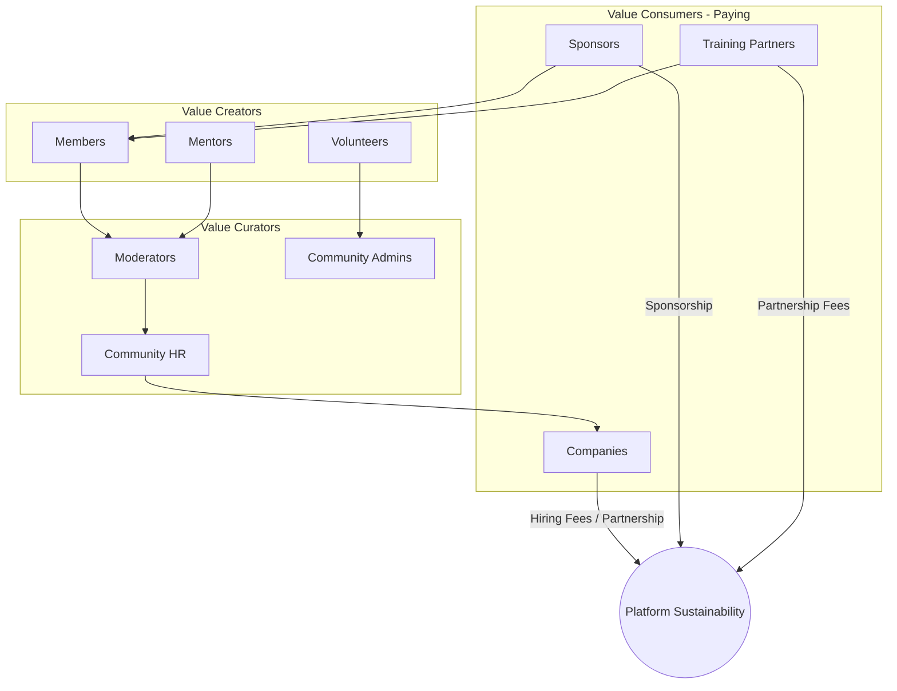
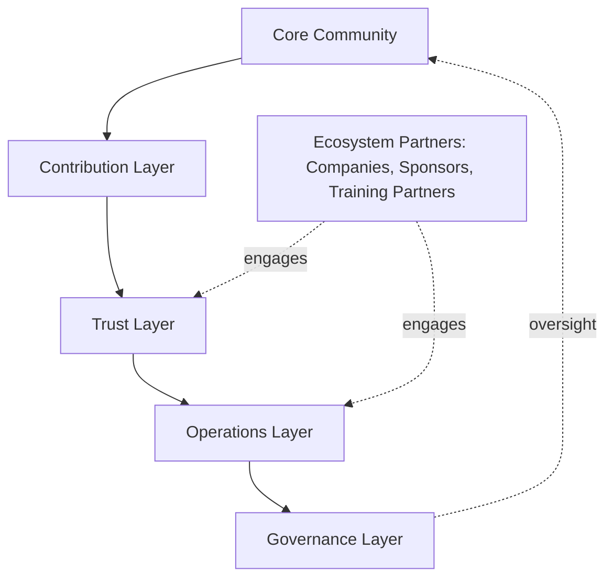
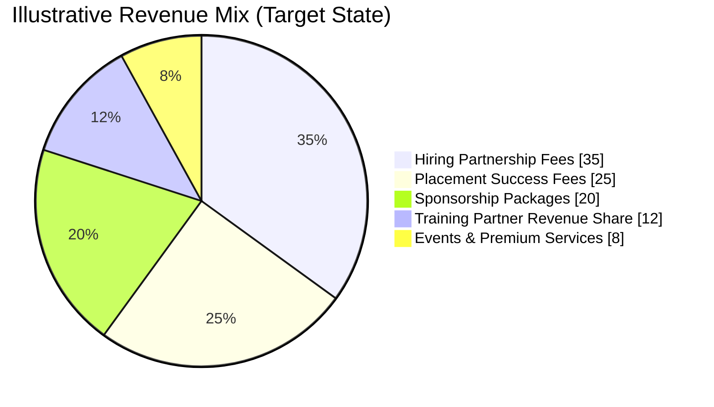
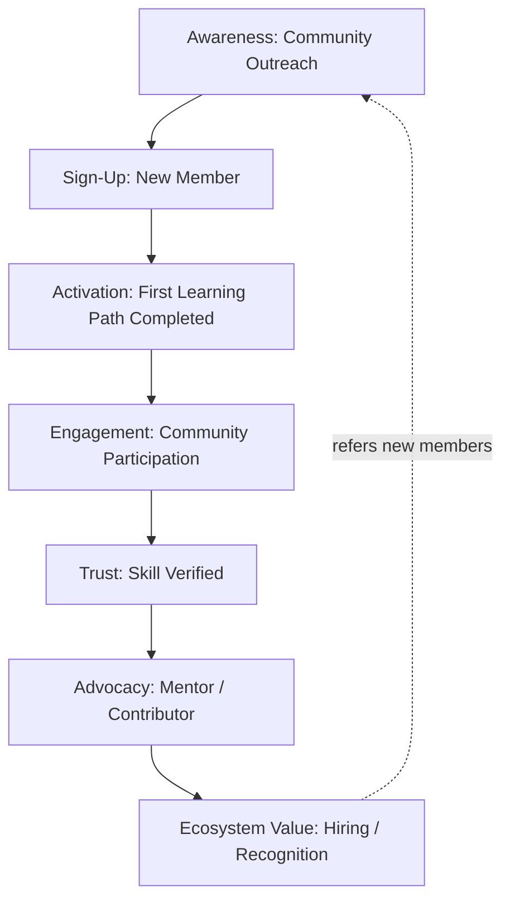
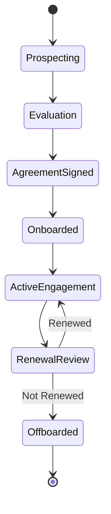
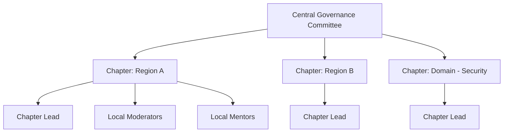
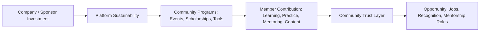

# 02 — Community Business Model

> **Document Type:** Business Model Document
> **Series:** Community Talent Ecosystem Platform — Business Documentation Suite
> **Cross-Reference:** Builds on `01_PROJECT_VISION.md`

---

## 1. Purpose of This Document

This document defines **how the ecosystem sustains itself** — structurally, operationally, and economically — while remaining faithful to the "Community First" philosophy established in `01_PROJECT_VISION.md`. It covers the business model, stakeholder responsibilities, revenue sources, growth strategy, partner and sponsor models, chapter structure, governance linkage, KPIs/OKRs, and community economics.

---

## 2. Business Model Overview

The Platform operates a **multi-sided community business model**: value is created by members (through learning and contribution), curated by community roles (moderators, mentors, HR), and monetized through parties who benefit from access to a trusted, verified community — companies, sponsors, and training partners — **without members ever paying for trust, verification, or opportunity.**

> **Callout**
> Members are never a revenue source. Revenue flows from organizations that benefit from access to a trusted community, not from the community itself.

---

## 3. Community Model

### 3.1 Structural Layers

| Layer | Description | Primary Roles |
|-------|--------------|----------------|
| Core Community | The base layer of all members | Students, Freshers, Engineers |
| Contribution Layer | Members actively contributing | Volunteers, Speakers, Content Contributors |
| Trust Layer | Members with verified skill and standing | Verified Members, Mentors |
| Operations Layer | Members running the community | Moderators, Admins, Community HR |
| Governance Layer | Members setting policy and direction | Community Leaders, Committees |
| Ecosystem Partners | External stakeholders engaging the community | Companies, Sponsors, Training Partners |

### 3.2 Layered Community Diagram

---

## 4. Stakeholders and Responsibilities

| Stakeholder | Core Responsibility | Accountable To |
|-------------|----------------------|-----------------|
| Community Member | Learn, practice, contribute honestly | Community Guidelines |
| Mentor | Guide members, validate skill, uphold standards | Governance Committee |
| Community Moderator | Enforce guidelines, manage day-to-day community health | Community Admin |
| Community Admin | Operational oversight of a chapter or function | Community Leaders |
| Community HR | Curate verified talent, manage employer relationships | Governance Committee, Companies |
| Community Leader | Set chapter direction, represent community in governance | Governance Committee |
| Company | Provide genuine opportunity, honor community hiring standards | Partnership Agreement |
| Sponsor | Fund initiatives without influencing merit-based outcomes | Sponsorship Agreement |
| Training Partner | Deliver quality learning content | Partnership Agreement |
| Event Organiser | Plan and execute community events | Community Admin |

> **Decision Note**
> No stakeholder — including Companies and Sponsors — has authority over verification or reputation outcomes. This authority sits exclusively with the Trust Layer (Mentors, Verified Members) as defined in `10_VERIFICATION_MODEL.md`.

---

## 5. Revenue Sources

### 5.1 Revenue Stream Overview

| Revenue Stream | Description | Payer |
|------------------|--------------|--------|
| Hiring Partnership Fees | Companies pay for structured access to verified talent pools | Companies |
| Placement Success Fees | Fee triggered upon successful, retained placement | Companies |
| Sponsorship Packages | Brand visibility, event sponsorship, scholarship funding | Sponsors |
| Training Partner Revenue Share | Partners distribute paid learning content to the community | Training Partners |
| Premium Community Services | Optional advanced tools for companies (e.g., analytics dashboards — business capability, not technical spec) | Companies |
| Event & Conference Partnerships | Paid participation slots for larger community-run events | Companies, Sponsors |

### 5.2 Revenue Model Diagram

> **Assumption**
> The revenue mix above is illustrative and intended for early business planning. Actual mix will be validated against real partner agreements during the pilot phase (see `15_ROADMAP.md`).

---

## 6. Growth Strategy

### 6.1 Growth Phases

| Phase | Focus | Primary Goal |
|-------|--------|----------------|
| Phase 1 — Foundation | Launch founding chapter(s), build initial trust layer | Prove the verification and mentorship loop works |
| Phase 2 — Community Depth | Expand contribution layer, formalize mentor program | Increase verified member density |
| Phase 3 — Employer Trust | Onboard hiring partners, activate Community HR function | Prove placement outcomes |
| Phase 4 — Chapter Expansion | Replicate model across new geographies/domains | Scale community governance |
| Phase 5 — Ecosystem Maturity | Sponsor network, training partner network at scale | Sustainable, diversified revenue |

### 6.2 Growth Funnel

---

## 7. Partner Model

### 7.1 Types of Partners

| Partner Type | Engagement Model | Value Exchanged |
|----------------|--------------------|-------------------|
| Training Partner | Content and learning path contribution | Distribution access to engaged learners |
| Technology Community Partner | Cross-community collaboration | Shared events, shared visibility |
| Hiring Partner (Company) | Access to verified talent pools | Partnership/placement fees |
| Strategic Industry Partner | Advisory input on skill standards | Long-term credibility and reach |

### 7.2 Partner Engagement Lifecycle

---

## 8. Sponsor Model (Summary)

Full detail is provided in `07_SPONSORSHIP_MODEL.md`. At the business-model level, sponsorship exists to fund community growth — scholarships, events, bootcamps — **without ever influencing verification, ranking, or hiring outcomes.**

| Sponsorship Tier (Illustrative) | Focus | Community Return |
|-----------------------------------|-------|---------------------|
| Community Supporter | General fund contribution | Visibility on community channels |
| Event Sponsor | Funds specific meetups/conferences | Branding at sponsored events |
| Scholarship Sponsor | Funds learning access for underserved members | Named scholarship recognition |
| Strategic Partner Sponsor | Long-term, multi-initiative funding | Advisory visibility, deeper brand integration |

---

## 9. Community Chapters

### 9.1 Chapter Concept

A **Chapter** is a semi-autonomous, geographically or thematically defined community unit (e.g., a city chapter or a domain-specific chapter such as "Security Chapter") operating under shared governance principles but with local leadership.

### 9.2 Chapter Structure

### 9.3 Chapter Responsibilities

| Responsibility | Owner |
|------------------|--------|
| Local event execution | Chapter Lead + Event Organisers |
| Local mentor recruitment | Chapter Lead |
| Escalation of governance issues | Chapter Lead → Central Governance |
| Adherence to global community standards | All Chapter Roles |

---

## 10. Governance Linkage

Governance mechanics are fully detailed in `13_COMMUNITY_GOVERNANCE.md`. At the business-model level, governance exists to ensure:

1. No single stakeholder group (including the platform operator) can unilaterally alter trust or verification standards.
2. Chapters operate with local autonomy inside global guardrails.
3. Conflicts of interest (e.g., a sponsor also being a hiring company) are disclosed and managed.

---

## 11. KPIs

| KPI | Definition | Business Relevance |
|-----|------------|----------------------|
| Verified Member Ratio | % of active members with at least one verified skill | Trust layer depth |
| Mentor Activation Rate | % of eligible members who become active mentors | Mentorship sustainability |
| Placement Success Rate | % of Community HR recommendations resulting in hire | Employer trust |
| Chapter Health Score | Composite of activity, retention, and moderation load | Operational sustainability |
| Sponsor Renewal Rate | % of sponsors renewing engagement | Revenue durability |

---

## 12. OKRs (Illustrative, Year 1)

| Objective | Key Result |
|-----------|------------|
| Establish a credible trust layer | 30% of active members achieve at least one verified skill |
| Prove the mentorship loop | 100+ active mentors onboarded across founding chapters |
| Prove employer trust | 3+ hiring partners complete at least one successful placement |
| Build sustainable chapter operations | 2 founding chapters reach operational self-sufficiency |

---

## 13. Community Economics

### 13.1 Value Exchange Principle

> **Principle**
> Members exchange **contribution** for **growth and opportunity**. Companies and sponsors exchange **investment** for **trusted access**. At no point does contribution get purchased, and at no point does investment purchase trust directly — trust is only earned through the verification layer.

### 13.2 Economic Flow

---

## 14. Best Practices

- Keep revenue-generating relationships structurally separate from verification and reputation systems.
- Review chapter health quarterly to avoid silent community decline.
- Require every partner and sponsor agreement to explicitly disclaim influence over merit-based systems.
- Reinvest a defined percentage of revenue into community programs (scholarships, mentorship tooling, events).

## 15. Assumptions

- Initial revenue will lag community growth; early phases require funding runway independent of revenue.
- Companies will accept a "trust-first" hiring model in exchange for lower hiring risk and cost.

## 16. Future Scope

- Community-owned economic models (e.g., member-elected allocation of a portion of sponsorship funds).
- Cross-chapter revenue sharing for shared events.

## 17. Review Notes

| Reviewer Role | Focus Area | Status |
|----------------|------------|--------|
| Finance/Business Sponsor | Revenue model viability | Pending Review |
| Community Governance | Chapter and governance linkage | Pending Review |

---

**Cross-References:** `01_PROJECT_VISION.md` · `05_HR_OPERATIONS.md` · `06_COMPANY_PARTNERSHIP_MODEL.md` · `07_SPONSORSHIP_MODEL.md` · `13_COMMUNITY_GOVERNANCE.md`
