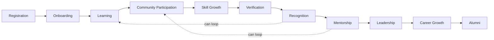
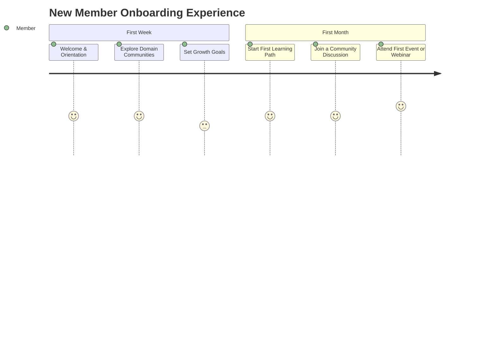
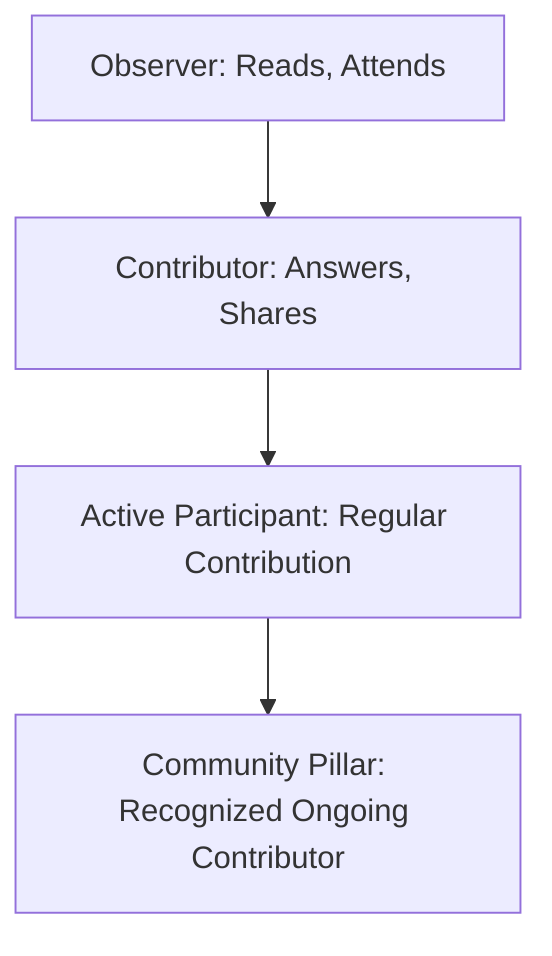
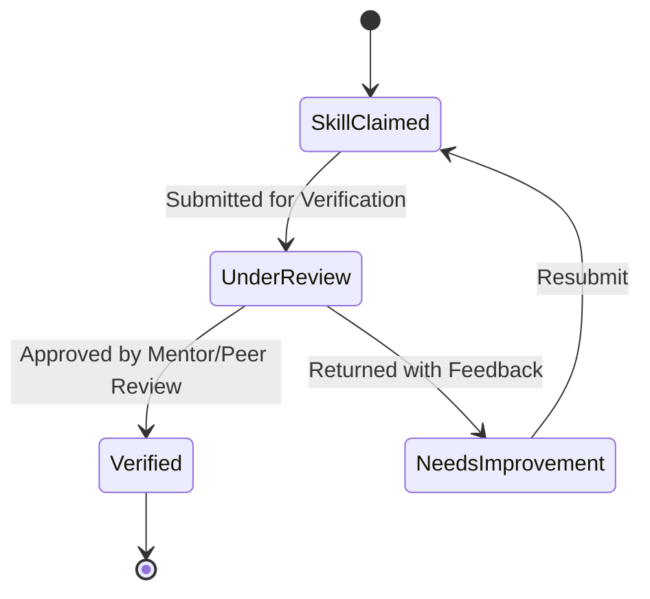
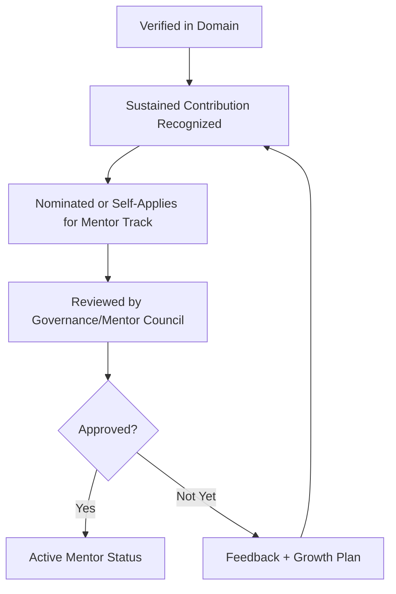
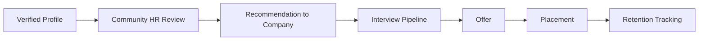
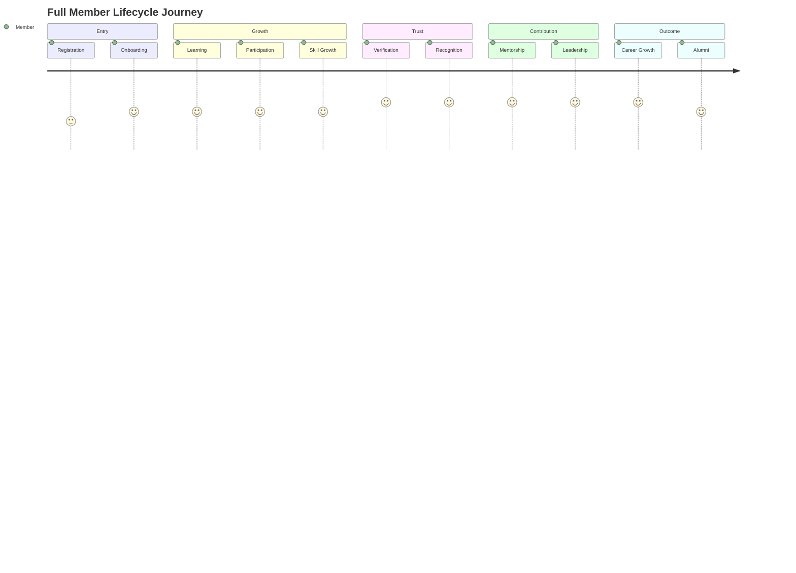
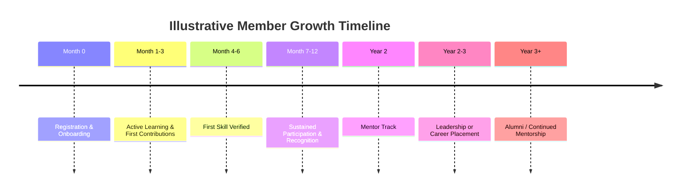

# 03 — Member Lifecycle

> **Document Type:** Lifecycle & Journey Document
> **Series:** Community Talent Ecosystem Platform — Business Documentation Suite
> **Cross-Reference:** Builds on `01_PROJECT_VISION.md`, `02_COMMUNITY_BUSINESS_MODEL.md`

---

## 1. Purpose

This document defines the complete lifecycle of a member — from first registration through to alumni status — describing each stage's business purpose, entry/exit criteria, and the experience the member should have. It is the backbone journey referenced by nearly every other document in this suite.

---

## 2. Lifecycle Overview

> **Callout**
> The lifecycle is **not strictly linear**. Members loop back into learning, participation, and verification continuously — the lifecycle describes a growth spiral, not a one-time funnel.

---

## 3. Stage 1 — Registration

### 3.1 Purpose
Establish a member's foundational identity within the community.

### 3.2 Business Rules

| Rule | Description |
|------|--------------|
| Identity Honesty | Members register with accurate professional information |
| Domain Selection | Members declare their primary domain(s) of interest (e.g., Cloud, Security) |
| Community Agreement | Members accept community guidelines as a condition of joining |

### 3.3 Entry/Exit Criteria

| Entry Criteria | Exit Criteria |
|-------------------|------------------|
| Individual expresses interest in joining | Profile created, guidelines accepted |

---

## 4. Stage 2 — Onboarding

### 4.1 Purpose
Orient the new member to community norms, available learning paths, and initial engagement opportunities.

### 4.2 Onboarding Journey

### 4.3 Onboarding Checklist (Business View)

- Domain and interest confirmed
- Initial growth goal set with guidance
- First learning path assigned or selected
- Introduced to relevant community spaces and mentors

---

## 5. Stage 3 — Learning

Full detail in `08_LEARNING_ECOSYSTEM.md`. At the lifecycle level:

| Element | Business Purpose |
|---------|---------------------|
| Learning Paths | Structured, domain-specific growth tracks |
| Peer Learning | Community-based knowledge exchange |
| Study Groups | Cohort-based accountability and depth |

---

## 6. Stage 4 — Community Participation

### 6.1 Participation Forms

| Form of Participation | Description |
|--------------------------|--------------|
| Discussion Contribution | Answering/asking questions in community spaces |
| Event Attendance | Meetups, webinars, conferences |
| Content Contribution | Writing, presenting, sharing knowledge |
| Volunteering | Supporting community operations |

### 6.2 Participation Depth Model

---

## 7. Stage 5 — Skill Growth

Skill growth is tracked as an evolving portfolio state, not a one-time assessment.

| Growth Signal | Description |
|------------------|--------------|
| Learning Path Completion | Structured curriculum milestones |
| Practice Challenge Completion | Applied, hands-on demonstration (see `09_LAB_AND_PRACTICE_MODEL.md`) |
| Peer Feedback | Informal signals from community interaction |

---

## 8. Stage 6 — Verification

Full detail in `10_VERIFICATION_MODEL.md`. At the lifecycle level, verification is the **trust checkpoint** that converts claimed skill into community-endorsed skill.

---

## 9. Stage 7 — Recognition

| Recognition Type | Trigger |
|---------------------|---------|
| Badge Award | Verified skill or milestone achieved |
| Leaderboard Placement | Sustained high-quality contribution |
| Community Shoutout | Notable contribution or achievement |
| Speaker Invitation | Demonstrated expertise and community standing |

---

## 10. Stage 8 — Mentorship

### 10.1 Path to Becoming a Mentor

### 10.2 Mentor Responsibilities

- Guide members through learning and verification.
- Uphold community standards during peer review.
- Model contribution behavior for newer members.

---

## 11. Stage 9 — Leadership

Members who sustain mentorship excellence and community trust may progress into **Community Leadership** roles (Chapter Lead, Committee Member, Event Organiser Lead). See `13_COMMUNITY_GOVERNANCE.md` for governance mechanics.

---

## 12. Stage 10 — Career Growth

### 12.1 Career Pathways

| Pathway | Description |
|---------|--------------|
| Community HR Recommendation | Verified profile surfaced to hiring partners |
| Direct Opportunity Visibility | Companies browse curated, verified talent pools |
| Speaking/Consulting Opportunities | Reputation-driven external opportunity |

### 12.2 Career Growth Flow

---

## 13. Stage 11 — Alumni

### 13.1 Purpose
Recognize members who have moved into full-time roles or reduced active participation while preserving their standing and enabling re-engagement.

| Alumni State | Description |
|-----------------|--------------|
| Active Alumni | Placed/employed, still contributes occasionally (e.g., mentoring) |
| Passive Alumni | Placed/employed, minimal active participation |
| Returning Member | Alumni re-engaging actively (e.g., as a mentor or speaker) |

---

## 14. Full Lifecycle Journey Map

---

## 15. Lifecycle Timeline (Illustrative)

---

## 16. Best Practices

- Never gate onboarding behind unnecessary friction — early activation drives long-term retention.
- Recognize small contributions early to build habitual participation.
- Ensure verification pathways remain accessible regardless of a member's initial experience level.
- Treat alumni as a continued community asset, not a lifecycle exit.

## 17. Assumptions

- Members progress at individual pace; no fixed timeline is enforced.
- Not all members will pursue mentorship or leadership — both remain optional, aspirational tracks.

## 18. Future Scope

- Formal "returning member" reactivation campaigns.
- Cross-chapter mobility for members who relocate.

## 19. Review Notes

| Reviewer Role | Focus Area | Status |
|----------------|------------|--------|
| Community Operations | Lifecycle operational feasibility | Pending Review |
| Learning Team | Learning-to-verification handoff | Pending Review |

---

**Cross-References:** `08_LEARNING_ECOSYSTEM.md` · `09_LAB_AND_PRACTICE_MODEL.md` · `10_VERIFICATION_MODEL.md` · `11_COMMUNITY_REPUTATION_SYSTEM.md` · `05_HR_OPERATIONS.md`
