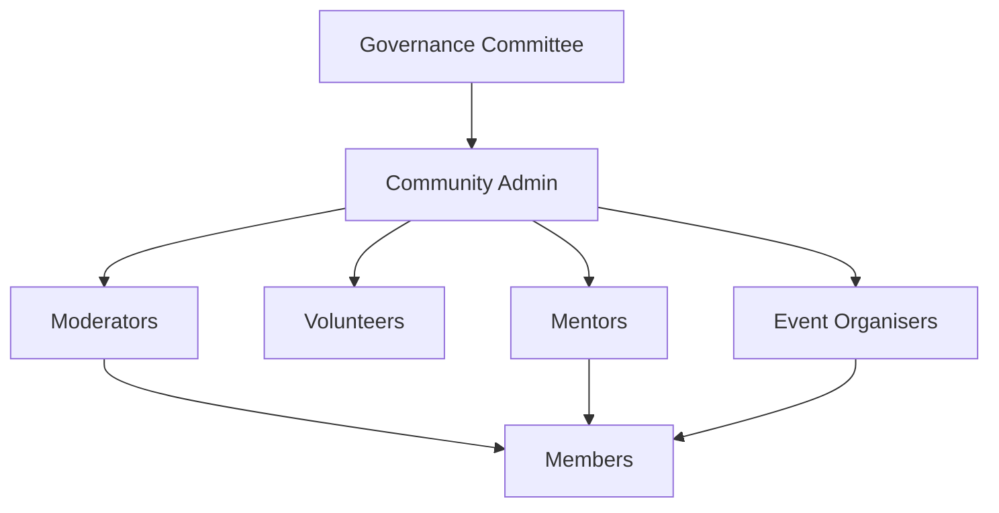
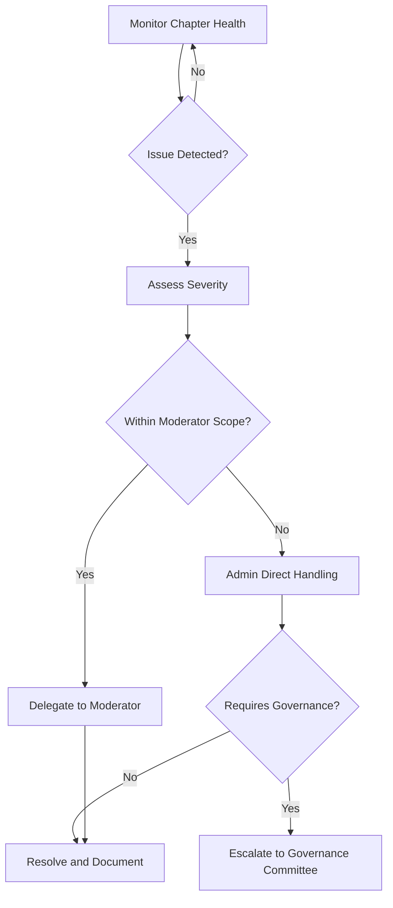
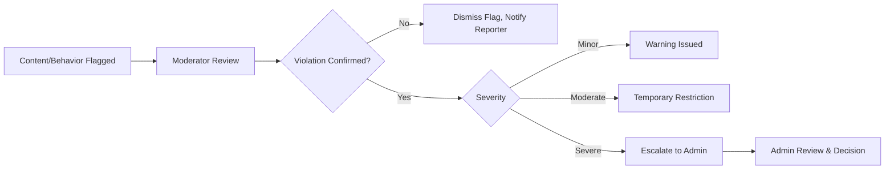
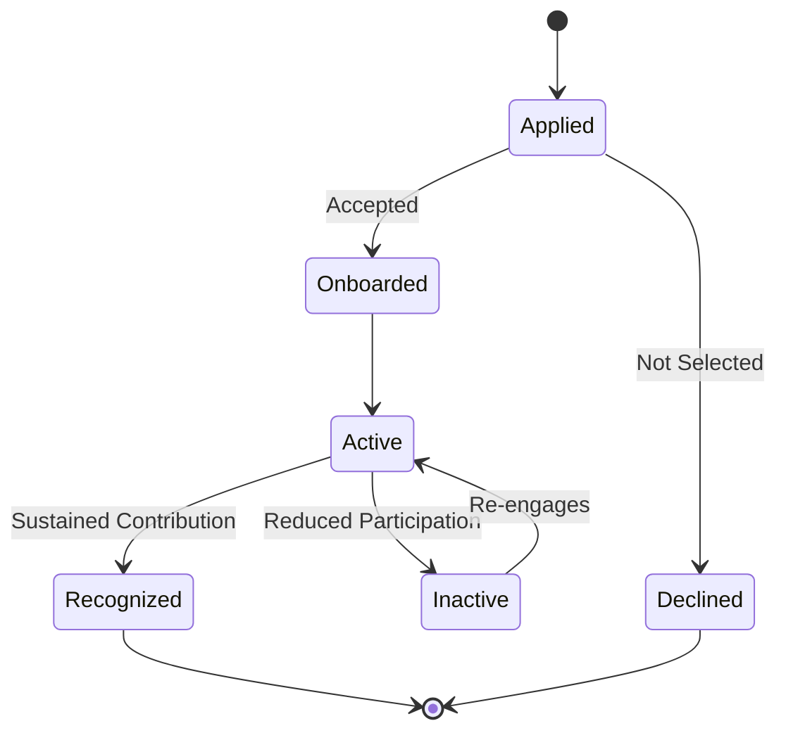
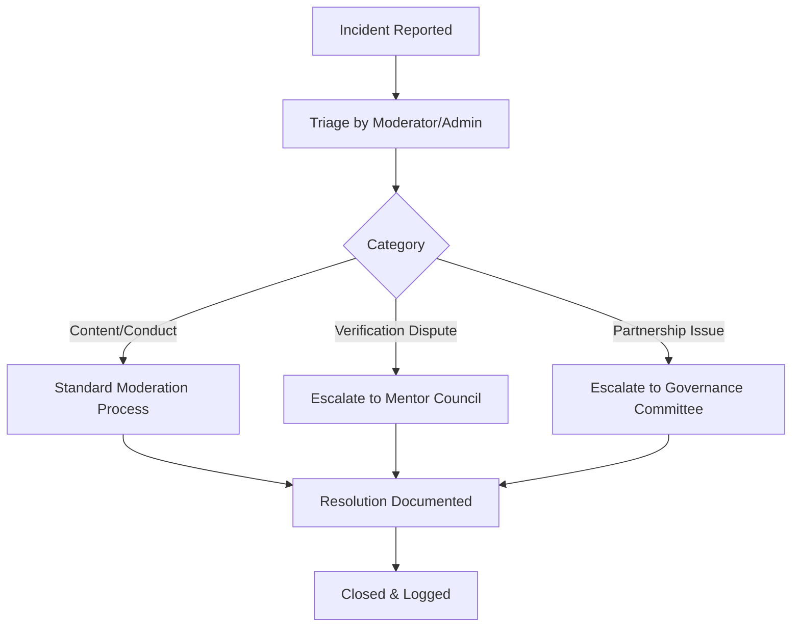
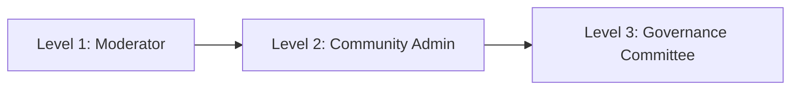
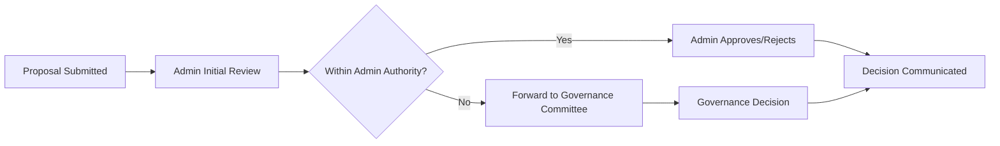

# 04 — Community Operations

> **Document Type:** Operations Model Document
> **Series:** Community Talent Ecosystem Platform — Business Documentation Suite
> **Cross-Reference:** `02_COMMUNITY_BUSINESS_MODEL.md`, `03_MEMBER_LIFECYCLE.md`

---

## 1. Purpose

This document defines how the community is operated day-to-day — the roles, workflows, escalation paths, and governance touchpoints that keep the ecosystem healthy, safe, and functioning at scale.

---

## 2. Operating Model Overview

---

## 3. Community Operations Functions

| Function | Description | Owner |
|----------|--------------|--------|
| Content Moderation | Ensures discussions meet community standards | Moderators |
| Member Support | Resolves member issues and questions | Moderators, Admins |
| Event Coordination | Plans and runs community events | Event Organisers |
| Mentor Coordination | Manages mentor assignments and support | Community Admin |
| Volunteer Management | Recruits and coordinates volunteers | Community Admin |
| Policy Enforcement | Applies community guidelines consistently | Moderators, Admins |
| Escalation Handling | Resolves issues beyond moderator authority | Community Admin, Governance |

---

## 4. Admin Operations

### 4.1 Responsibilities

- Oversee chapter or functional health.
- Approve moderator and volunteer appointments.
- Own escalations that cannot be resolved by moderators.
- Report chapter health metrics to Governance (see `13_COMMUNITY_GOVERNANCE.md`).

### 4.2 Admin Operations Flow

---

## 5. Moderator Operations

### 5.1 Responsibilities

| Responsibility | Description |
|------------------|--------------|
| Content Review | Reviewing flagged posts/content against guidelines |
| Member Guidance | Helping members navigate community norms |
| Conflict De-escalation | Managing disputes between members |
| Reporting | Escalating unresolved or severe issues to Admins |

### 5.2 Moderation Workflow

---

## 6. Volunteer Operations

### 6.1 Volunteer Roles

| Role | Description |
|------|--------------|
| Content Volunteer | Helps create/curate learning or community content |
| Event Volunteer | Supports event logistics and execution |
| Community Support Volunteer | Assists new members, answers questions |

### 6.2 Volunteer Lifecycle

---

## 7. Mentor Operations

Mentor lifecycle detail is covered in `03_MEMBER_LIFECYCLE.md` and `11_COMMUNITY_REPUTATION_SYSTEM.md`. Operationally, mentor coordination includes:

- Matching mentors to mentees or verification requests.
- Monitoring mentor workload to prevent burnout.
- Periodic mentor recognition and renewal review.

---

## 8. Event Operations (Summary)

Full detail in `12_COMMUNITY_EVENTS_MODEL.md`. Operationally, Community Operations owns:

- Event calendar coordination across chapters.
- Event organiser support and resourcing.
- Post-event health reporting (attendance, feedback, follow-up actions).

---

## 9. Incident Handling

### 9.1 Incident Categories

| Category | Example | Initial Owner |
|----------|---------|-----------------|
| Content Violation | Inappropriate or harmful content posted | Moderator |
| Conduct Violation | Harassment or community guideline breach | Moderator → Admin |
| Verification Dispute | Disagreement over a skill verification decision | Mentor Council |
| Partnership Issue | Company or sponsor dispute | Community Admin → Governance |

### 9.2 Incident Handling Flow

---

## 10. Escalation Matrix

| Level | Handled By | Example |
|-------|-------------|---------|
| Level 1 | Moderator | Routine content/behavior issue |
| Level 2 | Community Admin | Unresolved or repeated issue |
| Level 3 | Governance Committee | Policy-level or high-impact dispute |

---

## 11. Review Process

| Review Type | Frequency | Owner |
|----------------|-----------|--------|
| Chapter Health Review | Quarterly | Community Admin |
| Moderator Performance Review | Quarterly | Community Admin |
| Mentor Program Review | Bi-Annual | Governance Committee |
| Incident Log Review | Monthly | Community Admin |

---

## 12. Approval Workflow (General Community Decisions)

---

## 13. Governance Interface

Community Operations executes policy; it does not set policy. Policy-setting authority resides with the Governance Committee (`13_COMMUNITY_GOVERNANCE.md`). Operations is responsible for:

- Reporting operational health data to Governance.
- Flagging where existing policy is insufficient or unclear.
- Implementing governance decisions consistently across chapters.

---

## 14. Best Practices

- Document every escalation, regardless of outcome, to preserve institutional memory.
- Rotate moderator responsibilities periodically to prevent burnout.
- Keep moderation criteria public and consistent across chapters.
- Treat volunteer and mentor time as a finite, valuable resource — avoid over-committing individuals.

## 15. Assumptions

- Moderators and admins are themselves community members operating in a trusted capacity, not external staff.
- Chapters may have varying operational maturity; escalation paths must remain consistent regardless.

## 16. Future Scope

- Formal moderator certification/training track.
- Cross-chapter operations council for shared learning.

## 17. Review Notes

| Reviewer Role | Focus Area | Status |
|----------------|------------|--------|
| Community Operations Lead | Workflow completeness | Pending Review |
| Governance Committee | Escalation authority boundaries | Pending Review |

---

**Cross-References:** `02_COMMUNITY_BUSINESS_MODEL.md` · `12_COMMUNITY_EVENTS_MODEL.md` · `13_COMMUNITY_GOVERNANCE.md` · `11_COMMUNITY_REPUTATION_SYSTEM.md`
