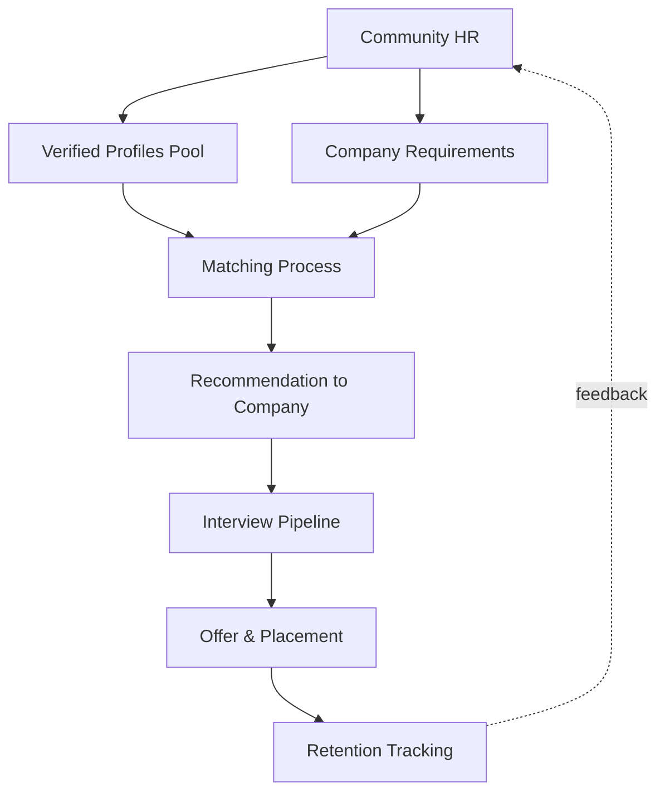
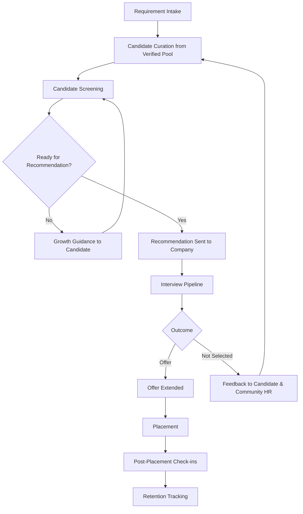
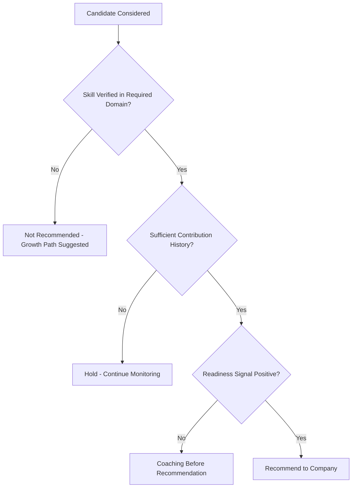
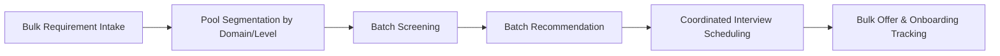
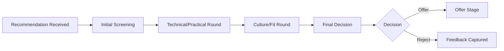
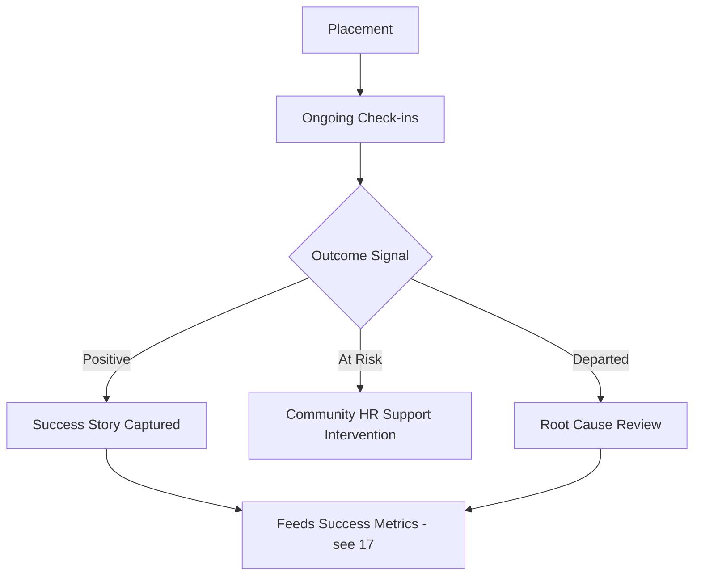

# 05 — HR Operations

> **Document Type:** HR Operations Model Document
> **Series:** Community Talent Ecosystem Platform — Business Documentation Suite
> **Cross-Reference:** `03_MEMBER_LIFECYCLE.md`, `06_COMPANY_PARTNERSHIP_MODEL.md`, `10_VERIFICATION_MODEL.md`

---

## 1. Purpose

This document defines how **Community HR** — a trusted, community-embedded function — operates the hiring lifecycle: from candidate screening through placement and retention, while preserving the "Trust Before Resume" principle established in `01_PROJECT_VISION.md`.

---

## 2. What Makes Community HR Different

| Traditional Recruiting | Community HR |
|--------------------------|----------------|
| Sources from open resume pools | Sources from verified, community-vetted members |
| Relies on self-reported skills | Relies on peer/mentor-verified skills |
| Limited visibility into practical ability | Visibility into contribution history and practice record |
| Transactional relationship | Ongoing relationship rooted in community trust |

> **Callout**
> Community HR does not "search" for candidates the way a recruiter searches a resume database. Community HR **curates and recommends** based on demonstrated, verified standing.

---

## 3. Community HR Operating Model

---

## 4. Hiring Lifecycle

### 4.1 Lifecycle Stages

| Stage | Description |
|-------|--------------|
| Requirement Intake | Company shares role needs with Community HR |
| Candidate Curation | Community HR identifies verified matches |
| Candidate Screening | Initial fit and readiness assessment |
| Recommendation | Curated shortlist sent to company |
| Interview Pipeline | Structured interview process |
| Feedback Loop | Interview feedback captured for both sides |
| Offer | Company extends offer |
| Placement | Candidate onboarded |
| Post-Placement | Ongoing check-ins |
| Retention | Long-term tracking of placement success |

### 4.2 Hiring Lifecycle Flow

---

## 5. Candidate Screening

### 5.1 Screening Criteria (Business View)

| Criterion | Description |
|-----------|--------------|
| Verified Skill Match | Candidate holds verified skills aligned to role needs |
| Contribution History | Depth and consistency of community contribution |
| Readiness Signal | Community HR judgment on interview readiness |
| Role Fit Indicators | Domain alignment, stated career goals |

### 5.2 Screening Decision Tree

---

## 6. Bulk Hiring

For companies with multiple open roles or high-volume hiring needs (e.g., graduate hiring drives):

| Step | Description |
|------|--------------|
| Bulk Requirement Intake | Company shares multiple role profiles at once |
| Pool Segmentation | Community HR segments verified members by domain/level |
| Batch Screening | Efficient, criteria-based screening at scale |
| Batch Recommendation | Shortlist delivered as a structured group |
| Coordinated Interview Scheduling | Structured pipeline to handle volume |

---

## 7. Interview Pipeline

### 7.1 Standard Pipeline Stages

| Stage | Owner |
|-------|--------|
| Initial Company Screening | Company |
| Technical/Practical Round | Company (informed by verified portfolio) |
| Community Fit / Culture Round | Company, informed by Community HR context |
| Final Decision | Company |

### 7.2 Interview Pipeline Diagram

---

## 8. Feedback

| Feedback Type | Purpose | Captured By |
|------------------|---------|--------------|
| Company → Candidate | Improve candidate readiness | Community HR |
| Company → Community HR | Improve future matching quality | Community HR |
| Candidate → Community HR | Improve candidate experience | Community HR |

> **Best Practice**
> Feedback loops must close within a defined window (e.g., within one week of an interview stage) to preserve candidate trust in the process.

---

## 9. Offer and Placement

### 9.1 Offer Stage Responsibilities

| Responsibility | Owner |
|------------------|--------|
| Offer negotiation support | Community HR (advisory), Company (final authority) |
| Offer acceptance tracking | Community HR |
| Onboarding coordination | Company, with Community HR visibility |

---

## 10. Post-Placement

### 10.1 Check-in Cadence (Illustrative)

| Milestone | Purpose |
|-----------|---------|
| 30 Days | Early onboarding health check |
| 90 Days | Role fit and satisfaction check |
| 6 Months | Retention and growth check |
| 12 Months | Long-term outcome and community re-engagement |

```mermaid
gantt
    title Post-Placement Check-in Timeline (Illustrative)
    dateFormat  X
    axisFormat %s
    section Check-ins
    30-Day Check-in       :a1, 0, 30
    90-Day Check-in       :a2, 30, 60
    6-Month Check-in      :a3, 90, 90
    12-Month Check-in     :a4, 180, 185
```

---

## 11. Retention

### 11.1 Retention Signals Tracked

| Signal | Business Meaning |
|--------|---------------------|
| Continued Employment | Placement stability |
| Continued Community Engagement | Alumni-level community health |
| Growth Within Company | Long-term placement success indicator |
| Return-to-Community Contribution | Indicates a healthy placement-to-mentor loop |

### 11.2 Retention Feedback Loop

---

## 12. Best Practices

- Never recommend a candidate solely because a company urgently needs headcount — recommendation quality protects long-term trust.
- Maintain transparent, documented screening criteria to avoid perceived bias.
- Treat "not recommended yet" as a growth conversation with the candidate, not a rejection.
- Track retention beyond placement — a hire is not "success" until sustained.

## 13. Assumptions

- Community HR operates independently of individual company sales pressure.
- Verified skill data (from `10_VERIFICATION_MODEL.md`) is available and current at the time of screening.

## 14. Future Scope

- Predictive readiness scoring based on historical placement retention data (business capability, not technical design).
- Formal candidate coaching program ahead of high-stakes interview pipelines.

## 15. Review Notes

| Reviewer Role | Focus Area | Status |
|----------------|------------|--------|
| Community HR Lead | Screening criteria fairness | Pending Review |
| Company Partnerships Lead | Employer experience alignment | Pending Review |

---

**Cross-References:** `03_MEMBER_LIFECYCLE.md` · `06_COMPANY_PARTNERSHIP_MODEL.md` · `10_VERIFICATION_MODEL.md` · `17_SUCCESS_METRICS.md`
