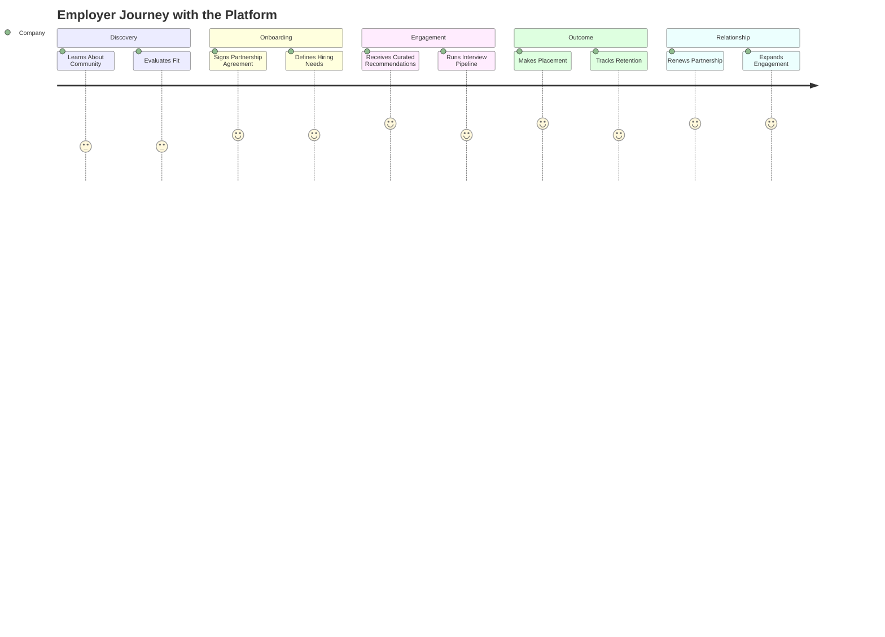
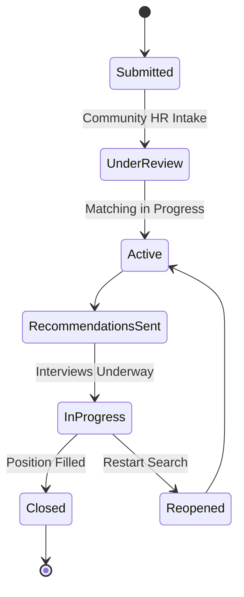
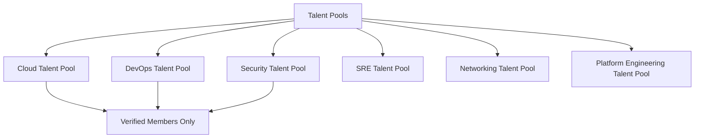
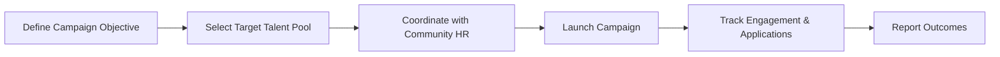
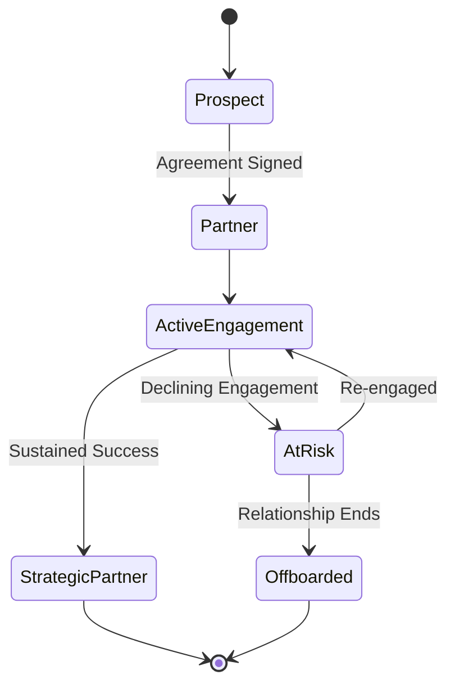

# 06 — Company Partnership Model

> **Document Type:** Partnership Model Document
> **Series:** Community Talent Ecosystem Platform — Business Documentation Suite
> **Cross-Reference:** `05_HR_OPERATIONS.md`, `02_COMMUNITY_BUSINESS_MODEL.md`

---

## 1. Purpose

This document defines the full employer-facing relationship — from first engagement through ongoing hiring partnership — describing the employer journey, benefits, dashboard capabilities (business-level), hiring request handling, talent pools, campaigns, reporting, and relationship management.

---

## 2. Employer Journey

---

## 3. Employer Benefits

| Benefit | Description |
|---------|--------------|
| Reduced Hiring Risk | Candidates arrive with verified, community-endorsed skill |
| Faster Time-to-Hire | Pre-curated shortlists reduce screening overhead |
| Access to Niche Talent | Deep pools in Networking, Cloud, DevOps, Security, SRE, and related domains |
| Employer Brand Visibility | Presence within a trusted technical community |
| Long-Term Talent Pipeline | Ongoing access rather than one-off transactional hiring |

---

## 4. Employer Dashboard (Business Capability View)

> **Note:** This section describes business capability only — no technical, UI, or system design is implied.

| Capability | Business Purpose |
|------------|---------------------|
| Talent Pool Visibility | View curated, verified candidate pools by domain |
| Hiring Request Management | Submit and track open role requirements |
| Pipeline Status Tracking | Understand where each candidate stands in process |
| Placement & Retention Reporting | Understand hiring outcomes over time |

---

## 5. Hiring Requests

### 5.1 Hiring Request Lifecycle

### 5.2 Hiring Request Data Points (Business-Level)

| Field | Purpose |
|-------|---------|
| Role Domain | Aligns to community skill categories |
| Experience Level | Aligns to lifecycle stage (Fresher, Experienced, etc.) |
| Required Verified Skills | Drives candidate matching |
| Urgency/Volume | Distinguishes single-role vs bulk hiring (see `05_HR_OPERATIONS.md`) |

---

## 6. Talent Pools

### 6.1 Talent Pool Structure

> **Callout**
> Talent pools are populated exclusively from the Verification Model (`10_VERIFICATION_MODEL.md`). Unverified members are not surfaced to companies, preserving trust integrity.

---

## 7. Recruitment Campaigns

### 7.1 Campaign Types

| Campaign Type | Use Case |
|-------------------|----------|
| Targeted Role Campaign | Filling a specific open role |
| Graduate/Fresher Drive | Bulk hiring from student/fresher pool |
| Domain Talent Spotlight | Highlighting a domain pool to raise employer awareness |
| Event-Linked Hiring Campaign | Hiring drive tied to a community event (see `12_COMMUNITY_EVENTS_MODEL.md`) |

### 7.2 Campaign Workflow

---

## 8. Placement Reports

| Report | Content | Audience |
|--------|---------|----------|
| Placement Summary Report | Roles filled, time-to-hire, source pool | Company Stakeholders |
| Retention Report | Post-placement retention status | Company HR, Community HR |
| Pipeline Health Report | Status of all active hiring requests | Company Hiring Managers |

---

## 9. Hiring Analytics (Business-Level)

> Business capability only — analytics mechanics are out of scope for this document.

| Metric | Business Question Answered |
|--------|-------------------------------|
| Time-to-Hire | How efficient is the hiring process? |
| Candidate-to-Offer Ratio | How well-matched are recommendations? |
| Retention Rate | How successful are placements long-term? |
| Talent Pool Utilization | How effectively is the pool being engaged? |

---

## 10. Relationship Management

### 10.1 Relationship Lifecycle

### 10.2 Relationship Tiers

| Tier | Description | Community Return |
|------|--------------|---------------------|
| New Partner | Early-stage engagement | Standard talent pool access |
| Active Partner | Consistent hiring activity | Priority recommendation support |
| Strategic Partner | Deep, sustained, multi-year engagement | Advisory input on skill standards, deeper visibility |

---

## 11. Governance Safeguards

- Companies cannot pay to influence candidate verification status or ranking.
- All company-facing recommendations originate exclusively from the verified talent pool.
- Partnership agreements must include community-standard non-influence clauses (see `13_COMMUNITY_GOVERNANCE.md`).

---

## 12. Best Practices

- Set clear expectations with new partners about the "trust-first" hiring model before onboarding.
- Provide partners with realistic timelines — quality curation takes longer than open-market sourcing but reduces downstream risk.
- Maintain a dedicated relationship owner per strategic partner to preserve continuity.

## 13. Assumptions

- Companies are willing to adapt internal hiring processes to accommodate a curated, trust-based pipeline.
- Partnership commercial terms are negotiated outside the scope of this business documentation (handled contractually).

## 14. Future Scope

- Multi-company shared hiring campaigns for niche domains.
- Formal employer advisory council feeding into skill standards (`10_VERIFICATION_MODEL.md`).

## 15. Review Notes

| Reviewer Role | Focus Area | Status |
|----------------|------------|--------|
| Partnerships Lead | Employer journey completeness | Pending Review |
| Community HR Lead | Talent pool integrity safeguards | Pending Review |

---

**Cross-References:** `05_HR_OPERATIONS.md` · `10_VERIFICATION_MODEL.md` · `12_COMMUNITY_EVENTS_MODEL.md` · `13_COMMUNITY_GOVERNANCE.md`
