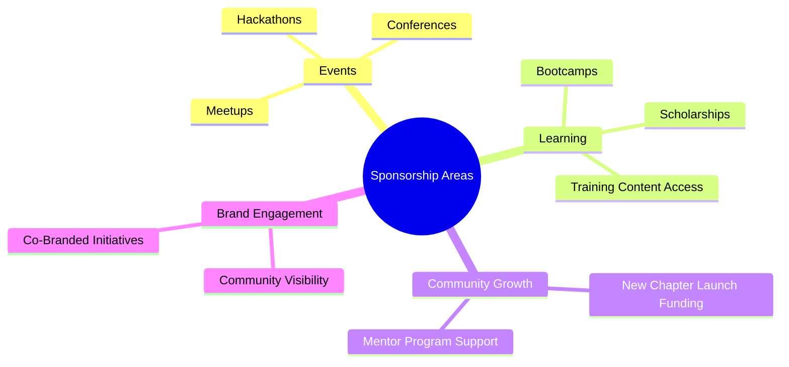
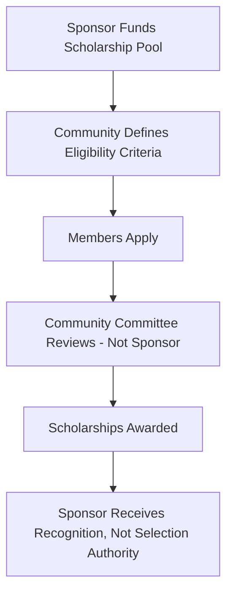
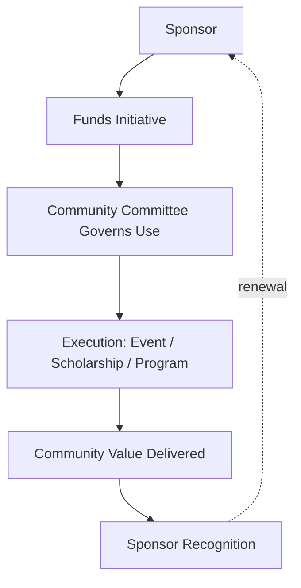
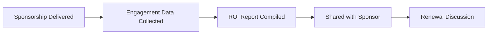

# 07 — Sponsorship Model

> **Document Type:** Sponsorship Model Document
> **Series:** Community Talent Ecosystem Platform — Business Documentation Suite
> **Cross-Reference:** `02_COMMUNITY_BUSINESS_MODEL.md`, `12_COMMUNITY_EVENTS_MODEL.md`

---

## 1. Purpose

This document defines how sponsors engage with and fund the community ecosystem — covering sponsor types, event and program sponsorship, brand visibility mechanics, marketing collaboration, and return on investment — while strictly preserving the "no pay-to-rank" principle from `01_PROJECT_VISION.md`.

---

## 2. Sponsorship Philosophy

> **Callout**
> Sponsorship funds the community's growth. It never funds influence over verification, reputation, ranking, or hiring outcomes. Every sponsorship agreement carries this as a binding, non-negotiable clause.

---

## 3. Sponsor Types

| Sponsor Type | Description |
|-----------------|--------------|
| Corporate Technology Sponsor | Technology companies investing in community visibility |
| Training/EdTech Sponsor | Organizations sponsoring learning access or scholarships |
| Event Sponsor | Funds specific meetups, conferences, hackathons |
| Community Growth Sponsor | Funds general ecosystem growth initiatives |

---

## 4. Sponsorship Areas

---

## 5. Events Sponsorship

| Element | Description |
|---------|--------------|
| Meetup Sponsorship | Funds venue, logistics, refreshments for local events |
| Conference Sponsorship | Funds larger, flagship community conferences |
| Hackathon Sponsorship | Funds prizes, infrastructure access, judging support |

---

## 6. Bootcamps and Training Sponsorship

| Element | Description |
|---------|--------------|
| Bootcamp Funding | Sponsors fund intensive, structured learning cohorts |
| Training Content Access | Sponsors fund member access to premium training partner content |

---

## 7. Scholarships

### 7.1 Scholarship Model

> **Decision Note**
> Scholarship recipient selection is always made by a community committee, never directly by the sponsor, to preserve merit-based integrity.

---

## 8. Brand Visibility

| Visibility Channel | Description |
|------------------------|--------------|
| Event Branding | Logo and mention at sponsored events |
| Community Communications | Recognition in newsletters, community updates |
| Sponsor Recognition Page | Dedicated acknowledgment within the community |

---

## 9. Marketing Collaboration

| Collaboration Type | Description |
|------------------------|--------------|
| Co-Branded Content | Joint webinars, technical sessions |
| Community Spotlight Features | Sponsor-supported member success stories |
| Joint Event Promotion | Shared marketing reach for sponsored events |

---

## 10. Community Collaboration Model

---

## 11. Sponsorship Tiers (Illustrative)

| Tier | Investment Focus | Recognition Level |
|------|----------------------|------------------------|
| Community Supporter | General fund | Standard recognition |
| Event Partner | Specific events | Event-level branding |
| Scholarship Partner | Learning access | Named scholarship recognition |
| Strategic Ecosystem Partner | Multi-initiative, long-term | Deep, ongoing visibility, advisory input (non-merit) |

---

## 12. ROI (Business View)

### 12.1 Sponsor Value Metrics

| Metric | What It Demonstrates |
|--------|--------------------------|
| Event Reach | Number of members engaged through sponsored events |
| Content Engagement | Interaction with co-branded content |
| Community Sentiment | Qualitative feedback on sponsor perception |
| Renewal Rate | Long-term sponsor satisfaction |

### 12.2 ROI Reporting Flow

---

## 13. Governance Safeguards

- No sponsor may influence verification, reputation, or hiring outcomes (see `10_VERIFICATION_MODEL.md`, `11_COMMUNITY_REPUTATION_SYSTEM.md`).
- All sponsorship agreements are reviewed against community guidelines by the Governance Committee (`13_COMMUNITY_GOVERNANCE.md`).
- Conflicts of interest (e.g., a sponsor also acting as a hiring company) must be disclosed.

---

## 14. Best Practices

- Clearly separate sponsorship funding decisions from merit-based community decisions in every agreement.
- Provide sponsors with transparent, regular reporting to sustain long-term relationships.
- Diversify the sponsor base to avoid over-reliance on any single sponsor.

## 15. Assumptions

- Sponsors accept the non-influence principle as a condition of engagement.
- Scholarship and program funding will be pooled and community-governed rather than sponsor-directed at the individual level.

## 16. Future Scope

- Multi-year strategic sponsorship program with formalized advisory (non-merit) councils.
- Sponsor-funded, community-nominated "Impact Awards."

## 17. Review Notes

| Reviewer Role | Focus Area | Status |
|----------------|------------|--------|
| Partnerships Lead | Sponsorship tier structure | Pending Review |
| Governance Committee | Non-influence safeguard adequacy | Pending Review |

---

**Cross-References:** `02_COMMUNITY_BUSINESS_MODEL.md` · `12_COMMUNITY_EVENTS_MODEL.md` · `13_COMMUNITY_GOVERNANCE.md`
