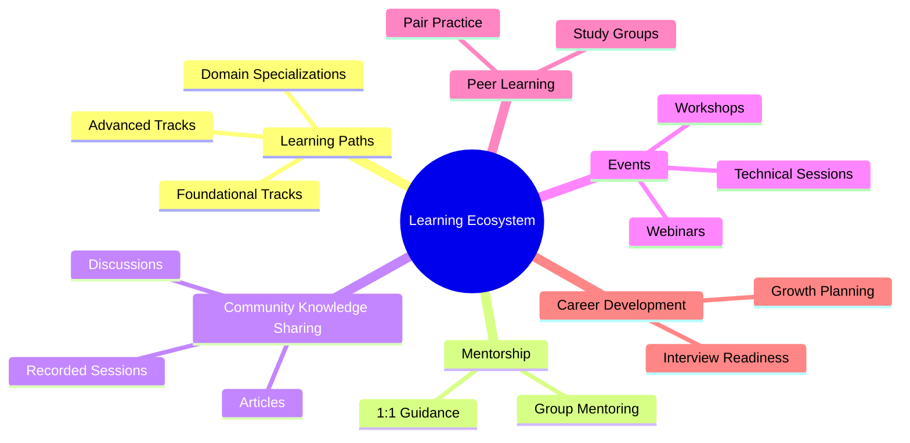
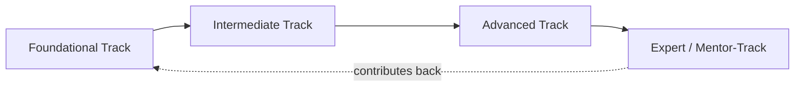
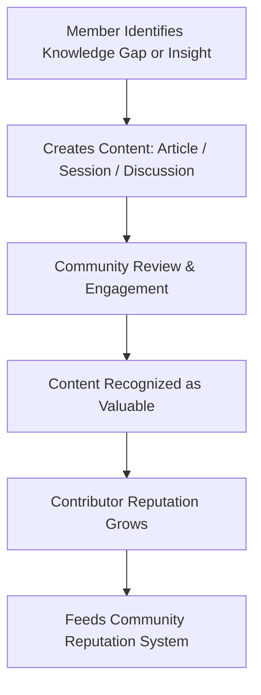
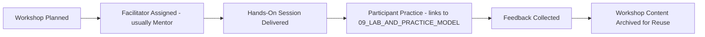
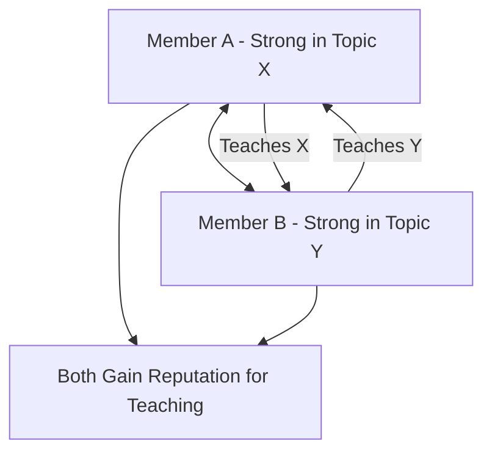
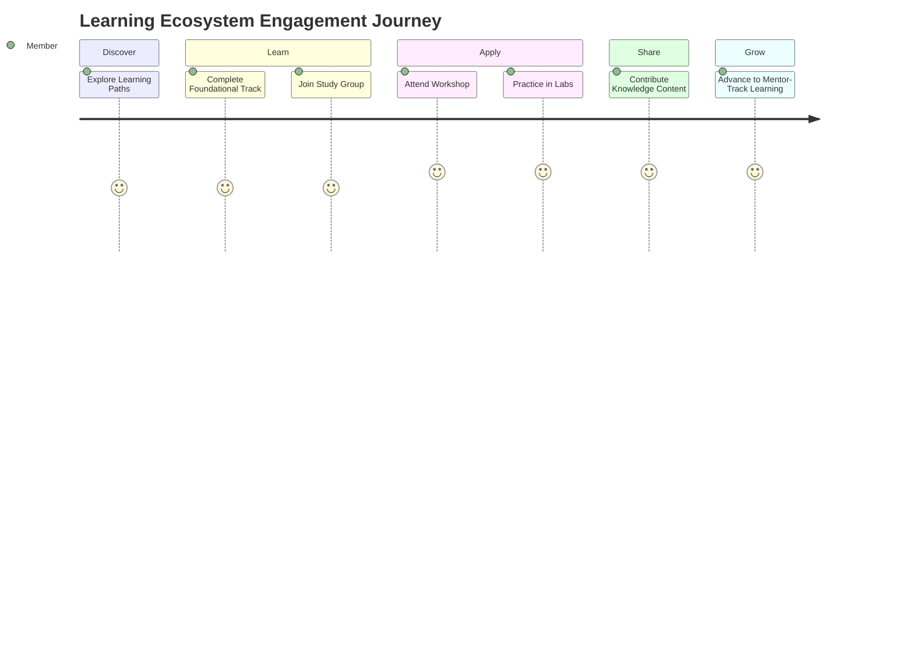

# 08 — Learning Ecosystem

> **Document Type:** Learning Model Document
> **Series:** Community Talent Ecosystem Platform — Business Documentation Suite
> **Cross-Reference:** `03_MEMBER_LIFECYCLE.md`, `09_LAB_AND_PRACTICE_MODEL.md`

---

## 1. Purpose

This document defines the philosophy and structure of learning within the ecosystem — how members grow through learning paths, mentorship, community knowledge sharing, and events, in service of the "Learning Before Hiring" principle.

---

## 2. Learning Philosophy

> **Quote**
> *"We don't teach to certify. We teach to prepare members to contribute, prove, and grow."*

| Principle | Description |
|-----------|--------------|
| Community-Sourced Knowledge | Much of the learning content is created and refined by the community itself |
| Applied Over Theoretical | Learning is oriented toward practice and real capability (see `09_LAB_AND_PRACTICE_MODEL.md`) |
| Peer-Reinforced | Learning is reinforced through community interaction, not solitary consumption |
| Continuous, Not Terminal | Learning does not end at "completion" — it's an ongoing part of community identity |

---

## 3. Learning Ecosystem Map

---

## 4. Learning Paths

### 4.1 Learning Path Structure

| Level | Description |
|-------|--------------|
| Foundational | Core concepts for a domain (e.g., Networking Basics) |
| Intermediate | Applied, role-relevant depth |
| Advanced | Specialization and complex scenario readiness |
| Expert / Mentor-Track | Preparation to teach and verify others |

### 4.2 Learning Path Flow

### 4.3 Domain Learning Paths (Illustrative)

| Domain | Example Path Focus |
|--------|--------------------|
| Networking | Fundamentals → Enterprise Networking → Advanced Troubleshooting |
| Cloud | Cloud Fundamentals → Multi-Cloud Operations → Cloud Architecture Practices |
| DevOps | CI/CD Fundamentals → Automation Practices → Advanced Delivery Practices |
| Security | Security Fundamentals → Applied Security Practices → Advanced Threat Readiness |
| SRE | Reliability Fundamentals → Incident Practices → Advanced SRE Practices |

---

## 5. Mentorship in Learning

Mentorship mechanics are detailed in `03_MEMBER_LIFECYCLE.md` and `11_COMMUNITY_REPUTATION_SYSTEM.md`. Within the learning ecosystem specifically:

| Mentorship Form | Description |
|---------------------|--------------|
| Guided Learning Support | Mentors help learners navigate learning paths |
| Practice Review | Mentors review practice submissions (see `09_LAB_AND_PRACTICE_MODEL.md`) |
| Career Guidance | Mentors advise on growth direction |

---

## 6. Communities (Knowledge Sharing Spaces)

| Space Type | Purpose |
|----------------|---------|
| Domain Discussion Spaces | Ongoing topical discussion by domain |
| Q&A Spaces | Structured question-and-answer knowledge exchange |
| Resource Sharing Spaces | Community-curated learning resources |

---

## 7. Knowledge Sharing

### 7.1 Contribution Formats

| Format | Description |
|--------|--------------|
| Written Articles | Member-authored knowledge content |
| Recorded Sessions | Talks, walkthroughs, and explainer sessions |
| Live Discussions | Real-time knowledge exchange |

### 7.2 Knowledge Sharing Flow

---

## 8. Events (Learning-Linked)

Full detail in `12_COMMUNITY_EVENTS_MODEL.md`. Within the learning ecosystem, events serve as concentrated, high-engagement learning moments:

| Event Type | Learning Purpose |
|----------------|----------------------|
| Technical Sessions | Deep-dive knowledge transfer |
| Workshops | Hands-on, guided applied learning |
| Study Groups | Cohort-based sustained learning |
| Webinars | Broad-reach knowledge sharing |

---

## 9. Technical Sessions

| Element | Description |
|---------|--------------|
| Speaker | Typically a mentor or recognized contributor |
| Format | Structured presentation plus Q&A |
| Outcome | Recorded and archived for ongoing community access |

---

## 10. Workshops

---

## 11. Study Groups

| Element | Description |
|---------|--------------|
| Formation | Members self-organize or are grouped by learning path/cohort |
| Cadence | Regular, recurring sessions |
| Outcome | Shared accountability and deeper peer learning |

---

## 12. Peer Learning

### 12.1 Peer Learning Model

> **Best Practice**
> Peer learning should be explicitly recognized within the reputation system (`11_COMMUNITY_REPUTATION_SYSTEM.md`) — teaching is a contribution, not just a courtesy.

---

## 13. Career Development

| Element | Description |
|---------|--------------|
| Growth Planning | Members set and revisit career growth goals with mentor input |
| Interview Readiness | Guidance and practice ahead of Community HR recommendations |
| Portfolio Refinement | Ongoing improvement of the member's professional portfolio |

---

## 14. Learning Ecosystem Journey

---

## 15. Best Practices

- Keep learning paths modular so members can move at individual pace.
- Recognize teaching and content contribution as equally valuable to consuming content.
- Archive all sessions and workshops for long-term community value.
- Regularly refresh learning paths to reflect evolving industry practice (governed content review, not technical process).

## 16. Assumptions

- Learning content will be a blend of community-created and training-partner-provided material (see `02_COMMUNITY_BUSINESS_MODEL.md`).
- Learning paths are domain-aligned to the professional categories defined in `01_PROJECT_VISION.md`.

## 17. Future Scope

- Cross-domain learning paths (e.g., Cloud + Security hybrid tracks).
- Community-elected "Learning Path Stewards" responsible for content quality per domain.

## 18. Review Notes

| Reviewer Role | Focus Area | Status |
|----------------|------------|--------|
| Learning Team Lead | Learning path structure completeness | Pending Review |
| Community Mentorship Lead | Mentor involvement in learning | Pending Review |

---

**Cross-References:** `03_MEMBER_LIFECYCLE.md` · `09_LAB_AND_PRACTICE_MODEL.md` · `11_COMMUNITY_REPUTATION_SYSTEM.md` · `12_COMMUNITY_EVENTS_MODEL.md`
