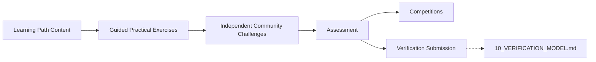
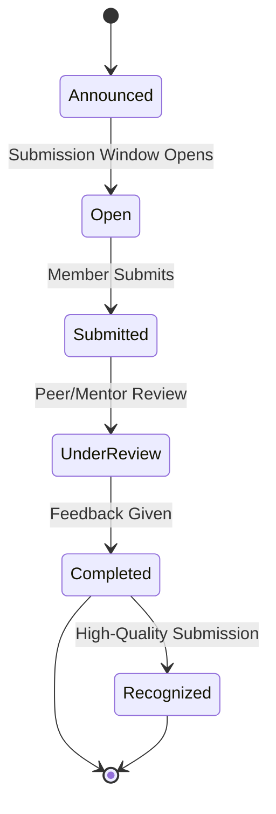
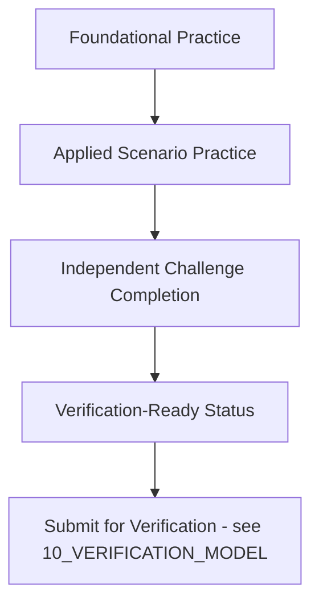
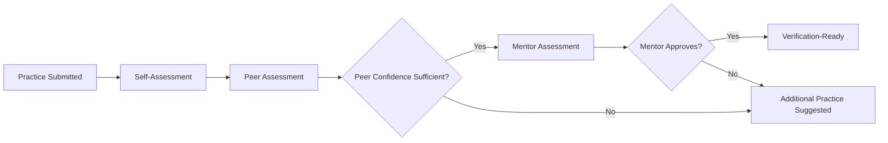
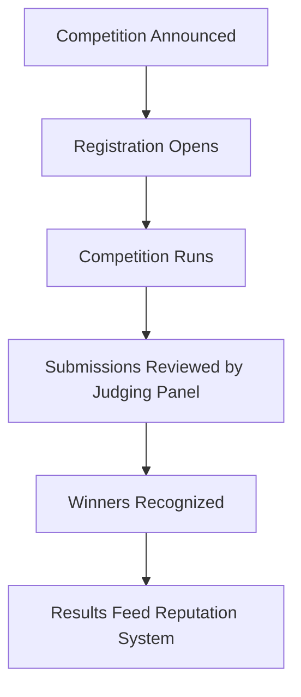
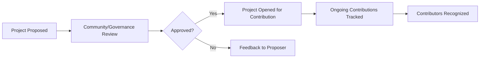
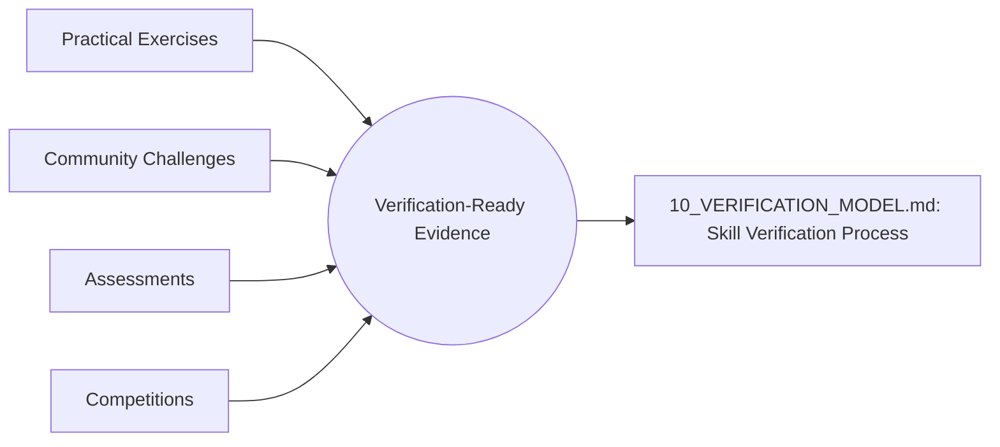

# 09 — Lab and Practice Model

> **Document Type:** Practice Model Document
> **Series:** Community Talent Ecosystem Platform — Business Documentation Suite
> **Cross-Reference:** `08_LEARNING_ECOSYSTEM.md`, `10_VERIFICATION_MODEL.md`

---

## 1. Purpose

This document defines how members move from theoretical learning to demonstrated, practical capability — the business model for hands-on practice, community challenges, assessment, and competitions. This is the layer that produces the evidence later used in verification (`10_VERIFICATION_MODEL.md`).

> **Note:** This document describes the business model of practice and assessment — not the technical lab infrastructure, tooling, or system design used to deliver it.

---

## 2. Hands-On Learning Philosophy

> **Quote**
> *"Knowing a concept and being able to apply it under real conditions are two different achievements. This ecosystem verifies the second."*

| Principle | Description |
|-----------|--------------|
| Practice Precedes Proof | Practical exercises are the raw material for verification |
| Community-Graded | Practice is often reviewed by peers/mentors, not just self-assessed |
| Progressive Difficulty | Practice scales from guided to independent to competitive |

---

## 3. Practice Model Overview

---

## 4. Practical Exercises

| Exercise Type | Description |
|-------------------|--------------|
| Guided Exercise | Step-by-step applied task tied directly to a learning path module |
| Scenario Exercise | Realistic, role-based problem scenario |
| Reflection Exercise | Member documents approach and reasoning, reviewed by peers/mentors |

---

## 5. Community Challenges

### 5.1 Challenge Types

| Challenge Type | Cadence | Purpose |
|-----------------|---------|---------|
| Weekly Practice Challenge | Weekly | Sustained engagement and skill reinforcement |
| Domain Deep-Dive Challenge | Monthly | Depth in a specific skill area |
| Community-Wide Challenge | Quarterly | Cross-domain visibility and engagement |

### 5.2 Challenge Lifecycle

---

## 6. Practice Roadmaps

### 6.1 Roadmap Concept

A Practice Roadmap is a structured sequence of exercises and challenges aligned to a learning path, designed to build a member toward verification-readiness in a specific skill.

### 6.2 Illustrative Roadmap Table

| Stage | Example Activity | Outcome Signal |
|-------|----------------------|-------------------|
| Stage 1 | Guided lab exercises | Foundational competence |
| Stage 2 | Scenario-based practice | Applied competence |
| Stage 3 | Community challenge completion | Independent competence |
| Stage 4 | Verification submission | Community-endorsed competence |

---

## 7. Assessment

### 7.1 Assessment Model (Business View)

| Assessment Type | Description | Reviewer |
|---------------------|--------------|-----------|
| Self-Assessment | Member reflects on readiness | Member |
| Peer Assessment | Community member reviews submitted practice | Peer |
| Mentor Assessment | Formal review ahead of verification | Mentor |

### 7.2 Assessment Flow

---

## 8. Competitions

| Competition Type | Description |
|----------------------|--------------|
| Domain Championships | Competitive events within a specific domain |
| Cross-Domain Hackathon-Style Events | Broader, collaborative competitive challenges |
| Community Recognition Competitions | Lighter-weight, engagement-driven contests |

### 8.1 Competition Lifecycle

---

## 9. Community Projects

| Project Type | Description |
|-------------------|--------------|
| Community-Built Resource | Collaborative, member-built knowledge or tool resource |
| Open Contribution Initiative | Ongoing project members can contribute to over time |

### 9.1 Community Project Flow

---

## 10. Practice-to-Verification Bridge

---

## 11. Best Practices

- Keep the difficulty curve gradual — a steep jump from guided practice to independent challenge discourages early-stage members.
- Ensure every challenge has clear, published review criteria to maintain fairness.
- Recognize participation, not just winning, to sustain engagement across skill levels.
- Rotate challenge topics to keep the practice ecosystem fresh and broadly relevant.

## 12. Assumptions

- Practice activities are domain-aligned with learning paths defined in `08_LEARNING_ECOSYSTEM.md`.
- Peer and mentor reviewers have sufficient bandwidth; volunteer/mentor load is monitored per `04_COMMUNITY_OPERATIONS.md`.

## 13. Future Scope

- Formal practice-based "readiness score" feeding directly into HR screening (`05_HR_OPERATIONS.md`).
- Company-sponsored real-world challenge scenarios (with strict non-influence safeguards, per `07_SPONSORSHIP_MODEL.md`).

## 14. Review Notes

| Reviewer Role | Focus Area | Status |
|----------------|------------|--------|
| Learning Team Lead | Practice-to-verification alignment | Pending Review |
| Mentor Council | Assessment fairness and workload | Pending Review |

---

**Cross-References:** `08_LEARNING_ECOSYSTEM.md` · `10_VERIFICATION_MODEL.md` · `11_COMMUNITY_REPUTATION_SYSTEM.md`
