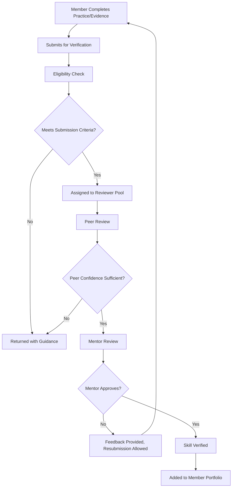
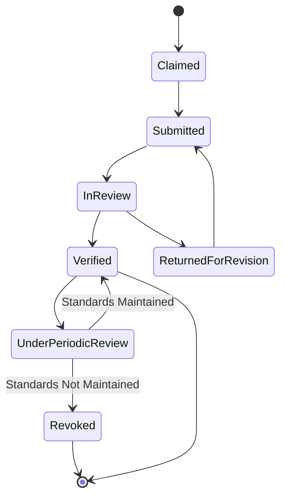
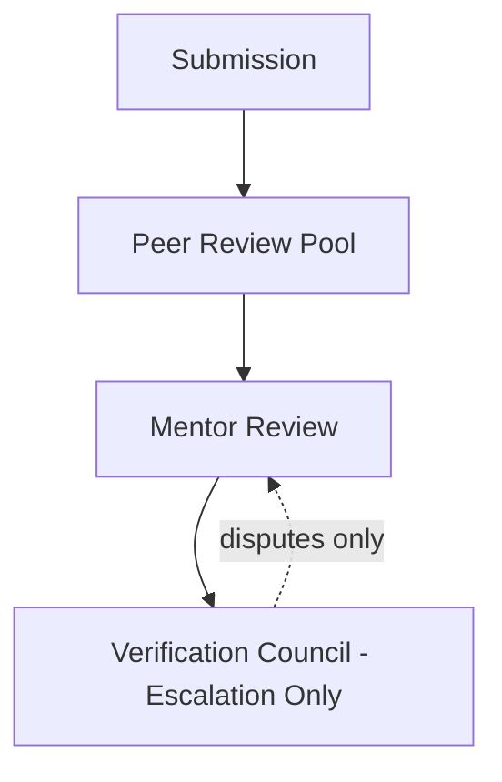
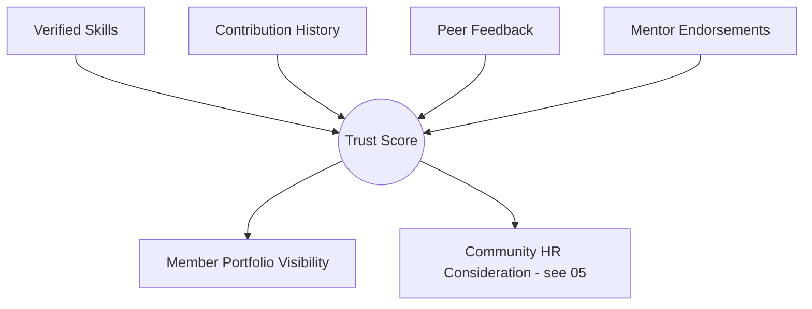
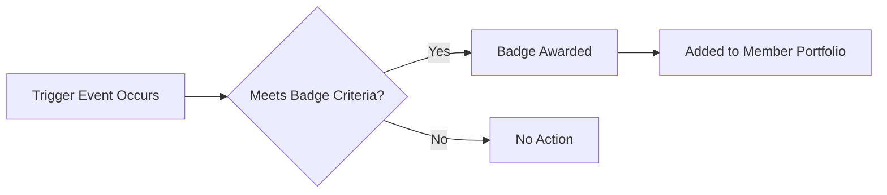
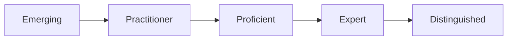
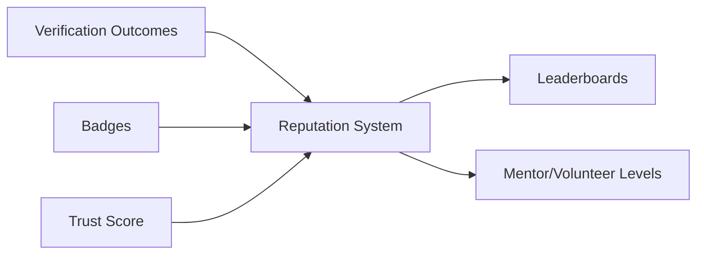
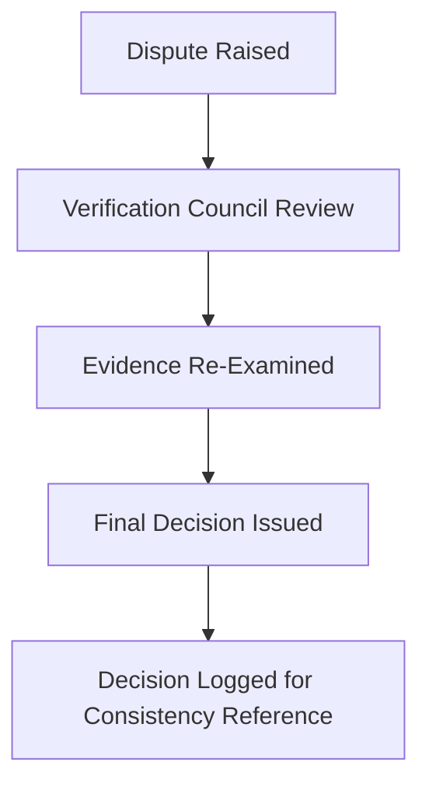

# 10 — Verification Model

> **Document Type:** Trust & Verification Model Document
> **Series:** Community Talent Ecosystem Platform — Business Documentation Suite
> **Cross-Reference:** `09_LAB_AND_PRACTICE_MODEL.md`, `11_COMMUNITY_REPUTATION_SYSTEM.md`, `05_HR_OPERATIONS.md`

---

## 1. Purpose

Verification is the single most important trust mechanism in the entire ecosystem — it is what converts a claimed skill into a community-endorsed, employer-trustable fact. This document defines the business model for how skill verification, community review, assessment, trust scoring, badges, and professional levels work together.

> **Callout**
> Every other document in this suite — hiring, reputation, portfolios, career growth — ultimately depends on the integrity of this model.

---

## 2. Verification Philosophy

| Principle | Description |
|-----------|--------------|
| Community-Verified, Not Self-Declared | No skill is considered "proven" until reviewed and endorsed by qualified peers/mentors |
| Evidence-Based | Verification is grounded in practical evidence (see `09_LAB_AND_PRACTICE_MODEL.md`) |
| Transparent Standards | Verification criteria are public and consistent |
| Revocable Trust | Verified status can be reviewed and revoked if standards are later found unmet |

---

## 3. Skill Verification Process

### 3.1 Verification Flow

### 3.2 Verification States

---

## 4. Community Review

### 4.1 Reviewer Roles

| Role | Responsibility |
|------|------------------|
| Peer Reviewer | Community members with relevant domain standing, providing first-pass review |
| Mentor Reviewer | Senior, trusted members providing final verification authority |
| Verification Council (escalation) | Handles disputed or edge-case verification decisions |

### 4.2 Review Panel Structure

---

## 5. Assessments

Assessment mechanics are detailed in `09_LAB_AND_PRACTICE_MODEL.md`. Within verification specifically, assessment results serve as the primary evidentiary basis for a reviewer's decision.

| Evidence Type | Weight in Verification Decision |
|-------------------|-------------------------------------|
| Practical Exercise Outcomes | High |
| Community Challenge Performance | High |
| Peer Endorsement History | Medium |
| Contribution/Teaching History | Medium |

---

## 6. Practical Validation

> **Decision Note**
> Verification is never granted on the basis of course completion alone. Practical validation — demonstrated application — is a mandatory input.

### 6.1 Practical Validation Criteria (Business View)

| Criterion | Description |
|-----------|--------------|
| Correctness | The practical work meets the defined standard for the skill |
| Independence | The work reflects the member's own understanding, not guided assistance |
| Consistency | The member demonstrates the skill more than once, not as a single fluke result |

---

## 7. Trust Score

### 7.1 Trust Score Concept

A **Trust Score** is a composite, business-level indicator of a member's overall verified standing and community credibility — combining verified skills, contribution history, and community feedback.

### 7.2 Trust Score Principles

| Principle | Description |
|-----------|--------------|
| No Purchase Path | Trust Score cannot be purchased, boosted by sponsorship, or fast-tracked by companies |
| Decays Without Activity | Sustained inactivity may reduce visibility of trust standing (subject to periodic review) |
| Transparent to the Member | Members can see how their own trust standing is composed |

---

## 8. Badges

| Badge Category | Example | Trigger |
|--------------------|---------|---------|
| Skill Badge | "Verified: Cloud Fundamentals" | Skill verification approval |
| Contribution Badge | "Community Contributor" | Sustained content/discussion contribution |
| Milestone Badge | "1-Year Member" | Tenure milestone |
| Leadership Badge | "Mentor" / "Chapter Lead" | Role attainment |

### 8.1 Badge Award Flow

---

## 9. Professional Levels

### 9.1 Level Structure (Illustrative)

| Level | Description | Typical Basis |
|-------|--------------|-------------------|
| Emerging | New to the domain, foundational learning underway | Registration + early learning activity |
| Practitioner | Verified foundational skill(s) | 1+ verified skill |
| Proficient | Verified intermediate/advanced skill(s) + sustained contribution | Multiple verified skills, contribution history |
| Expert | Deep verified expertise + mentorship activity | Verified advanced skill + active mentoring |
| Distinguished | Sustained, recognized community leadership | Long-term contribution, leadership role |

### 9.2 Level Progression

---

## 10. Community Reputation (Interface)

Verification is a primary input into the broader Community Reputation System — full detail in `11_COMMUNITY_REPUTATION_SYSTEM.md`.

---

## 11. Verification Disputes

| Step | Description |
|------|--------------|
| Dispute Raised | Member or reviewer flags a disagreement |
| Verification Council Review | Escalation-only panel reviews the case |
| Final Decision | Council decision is binding, documented, and communicated |

---

## 12. Best Practices

- Keep verification criteria domain-specific and publicly documented to avoid perceived arbitrariness.
- Rotate peer reviewers to prevent reviewer fatigue and bias.
- Periodically re-review verified status for fast-evolving domains (e.g., security) to keep trust current.
- Never allow commercial relationships (sponsorship, company partnership) to shortcut the verification pipeline.

## 13. Assumptions

- A sufficient pool of qualified peer and mentor reviewers exists or is cultivated as the community matures.
- Verification criteria will be domain-specific and maintained by community subject-matter stewards.

## 14. Future Scope

- Formal periodic re-verification cycles for high-change domains.
- Cross-community verification recognition (federated trust across partner communities).

## 15. Review Notes

| Reviewer Role | Focus Area | Status |
|----------------|------------|--------|
| Mentor Council | Verification criteria rigor | Pending Review |
| Governance Committee | Dispute resolution authority | Pending Review |

---

**Cross-References:** `09_LAB_AND_PRACTICE_MODEL.md` · `11_COMMUNITY_REPUTATION_SYSTEM.md` · `05_HR_OPERATIONS.md` · `06_COMPANY_PARTNERSHIP_MODEL.md`
