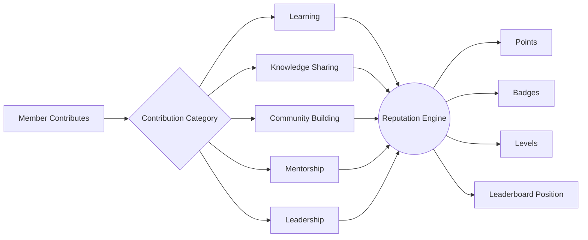
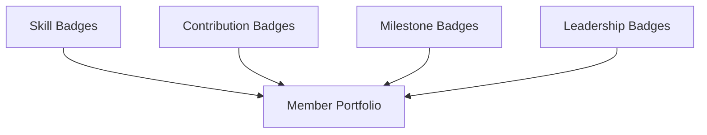
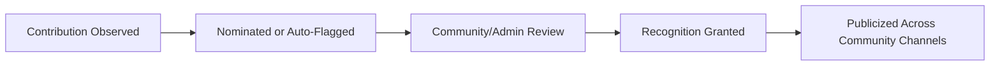
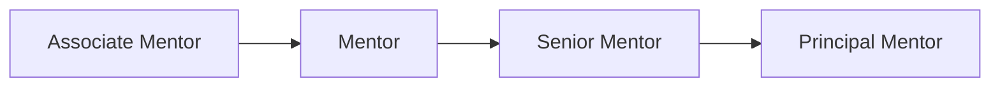
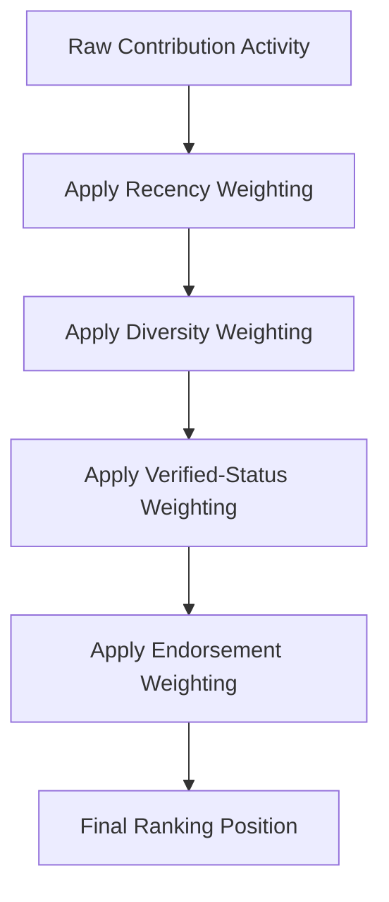
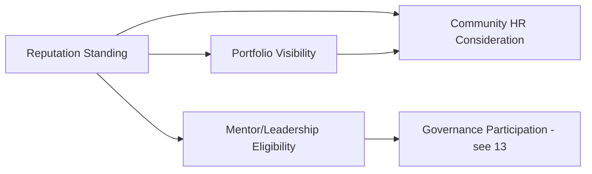

# 11 — Community Reputation System

> **Document Type:** Reputation Model Document
> **Series:** Community Talent Ecosystem Platform — Business Documentation Suite
> **Cross-Reference:** `10_VERIFICATION_MODEL.md`, `03_MEMBER_LIFECYCLE.md`

---

## 1. Purpose

This document defines the business model for how contribution translates into visible, structured reputation — the points, badges, achievements, recognition, leaderboards, and level systems that reward members for building and sustaining the community.

---

## 2. Reputation Philosophy

> **Quote**
> *"Reputation here is not popularity. It is a visible record of contribution the community has chosen to recognize."*

| Principle | Description |
|-----------|--------------|
| Contribution Before Reputation | Reputation always follows demonstrated contribution, never precedes it |
| Multi-Dimensional | Reputation reflects learning, verification, teaching, mentoring, and community-building — not a single axis |
| Transparent | Reputation mechanics are visible and understandable to members |
| Non-Purchasable | Reputation cannot be bought, sponsored, or fast-tracked |

---

## 3. Contribution Model

### 3.1 Contribution Categories

| Category | Example Contribution |
|--------------|---------------------------|
| Learning Contribution | Completing learning paths, practice challenges |
| Knowledge Contribution | Writing articles, running sessions, answering questions |
| Community Building | Volunteering, event support, onboarding new members |
| Mentorship Contribution | Guiding members, reviewing verification submissions |
| Leadership Contribution | Chapter leadership, governance participation |

### 3.2 Contribution-to-Reputation Flow

---

## 4. Points

### 4.1 Points Philosophy (Business View)

> Points are directional signals of contribution volume and consistency — they are **not** a replacement for verification (`10_VERIFICATION_MODEL.md`) and never substitute for verified skill status in hiring decisions.

| Point Source | Relative Weight |
|-------------------|----------------------|
| Verified Skill Achieved | High |
| Quality Knowledge Contribution | Medium-High |
| Sustained Participation | Medium |
| Event Attendance | Low-Medium |
| Mentorship Activity | High |

---

## 5. Badges

Badge mechanics are shared with `10_VERIFICATION_MODEL.md`. Within the reputation system, badges serve as the visible, portable symbols of contribution and trust displayed on a member's portfolio.

---

## 6. Achievements

| Achievement Type | Example |
|----------------------|---------|
| Consistency Achievement | "Active every month for a year" |
| Depth Achievement | "10 verified skills across domains" |
| Community Impact Achievement | "Answered 100 community questions" |
| Growth Achievement | "Mentored 5 members to verification" |

---

## 7. Recognition

### 7.1 Recognition Mechanisms

| Mechanism | Description |
|---------------|--------------|
| Community Shoutouts | Public acknowledgment of notable contribution |
| Spotlight Features | Featured member stories in community communications |
| Award Ceremonies | Periodic, formal recognition events (see `12_COMMUNITY_EVENTS_MODEL.md`) |

### 7.2 Recognition Cycle

---

## 8. Leaderboards

### 8.1 Leaderboard Types

| Leaderboard | Basis |
|-----------------|-------|
| Overall Contribution Leaderboard | Aggregate points across all categories |
| Domain Leaderboard | Contribution within a specific domain (e.g., Security) |
| Mentorship Leaderboard | Mentoring activity and outcomes |
| Chapter Leaderboard | Aggregate chapter-level contribution |

> **Best Practice**
> Leaderboards should reset or rebalance periodically (e.g., seasonally) to keep long-standing members from permanently dominating visibility and to encourage sustained, current participation.

---

## 9. Mentor Levels

| Level | Criteria (Illustrative) |
|-------|-------------------------------|
| Associate Mentor | Newly approved into Mentor Track |
| Mentor | Sustained mentoring activity with positive outcomes |
| Senior Mentor | Extended tenure, high-impact mentoring record |
| Principal Mentor | Community-wide recognized authority, often governance-eligible |

---

## 10. Volunteer Levels

| Level | Criteria (Illustrative) |
|-------|-------------------------------|
| New Volunteer | Recently onboarded |
| Active Volunteer | Consistent recent contribution |
| Core Volunteer | Sustained, high-trust contribution over time |
| Volunteer Lead | Coordinates other volunteers |

---

## 11. Ranking Algorithms (Business Logic Only)

> **Note:** This section describes business logic at a conceptual level only. No technical scoring formulas, code, or system architecture are included, per documentation scope.

| Ranking Factor | Business Rationale |
|--------------------|--------------------------|
| Recency of Contribution | Keeps rankings reflective of current engagement |
| Diversity of Contribution | Rewards well-rounded community members over single-category grinding |
| Verified vs. Unverified Weight | Verified achievements weigh more heavily than unverified activity |
| Community Endorsement | Peer and mentor endorsement carries meaningful weight |

### 11.1 Ranking Consideration Flow

---

## 12. Reputation-to-Opportunity Linkage

---

## 13. Best Practices

- Keep reputation mechanics transparent — members should always understand why they hold their current standing.
- Weight verified, evidence-backed contribution above raw activity volume.
- Guard against gaming behaviors (e.g., low-effort high-frequency posting) through diversity and quality weighting.
- Regularly celebrate a broad range of contribution types, not just top-leaderboard members.

## 14. Assumptions

- Reputation signals are computed and displayed at a business-capability level; underlying technical scoring mechanisms are out of scope for this document.
- Reputation is portable across chapters within the community.

## 15. Future Scope

- Cross-community reputation portability (federated trust networks).
- Reputation-linked community grants or micro-funding for high-impact contributors.

## 16. Review Notes

| Reviewer Role | Focus Area | Status |
|----------------|------------|--------|
| Community Operations | Anti-gaming safeguards | Pending Review |
| Mentor Council | Mentor/Volunteer level criteria | Pending Review |

---

**Cross-References:** `10_VERIFICATION_MODEL.md` · `03_MEMBER_LIFECYCLE.md` · `04_COMMUNITY_OPERATIONS.md` · `05_HR_OPERATIONS.md`
