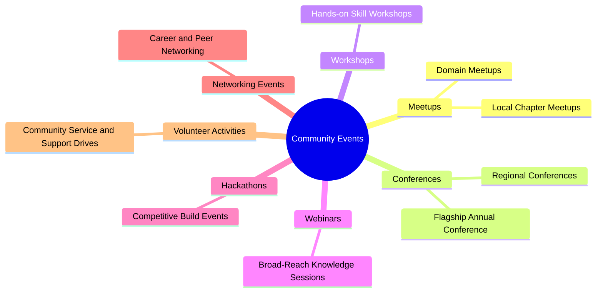
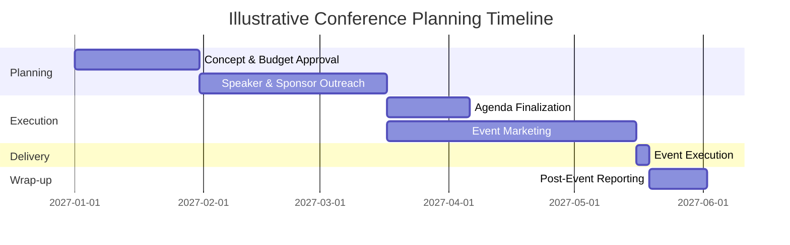
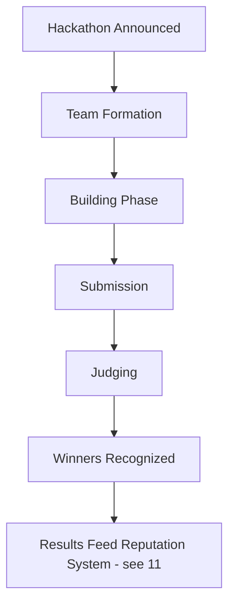
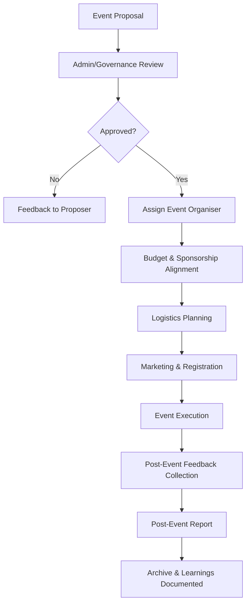
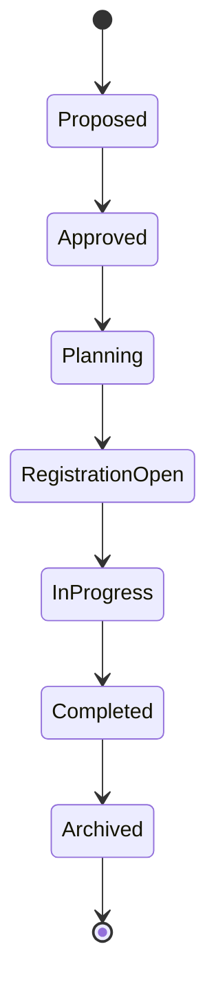
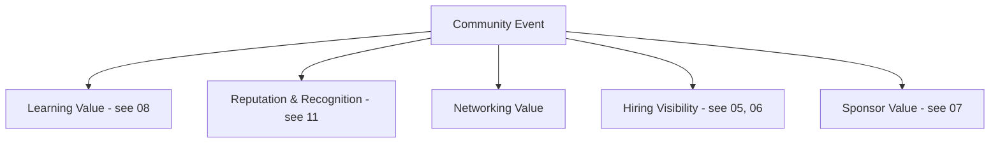

# 12 — Community Events Model

> **Document Type:** Events Model Document
> **Series:** Community Talent Ecosystem Platform — Business Documentation Suite
> **Cross-Reference:** `04_COMMUNITY_OPERATIONS.md`, `07_SPONSORSHIP_MODEL.md`, `08_LEARNING_ECOSYSTEM.md`

---

## 1. Purpose

This document defines the business model for how the community plans, runs, and derives value from events — meetups, conferences, workshops, webinars, hackathons, networking events, and volunteer activities.

---

## 2. Event Types Overview

---

## 3. Meetups

| Element | Description |
|---------|--------------|
| Format | Small-scale, local or virtual, recurring |
| Purpose | Sustained local community connection |
| Owner | Chapter Lead + Event Organisers |

---

## 4. Conferences

| Element | Description |
|---------|--------------|
| Format | Large-scale, multi-session, often annual |
| Purpose | Flagship community showcase, cross-chapter unification |
| Owner | Central Community Operations + Chapter Representatives |

### 4.1 Conference Planning Timeline (Illustrative)

---

## 5. Workshops

Cross-referenced with `08_LEARNING_ECOSYSTEM.md` — workshops are hands-on, facilitator-led learning events, typically smaller and more applied than conferences.

---

## 6. Webinars

| Element | Description |
|---------|--------------|
| Format | Virtual, broad-reach, often recorded |
| Purpose | Scalable knowledge sharing across all chapters |
| Owner | Learning Team / Mentors |

---

## 7. Hackathons

### 7.1 Hackathon Model

| Element | Description |
|---------|--------------|
| Sponsorship Link | Often sponsor-funded (see `07_SPONSORSHIP_MODEL.md`) |
| Hiring Link | Strong performers may be surfaced to Community HR (see `05_HR_OPERATIONS.md`) |

---

## 8. Networking Events

| Element | Description |
|---------|--------------|
| Purpose | Facilitate peer and career connections |
| Format | Structured mixers, roundtables, "office hours" with mentors |

---

## 9. Volunteer Activities

Cross-referenced with `04_COMMUNITY_OPERATIONS.md` — volunteer-run initiatives such as community support drives, onboarding buddy programs, and event logistics support.

---

## 10. Planning Workflow

### 10.1 General Event Planning Flow

### 10.2 Event Roles

| Role | Responsibility |
|------|------------------|
| Event Organiser | End-to-end event planning and execution |
| Community Admin | Approval, budget alignment, escalation point |
| Volunteers | Logistics and on-ground/virtual support |
| Sponsors (if applicable) | Funding, brand presence (see `07_SPONSORSHIP_MODEL.md`) |

---

## 11. Event Lifecycle States

---

## 12. Event Value to Ecosystem

---

## 13. Best Practices

- Maintain a shared cross-chapter event calendar to avoid scheduling conflicts and maximize reach.
- Always capture post-event feedback and publish a lightweight report for institutional learning.
- Balance sponsor visibility with authentic community value — sponsorship should enhance, not dominate, the event experience.
- Recognize volunteer and organiser effort explicitly through the reputation system.

## 14. Assumptions

- Event cadence will scale with chapter maturity; new chapters may start with lightweight meetups before conferences.
- Hybrid (in-person + virtual) formats will be common given a globally distributed community.

## 15. Future Scope

- Cross-chapter joint conferences.
- Community-voted event topic selection.

## 16. Review Notes

| Reviewer Role | Focus Area | Status |
|----------------|------------|--------|
| Community Operations Lead | Planning workflow completeness | Pending Review |
| Partnerships Lead | Sponsor/hiring event linkage | Pending Review |

---

**Cross-References:** `04_COMMUNITY_OPERATIONS.md` · `07_SPONSORSHIP_MODEL.md` · `08_LEARNING_ECOSYSTEM.md` · `11_COMMUNITY_REPUTATION_SYSTEM.md`
