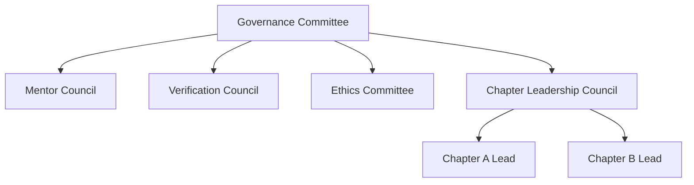
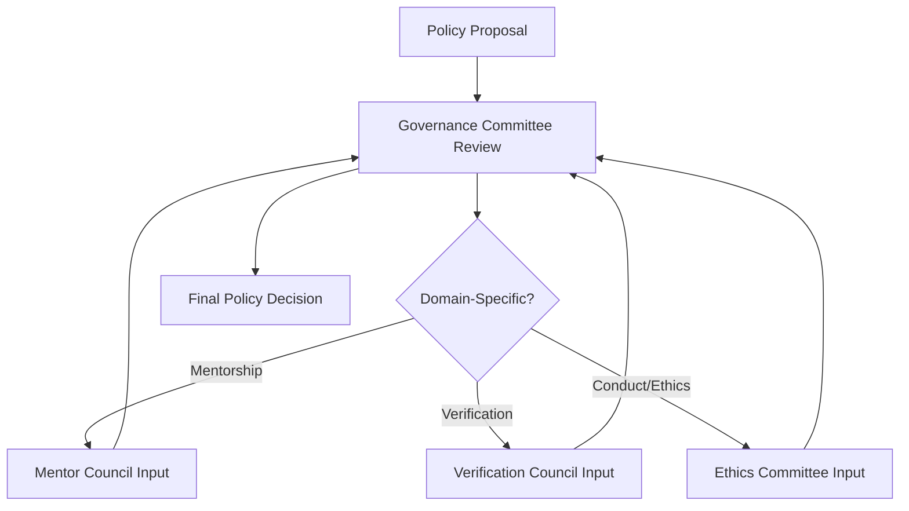
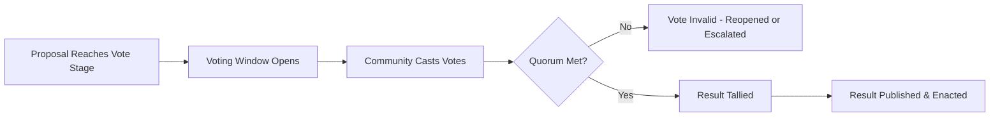
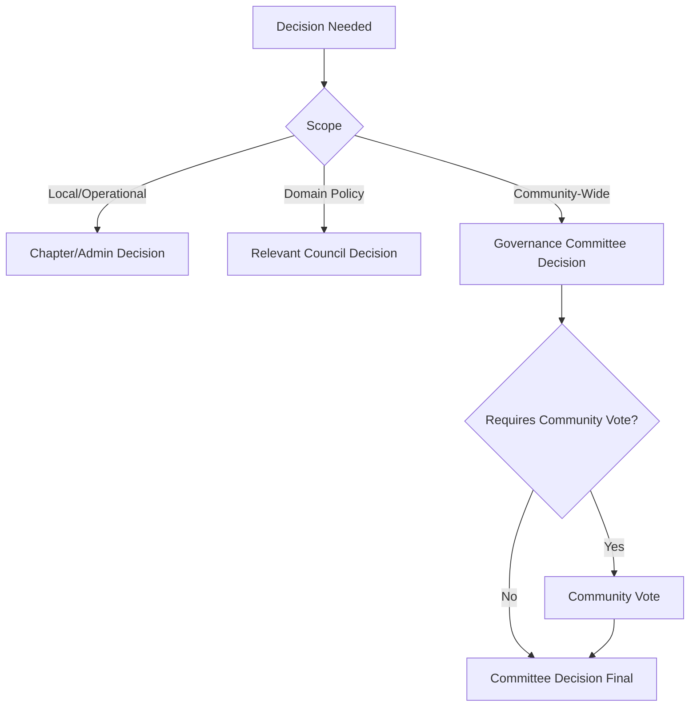
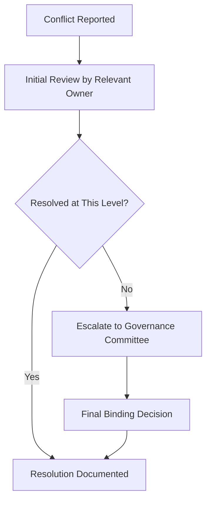
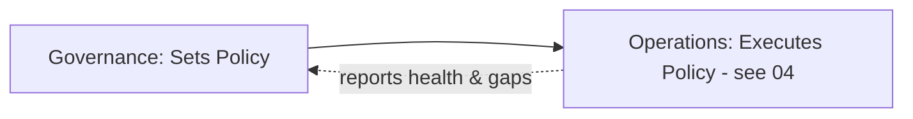

# 13 — Community Governance

> **Document Type:** Governance Model Document
> **Series:** Community Talent Ecosystem Platform — Business Documentation Suite
> **Cross-Reference:** `02_COMMUNITY_BUSINESS_MODEL.md`, `04_COMMUNITY_OPERATIONS.md`

---

## 1. Purpose

This document defines how the community governs itself — roles, committees, voting, policy-making, decision authority, conflict resolution, ethics, compliance, and community rules — ensuring the "Community Driven" philosophy remains structurally real, not aspirational.

---

## 2. Governance Philosophy

> **Quote**
> *"A community that is only community-branded but centrally controlled is not community-driven. Governance is where that promise is proven or broken."*

| Principle | Description |
|-----------|--------------|
| Distributed Authority | No single role holds unchecked power over trust systems |
| Elected Representation | Key governance roles include community-elected participation |
| Transparent Decision-Making | Policy decisions and rationale are documented and visible |
| Layered Accountability | Local chapter autonomy operates inside global guardrails |

---

## 3. Governance Structure

---

## 4. Roles

| Role | Description | Selection Method |
|------|--------------|----------------------|
| Governance Committee Member | Sets community-wide policy | Elected + Platform-Appointed Mix |
| Mentor Council Member | Oversees mentorship standards | Elected by Mentor body |
| Verification Council Member | Handles verification disputes (see `10_VERIFICATION_MODEL.md`) | Appointed from senior Mentors |
| Ethics Committee Member | Reviews conduct and ethics matters | Elected + Appointed Mix |
| Chapter Lead | Leads a local/domain chapter | Elected by Chapter members |

---

## 5. Committees

### 5.1 Committee Overview

| Committee | Mandate |
|---------------|---------|
| Governance Committee | Top-level policy, cross-cutting decisions |
| Mentor Council | Mentor standards, mentor promotion/demotion decisions |
| Verification Council | Verification dispute resolution (escalation only) |
| Ethics Committee | Conduct violations, conflicts of interest |
| Chapter Leadership Council | Cross-chapter coordination and shared learnings |

### 5.2 Committee Interaction Model

---

## 6. Voting

### 6.1 Voting Principles

| Principle | Description |
|-----------|--------------|
| One Member, One Vote | For matters open to general community vote |
| Quorum Requirement | Minimum participation threshold for validity |
| Transparent Results | Voting outcomes are published to the community |

### 6.2 Voting Workflow

---

## 7. Policies

| Policy Area | Description |
|-----------------|--------------|
| Community Guidelines | Baseline conduct expectations for all members |
| Verification Standards Policy | Governs how verification criteria are set/changed (see `10_VERIFICATION_MODEL.md`) |
| Sponsorship & Partnership Policy | Non-influence safeguards (see `07_SPONSORSHIP_MODEL.md`, `06_COMPANY_PARTNERSHIP_MODEL.md`) |
| Chapter Charter Policy | Rules governing chapter formation and autonomy |

---

## 8. Decision Making

### 8.1 Decision Authority Matrix

| Decision Type | Authority |
|-------------------|-----------|
| Day-to-day moderation | Moderators (see `04_COMMUNITY_OPERATIONS.md`) |
| Chapter-level operational decisions | Chapter Lead / Community Admin |
| Verification standards changes | Verification Council + Governance Committee |
| Community-wide policy changes | Governance Committee (with community vote where applicable) |
| Ethics violations | Ethics Committee |

### 8.2 Decision Escalation Flow

---

## 9. Conflict Resolution

### 9.1 Conflict Types

| Conflict Type | Resolution Owner |
|--------------------|------------------------|
| Member-to-Member Conduct | Moderator → Ethics Committee (if escalated) |
| Verification Dispute | Verification Council |
| Chapter Leadership Dispute | Chapter Leadership Council → Governance Committee |
| Partner/Sponsor Conflict of Interest | Ethics Committee → Governance Committee |

### 9.2 Conflict Resolution Flow

---

## 10. Ethics

| Ethics Principle | Description |
|-----------------------|--------------|
| No Undue Influence | No party may purchase or coerce trust, verification, or hiring outcomes |
| Conflict of Interest Disclosure | Any dual role (e.g., sponsor + hiring company) must be disclosed |
| Fair Treatment | All members are subject to the same standards regardless of seniority or affiliation |

---

## 11. Compliance

| Compliance Area | Description |
|----------------------|--------------|
| Guideline Adherence Audits | Periodic review of community guideline adherence across chapters |
| Partnership Agreement Compliance | Ensuring companies/sponsors honor non-influence clauses |
| Governance Process Audits | Ensuring committees follow documented decision processes |

---

## 12. Community Rules

| Rule Category | Example |
|--------------------|---------|
| Conduct Rules | Respectful, professional interaction standards |
| Contribution Integrity Rules | No plagiarism, no fraudulent verification submissions |
| Role Integrity Rules | No abuse of moderator/mentor authority for personal gain |

---

## 13. Governance-to-Operations Interface

---

## 14. Best Practices

- Keep governance decisions and rationale documented and searchable for future consistency.
- Rotate committee membership periodically to avoid entrenched power.
- Separate operational escalation (Community Operations) from policy-setting authority (Governance) clearly.
- Require explicit conflict-of-interest disclosure at chapter and central levels alike.

## 15. Assumptions

- The community has sufficient scale and engagement to sustain elected governance roles.
- Governance committee composition will evolve as the community matures (starting more platform-appointed, shifting toward more elected representation over time).

## 16. Future Scope

- Fully community-elected Governance Committee at scale.
- Formal community constitution/charter ratified by member vote.

## 17. Review Notes

| Reviewer Role | Focus Area | Status |
|----------------|------------|--------|
| Governance Committee (Founding) | Structure and authority balance | Pending Review |
| Legal/Compliance Advisor | Ethics and compliance completeness | Pending Review |

---

**Cross-References:** `02_COMMUNITY_BUSINESS_MODEL.md` · `04_COMMUNITY_OPERATIONS.md` · `10_VERIFICATION_MODEL.md` · `07_SPONSORSHIP_MODEL.md` · `06_COMPANY_PARTNERSHIP_MODEL.md`
