# 14 — Business Workflows

> **Document Type:** Consolidated Workflow Reference Document
> **Series:** Community Talent Ecosystem Platform — Business Documentation Suite
> **Purpose:** This document consolidates the most important end-to-end business workflows referenced across the entire suite into a single operational reference.

---

## 1. Purpose

While each domain document (`03` through `13`) describes its own workflows in context, this document exists as a **single consolidated reference** for every major cross-functional workflow in the ecosystem — useful for onboarding new community operators, auditing process consistency, and downstream BRD/PRD development.

---

## 2. Registration Workflow

```mermaid
flowchart TD
    A[Individual Discovers Community] --> B[Initiates Registration]
    B --> C[Provides Professional Information]
    C --> D[Selects Domain(s) of Interest]
    D --> E[Accepts Community Guidelines]
    E --> F[Profile Created]
    F --> G[Routed to Onboarding - see 03]
```

---

## 3. Learning Workflow

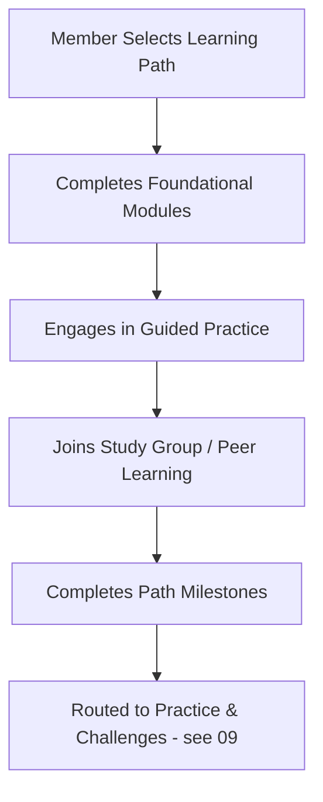

---

## 4. Mentorship Workflow

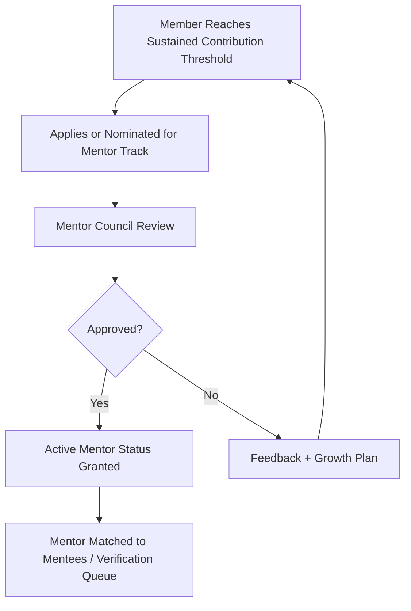

---

## 5. Recruitment (Hiring) Workflow

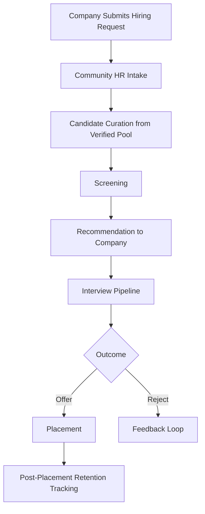

---

## 6. Verification Workflow

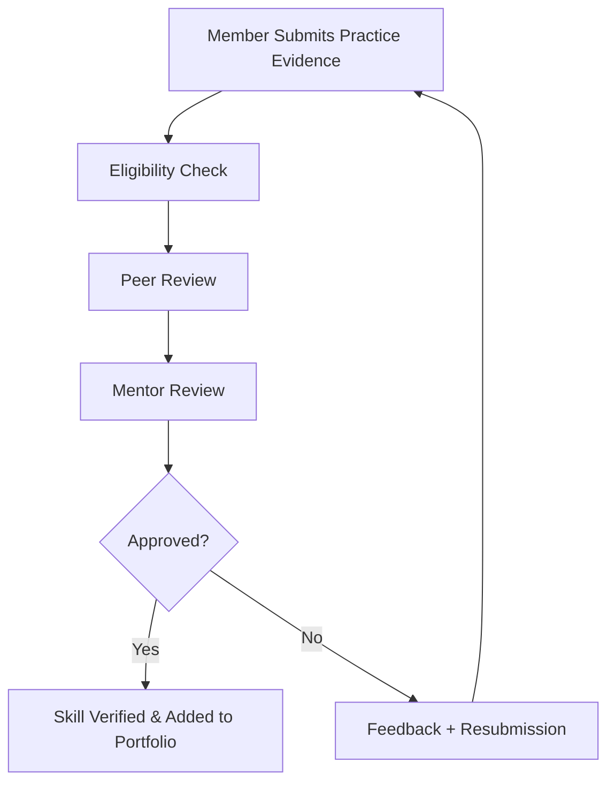

---

## 7. Events Workflow

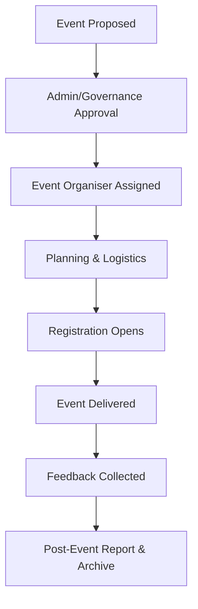

---

## 8. Sponsor Engagement Workflow

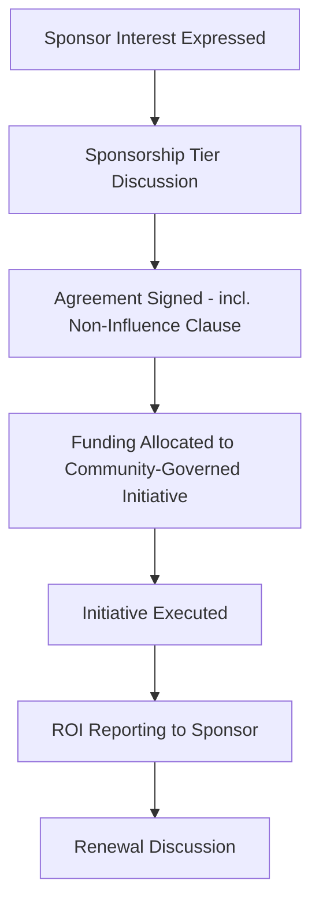

---

## 9. Community Chapter Formation Workflow

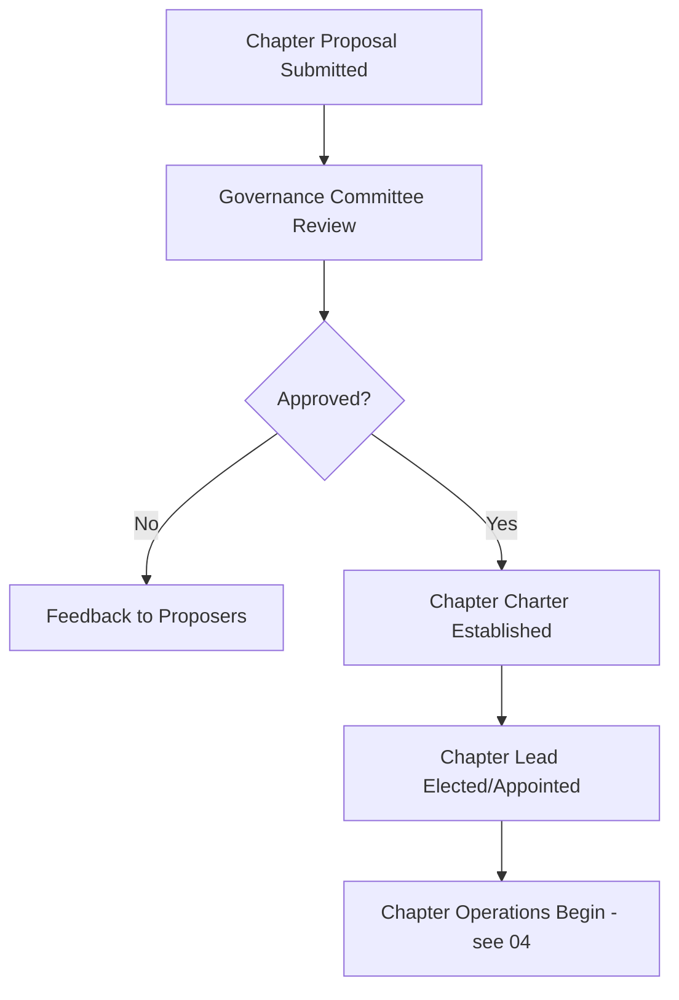

---

## 10. Volunteer Management Workflow

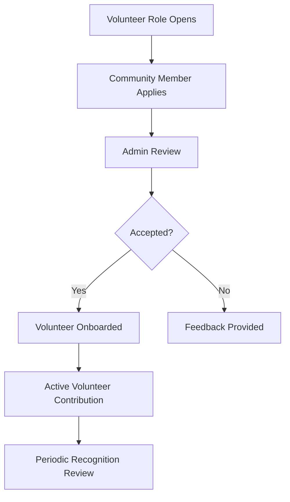

---

## 11. Escalation Workflow

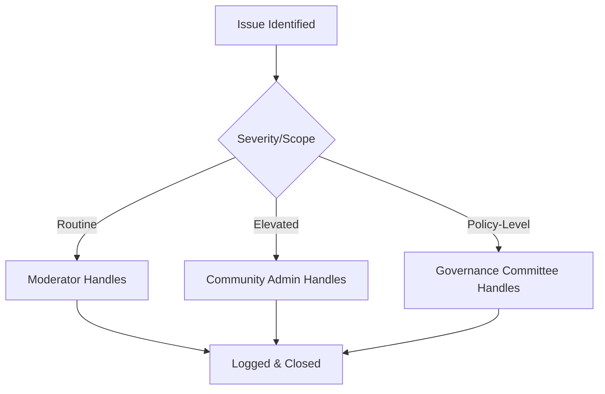

---

## 12. Feedback Workflow

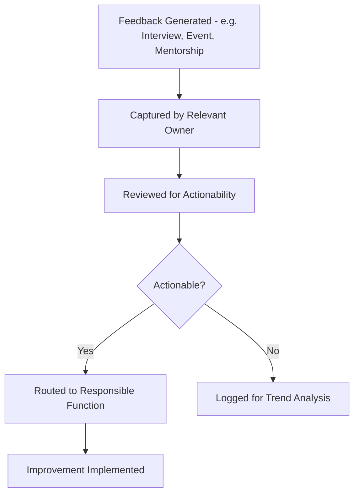

---

## 13. Issue Resolution Workflow

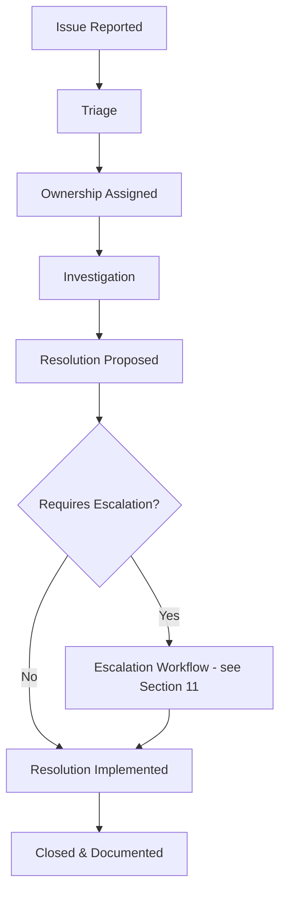

---

## 14. Cross-Workflow Integration Map

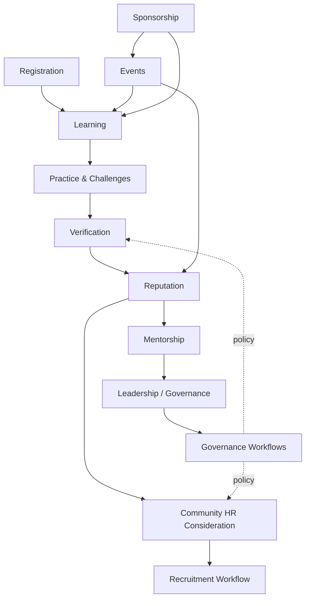

---

## 15. Master Workflow Timeline (Illustrative, Single Member)

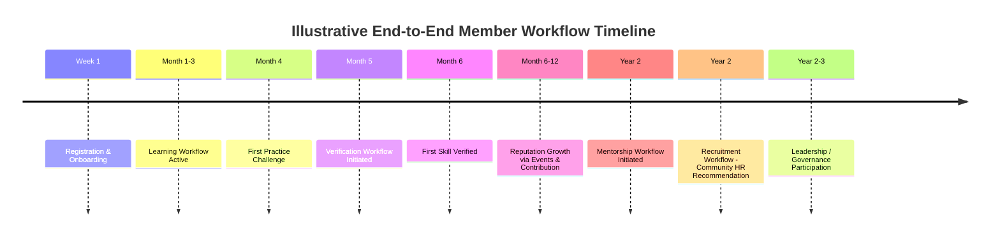

---

## 16. Best Practices

- Treat this document as a living index — when a workflow changes in its source document, update the reference here too.
- Use this document as the starting point for BRD/PRD workflow diagrams in later technical phases.
- Validate cross-workflow dependencies (Section 14) whenever any single workflow is redesigned.

## 17. Assumptions

- All workflows described here assume the business model, governance, and role definitions established in prior documents remain stable.

## 18. Future Scope

- Workflow versioning and change-log tracking as the platform matures.
- Workflow-level SLA definitions (business, not technical) for operational maturity.

## 19. Review Notes

| Reviewer Role | Focus Area | Status |
|----------------|------------|--------|
| Product Strategy | Cross-workflow consistency | Pending Review |
| Community Operations | Workflow completeness | Pending Review |

---

**Cross-References:** All prior documents (`01`–`13`)
