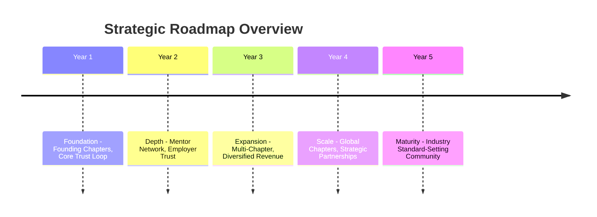
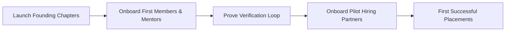
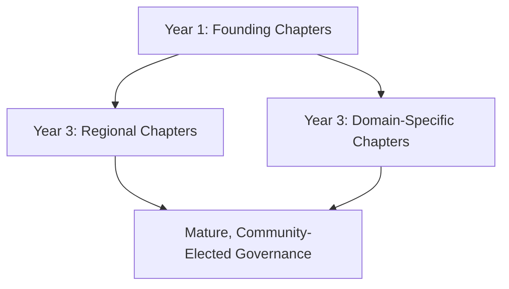
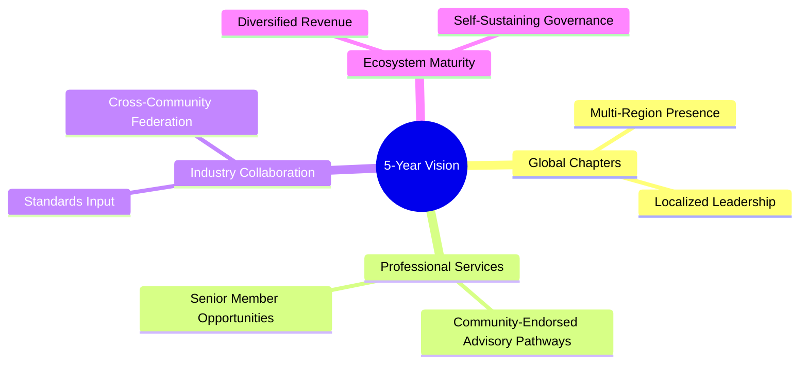
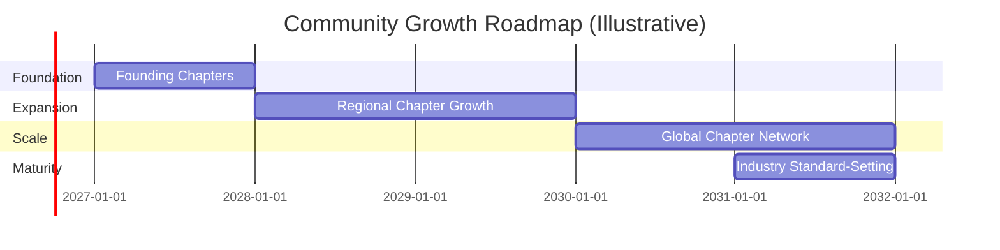
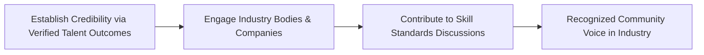

# 15 — Roadmap

> **Document Type:** Strategic Roadmap Document
> **Series:** Community Talent Ecosystem Platform — Business Documentation Suite
> **Cross-Reference:** `01_PROJECT_VISION.md`, `02_COMMUNITY_BUSINESS_MODEL.md`

---

## 1. Purpose

This document lays out the business roadmap across 1-year, 3-year, and 5-year horizons — covering community growth, chapter expansion, professional services, and industry collaboration.

---

## 2. Roadmap Overview

---

## 3. Year 1 — Foundation

### 3.1 Focus Areas

| Focus Area | Goal |
|----------------|------|
| Founding Chapter Launch | Establish 1–2 founding chapters |
| Core Trust Loop | Prove learning → practice → verification → reputation loop works |
| Initial Mentor Network | Onboard first cohort of mentors |
| First Hiring Partnerships | Onboard 2–3 pilot hiring partners |

### 3.2 Year 1 Milestone Flow

---

## 4. Year 3 — Expansion

### 4.1 Focus Areas

| Focus Area | Goal |
|----------------|------|
| Multi-Chapter Expansion | Expand to multiple regions/domains |
| Diversified Revenue | Establish sponsorship and training partner revenue at scale |
| Mature Governance | Transition toward more community-elected governance |
| Employer Network Growth | Expand hiring partner base significantly |

### 4.2 Expansion Diagram

---

## 5. Year 5 — Vision Realized

### 5.1 Focus Areas

| Focus Area | Goal |
|----------------|------|
| Global Chapter Network | Sustained chapters across multiple geographies |
| Professional Services | Community-endorsed advisory/consulting pathways for senior members |
| Industry Collaboration | Recognized voice in shaping industry skill standards |
| Ecosystem Maturity | Diversified, sustainable revenue independent of any single stream |

### 5.2 5-Year Vision Map

---

## 6. Community Growth Roadmap

---

## 7. Global Chapters Roadmap

| Phase | Chapter Scope |
|-------|-------------------|
| Phase 1 | Founding chapter(s) in initial region |
| Phase 2 | Additional regional chapters |
| Phase 3 | Domain-specific chapters (e.g., Security Chapter, SRE Chapter) |
| Phase 4 | Global chapter network with shared governance |

---

## 8. Professional Services (Future Business Line)

> **Note:** Business concept only — no technical or delivery design implied.

| Service Concept | Description |
|---------------------|--------------|
| Community-Endorsed Advisory | Senior, distinguished-level members offer advisory services with community backing |
| Corporate Training Partnerships | Community-vetted trainers deliver enterprise training |

---

## 9. Industry Collaboration Roadmap

---

## 10. Roadmap Dependencies

| Milestone | Depends On |
|---------------|----------------|
| Employer Trust (Year 1-2) | Verification Model integrity (`10_VERIFICATION_MODEL.md`) |
| Chapter Expansion (Year 3+) | Mature Community Operations (`04_COMMUNITY_OPERATIONS.md`) |
| Industry Collaboration (Year 5) | Sustained Placement Success (`17_SUCCESS_METRICS.md`) |

---

## 11. Best Practices

- Treat Year 1 as a proof-of-model phase — resist premature scale before the trust loop is validated.
- Revisit roadmap milestones annually against actual metrics (see `17_SUCCESS_METRICS.md`).
- Expand governance authority gradually and deliberately, in step with community maturity.

## 12. Assumptions

- Roadmap timelines are illustrative and subject to revision based on actual community growth and funding.
- Regional expansion will follow demand signals rather than a fixed predetermined sequence.

## 13. Future Scope

- Formal 10-year vision once 5-year milestones are validated.
- Community-proposed roadmap amendments via governance process.

## 14. Review Notes

| Reviewer Role | Focus Area | Status |
|----------------|------------|--------|
| Business Sponsor | Roadmap feasibility | Pending Review |
| Governance Committee | Governance maturity pacing | Pending Review |

---

**Cross-References:** `01_PROJECT_VISION.md` · `02_COMMUNITY_BUSINESS_MODEL.md` · `17_SUCCESS_METRICS.md`
