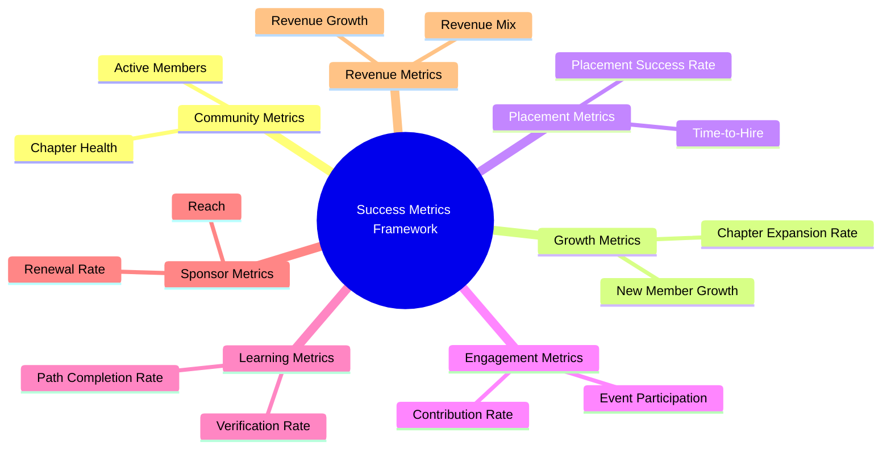
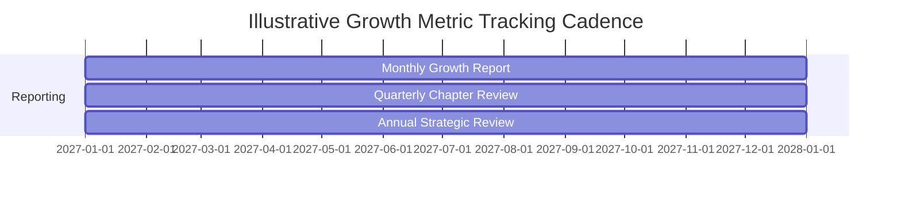
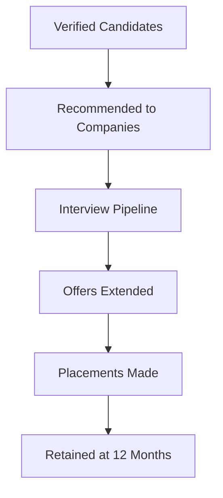
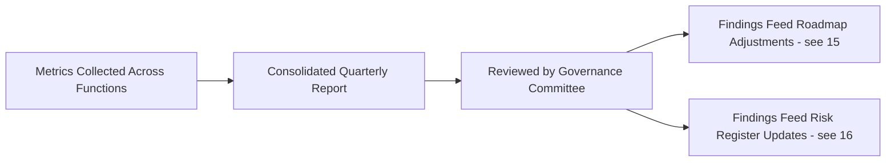

# 17 — Success Metrics

> **Document Type:** Metrics & KPI Document
> **Series:** Community Talent Ecosystem Platform — Business Documentation Suite
> **Cross-Reference:** `02_COMMUNITY_BUSINESS_MODEL.md`, `15_ROADMAP.md`, `16_RISK_ANALYSIS.md`

---

## 1. Purpose

This document defines how success is measured across the ecosystem — community health, growth, placement outcomes, engagement, learning, sponsorship, and revenue.

---

## 2. Metrics Framework Overview

---

## 3. KPIs (Consolidated)

| KPI | Definition | Category |
|-----|------------|----------|
| Active Member Rate | % of registered members active in the last 30/90 days | Community |
| Verified Member Ratio | % of active members with at least one verified skill | Community / Trust |
| Mentor Activation Rate | % of eligible members active as mentors | Community |
| Chapter Health Score | Composite activity/retention/moderation score | Community |
| New Member Growth Rate | Month-over-month new registrations | Growth |
| Chapter Expansion Rate | New chapters launched per period | Growth |
| Placement Success Rate | % of Community HR recommendations resulting in hire | Placement |
| Time-to-Hire | Average duration from recommendation to offer | Placement |
| Retention Rate (Post-Placement) | % of placements retained at 6/12 months | Placement |
| Contribution Rate | % of members contributing content/participation monthly | Engagement |
| Event Participation Rate | % of members attending at least one event per quarter | Engagement |
| Learning Path Completion Rate | % of started paths completed | Learning |
| Verification Approval Rate | % of verification submissions approved | Learning / Trust |
| Sponsor Renewal Rate | % of sponsors renewing engagement | Sponsor |
| Revenue Growth Rate | Period-over-period revenue growth | Revenue |
| Revenue Diversification Index | Spread of revenue across streams (business, not technical, view) | Revenue |

---

## 4. Community Metrics

| Metric | Target Signal |
|--------|-------------------|
| Active Member Rate | Healthy: 40%+ monthly active |
| Verified Member Ratio | Healthy Year 1: 20-30% |
| Mentor Activation Rate | Healthy: 5-10% of eligible verified members |

---

## 5. Growth Metrics

---

## 6. Placement Metrics

| Metric | Business Meaning |
|--------|----------------------|
| Placement Success Rate | Direct measure of Community HR effectiveness (see `05_HR_OPERATIONS.md`) |
| Time-to-Hire | Efficiency of the trust-first hiring model vs. traditional recruiting |
| Retention Rate | Long-term validation that verification predicts real job success |

### 6.1 Placement Funnel

---

## 7. Engagement Metrics

| Metric | Business Meaning |
|--------|----------------------|
| Contribution Rate | Health of the community's active knowledge economy |
| Event Participation Rate | Strength of community connection beyond passive membership |
| Peer Learning Participation | Depth of horizontal knowledge exchange |

---

## 8. Learning Metrics

| Metric | Business Meaning |
|--------|----------------------|
| Learning Path Completion Rate | Effectiveness of learning content and structure |
| Practice Challenge Participation | Applied-learning engagement depth |
| Verification Approval Rate | Quality alignment between practice and verification standards |

---

## 9. Sponsor Metrics

| Metric | Business Meaning |
|--------|----------------------|
| Sponsor Renewal Rate | Long-term sponsor satisfaction |
| Sponsorship Reach | Number of members engaged through sponsor-funded initiatives |
| Scholarship Impact | Number and outcomes of scholarship recipients |

---

## 10. Revenue Metrics

| Metric | Business Meaning |
|--------|----------------------|
| Revenue Growth Rate | Overall business sustainability trajectory |
| Revenue Diversification Index | Resilience against single-stream dependency (see `16_RISK_ANALYSIS.md`) |
| Cost-to-Serve per Member | Long-term unit economics health (business-level tracking only) |

---

## 11. Metrics Governance

---

## 12. Reporting Cadence

| Report | Frequency | Owner |
|-----------|-----------|--------|
| Community Health Report | Monthly | Community Operations |
| Placement & Hiring Report | Monthly | Community HR |
| Sponsor & Revenue Report | Quarterly | Partnerships / Finance |
| Strategic Metrics Review | Quarterly | Governance Committee |

---

## 13. Best Practices

- Avoid vanity metrics (e.g., raw registration count) as primary success indicators — prioritize verified engagement and placement outcomes.
- Pair every quantitative metric with qualitative community sentiment where possible.
- Review metrics against roadmap milestones (`15_ROADMAP.md`) at each strategic checkpoint.

## 14. Assumptions

- Metrics are tracked and reported at a business-capability level; underlying data collection systems are out of scope for this document.

## 15. Future Scope

- Benchmarking against comparable community and marketplace models as more data matures.
- Member-facing transparency dashboard summarizing aggregate (anonymized) community health metrics.

## 16. Review Notes

| Reviewer Role | Focus Area | Status |
|----------------|------------|--------|
| Business Sponsor | KPI/OKR alignment | Pending Review |
| Governance Committee | Metrics governance process | Pending Review |

---

**Cross-References:** `02_COMMUNITY_BUSINESS_MODEL.md` · `05_HR_OPERATIONS.md` · `15_ROADMAP.md` · `16_RISK_ANALYSIS.md`
