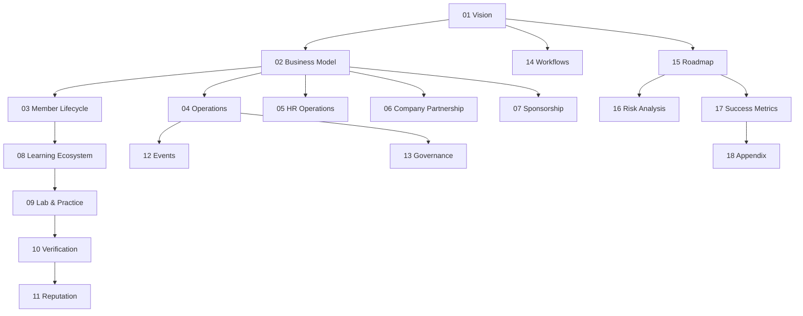

# 18 — Appendix

> **Document Type:** Appendix / Reference Document
> **Series:** Community Talent Ecosystem Platform — Business Documentation Suite

---

## 1. Purpose

This appendix consolidates the glossary, business terms, definitions, assumptions, and abbreviations referenced throughout the documentation suite. See also `BUSINESS_GLOSSARY.md` for the full standalone glossary deliverable.

---

## 2. Glossary (Summary)

| Term | Definition |
|------|------------|
| Member | Any registered individual participating in the community ecosystem |
| Verified Skill | A skill formally endorsed through the community verification process |
| Trust Score | Composite business indicator of a member's verified standing and credibility |
| Community HR | The trusted, community-embedded function that curates and recommends verified talent to companies |
| Chapter | A semi-autonomous, geographically or thematically defined community unit |
| Mentor | A senior, trusted member who guides others and participates in verification |
| Governance Committee | The top-level policy-setting body for the community |
| Portfolio | A member's continuously evolving professional identity record within the ecosystem |

---

## 3. Business Terms

| Term | Definition |
|------|------------|
| Community First | Philosophy prioritizing community health over commercial interest in all decisions |
| Learning Before Hiring | Philosophy that growth is the entry point to the ecosystem, not a hiring funnel |
| Trust Before Resume | Philosophy that verified proof outranks self-declared claims |
| Contribution Before Reputation | Philosophy that reputation must be earned through visible contribution |
| Non-Influence Clause | Contractual safeguard preventing sponsors/companies from affecting verification or reputation outcomes |

---

## 4. Definitions by Domain Document

| Document | Key Definitions Introduced |
|----------|------------------------------|
| `01_PROJECT_VISION.md` | Vision, Mission, Business Philosophy |
| `02_COMMUNITY_BUSINESS_MODEL.md` | Business Model, Chapter, Revenue Streams |
| `03_MEMBER_LIFECYCLE.md` | Lifecycle Stages, Alumni States |
| `10_VERIFICATION_MODEL.md` | Trust Score, Verification States, Professional Levels |
| `11_COMMUNITY_REPUTATION_SYSTEM.md` | Points, Badges, Leaderboards, Mentor/Volunteer Levels |

---

## 5. Assumptions (Consolidated)

- The community will grow organically through founding chapters before formal global expansion.
- Verification relies on a mix of peer review and mentor authority.
- Sponsorship and company partnership never influence verification, reputation, or hiring outcomes.
- Metrics, dashboards, and scoring mechanics are described at business-capability level only; technical implementation is explicitly out of scope for this suite.

---

## 6. Abbreviations

| Abbreviation | Meaning |
|-------------------|---------|
| BRD | Business Requirements Document |
| PRD | Product Requirements Document |
| SRS | Software Requirements Specification |
| UX | User Experience |
| UI | User Interface |
| KPI | Key Performance Indicator |
| OKR | Objective and Key Result |
| ROI | Return on Investment |
| SRE | Site Reliability Engineering |
| HR | Human Resources |

---

## 7. References

This documentation suite is self-referential — every document cross-references related documents within the same suite (see `DOCUMENT_INDEX.md` and `MASTER_TABLE_OF_CONTENTS.md`). No external references are required to interpret this suite, by design.

---

## 8. Document Suite Map

---

## 9. Best Practices

- Keep this appendix synchronized whenever new terms are introduced in any document within the suite.
- Use `BUSINESS_GLOSSARY.md` as the canonical, standalone glossary reference for external stakeholders (e.g., investors, new hires).

## 10. Review Notes

| Reviewer Role | Focus Area | Status |
|----------------|------------|--------|
| Documentation Owner | Terminology consistency across suite | Pending Review |

---

**Cross-References:** All documents in the suite (`01`–`17`) · `BUSINESS_GLOSSARY.md` · `DOCUMENT_INDEX.md`
