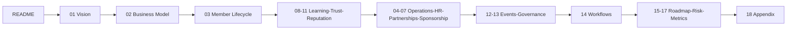

# Master Table of Contents

> **Community Talent Ecosystem Platform — Complete Business Documentation Suite**

---

## Suite Structure

```mermaid
graph TD
    subgraph Foundation
        D01[01 Project Vision]
        D02[02 Community Business Model]
        D03[03 Member Lifecycle]
    end
    subgraph Operations and People
        D04[04 Community Operations]
        D05[05 HR Operations]
        D06[06 Company Partnership Model]
        D07[07 Sponsorship Model]
    end
    subgraph Learning and Trust
        D08[08 Learning Ecosystem]
        D09[09 Lab and Practice Model]
        D10[10 Verification Model]
        D11[11 Community Reputation System]
    end
    subgraph Community Life
        D12[12 Community Events Model]
        D13[13 Community Governance]
    end
    subgraph Strategy
        D14[14 Business Workflows]
        D15[15 Roadmap]
        D16[16 Risk Analysis]
        D17[17 Success Metrics]
        D18[18 Appendix]
    end
    Foundation --> "Operations and People"
    Foundation --> "Learning and Trust"
    "Operations and People" --> "Community Life"
    "Learning and Trust" --> "Community Life"
    "Community Life" --> Strategy
```

---

## 1. Foundation Documents

| # | Document | Summary |
|---|----------|---------|
| 01 | `01_PROJECT_VISION.md` | Vision, mission, objectives, problems, market need, philosophy, value proposition, audience |
| 02 | `02_COMMUNITY_BUSINESS_MODEL.md` | Business model, stakeholders, revenue, growth, partners, sponsors, chapters, governance linkage, KPIs/OKRs |
| 03 | `03_MEMBER_LIFECYCLE.md` | Full member journey from registration to alumni |

## 2. Operations and People Documents

| # | Document | Summary |
|---|----------|---------|
| 04 | `04_COMMUNITY_OPERATIONS.md` | Admin, moderator, volunteer, mentor, event operations; incidents; escalation |
| 05 | `05_HR_OPERATIONS.md` | Community HR hiring lifecycle, screening, bulk hiring, interviews, placement, retention |
| 06 | `06_COMPANY_PARTNERSHIP_MODEL.md` | Employer journey, benefits, dashboard, hiring requests, talent pools, campaigns |
| 07 | `07_SPONSORSHIP_MODEL.md` | Sponsors, events/bootcamps/scholarships, brand visibility, ROI |

## 3. Learning and Trust Documents

| # | Document | Summary |
|---|----------|---------|
| 08 | `08_LEARNING_ECOSYSTEM.md` | Learning philosophy, paths, mentorship, communities, events, career development |
| 09 | `09_LAB_AND_PRACTICE_MODEL.md` | Hands-on practice, challenges, roadmaps, assessment, competitions, projects |
| 10 | `10_VERIFICATION_MODEL.md` | Skill verification, community review, trust score, badges, professional levels |
| 11 | `11_COMMUNITY_REPUTATION_SYSTEM.md` | Contribution model, points, badges, leaderboards, mentor/volunteer levels |

## 4. Community Life Documents

| # | Document | Summary |
|---|----------|---------|
| 12 | `12_COMMUNITY_EVENTS_MODEL.md` | Meetups, conferences, workshops, webinars, hackathons, planning workflow |
| 13 | `13_COMMUNITY_GOVERNANCE.md` | Roles, committees, voting, policies, decision-making, ethics, compliance |

## 5. Strategy Documents

| # | Document | Summary |
|---|----------|---------|
| 14 | `14_BUSINESS_WORKFLOWS.md` | Consolidated reference of every major cross-functional workflow |
| 15 | `15_ROADMAP.md` | 1/3/5-year roadmap, chapter expansion, professional services, industry collaboration |
| 16 | `16_RISK_ANALYSIS.md` | Business, community, sponsor, growth, hiring risks and mitigations |
| 17 | `17_SUCCESS_METRICS.md` | KPIs across community, growth, placement, engagement, learning, sponsor, revenue |
| 18 | `18_APPENDIX.md` | Glossary, terms, definitions, assumptions, abbreviations |

## 6. Suite-Level Reference Documents

| Document | Purpose |
|----------|---------|
| `MASTER_TABLE_OF_CONTENTS.md` | This document — full suite structure |
| `DOCUMENT_INDEX.md` | Quick lookup index by topic/keyword |
| `README.md` | Suite orientation and how to use this documentation |
| `CHANGELOG.md` | Version history of the documentation suite |
| `REVIEW_CHECKLIST.md` | Checklist for reviewing the suite before downstream use |
| `BUSINESS_GLOSSARY.md` | Standalone canonical glossary |

---

## Recommended Reading Order



---

**Total Documents in Suite:** 18 core documents + 6 reference documents = **24 documents**
