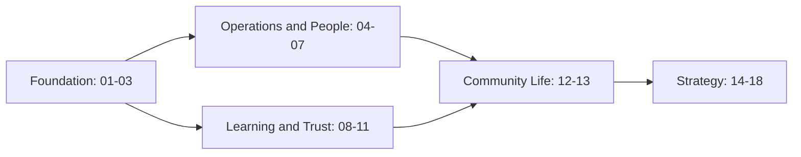

# Community Talent Ecosystem Platform
### Business Documentation Suite — README

---

## What This Is

This is a complete, business-focused documentation suite for a **Community Talent Ecosystem Platform** — a professional community ecosystem (not a job portal, not LinkedIn, not an LMS) serving professionals in Networking, Cloud, DevOps, Linux, Security, SRE, Infrastructure, Platform Engineering, and Automation.

The suite is written entirely from a **business, strategy, and community-operations perspective**. It deliberately excludes technology stack, database, API, programming, cloud infrastructure, system design, architecture diagrams, and UI/backend design — those are intentionally left for a later, separate technical phase.

---

## Business Philosophy (Quick Reference)

> Community First · Learning Before Hiring · Trust Before Resume · Contribution Before Reputation · Community Driven, Industry Connected

Full detail: `01_PROJECT_VISION.md`

---

## How This Suite Is Organized

See `MASTER_TABLE_OF_CONTENTS.md` for the full structural map and `DOCUMENT_INDEX.md` for a keyword/stakeholder lookup index.

---

## How to Use This Suite

1. **New to the project?** Start with `01_PROJECT_VISION.md`, then `02_COMMUNITY_BUSINESS_MODEL.md`, then `03_MEMBER_LIFECYCLE.md`.
2. **Building a specific function?** Use `DOCUMENT_INDEX.md` to jump directly to the relevant document (e.g., HR → `05_HR_OPERATIONS.md`).
3. **Preparing downstream deliverables** (BRD, PRD, SRS, UX research, pitch decks)? See the "Index by Downstream Use Case" table in `DOCUMENT_INDEX.md` — this suite is designed to be the business foundation for all of them without requiring the underlying analysis to be redone.
4. **Reviewing the suite for quality/completeness?** Use `REVIEW_CHECKLIST.md`.

---

## Document Conventions Used Throughout

| Convention | Meaning |
|----------------|---------|
| `> **Callout**` | An important standalone insight |
| `> **Decision Note**` | A deliberate business decision and its rationale |
| `> **Quote**` | A guiding statement or illustrative voice |
| `Mermaid diagrams` | Visual representation of flows, structures, and relationships (business-level only) |
| `Cross-References` (document footer) | Related documents to read next |

---

## Explicit Scope Boundaries

**This suite intentionally contains NO:**
Technology stack · Database design · APIs · Programming/code · Cloud provider specifics · Containers/orchestration · System design · Technical architecture diagrams · UI design · Backend design · Microservices design

**This suite intentionally DOES contain:**
Vision & strategy · Business model & economics · Member and stakeholder journeys · Operational workflows · Governance and policy · Learning, practice, and verification philosophy · Reputation and trust mechanics (business logic only) · Roadmap, risk, and success metrics

---

## Suite Contents

18 core numbered documents (`01`–`18`) plus 6 reference documents:

- `MASTER_TABLE_OF_CONTENTS.md`
- `DOCUMENT_INDEX.md`
- `README.md` (this document)
- `CHANGELOG.md`
- `REVIEW_CHECKLIST.md`
- `BUSINESS_GLOSSARY.md`

---

## Status

This is **Draft v1.0** of the complete business documentation suite. See `REVIEW_CHECKLIST.md` for outstanding review items before this suite is used as a foundation for technical or investor-facing work.

---

## Maintaining This Suite

- Any change to one document's content that affects definitions, workflows, or terminology used elsewhere should be reflected in `18_APPENDIX.md` / `BUSINESS_GLOSSARY.md` and logged in `CHANGELOG.md`.
- Cross-references at the bottom of each document should be kept current as the suite evolves.
