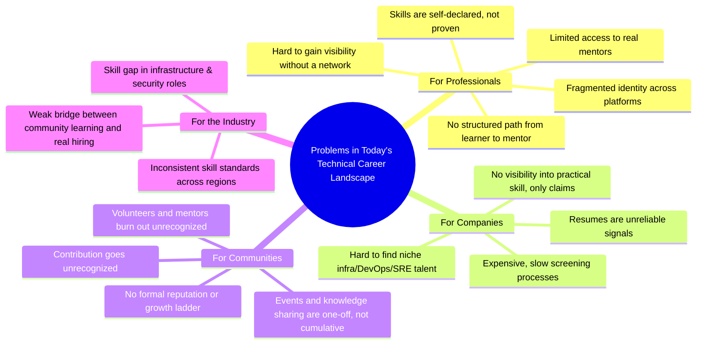
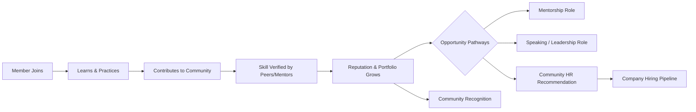
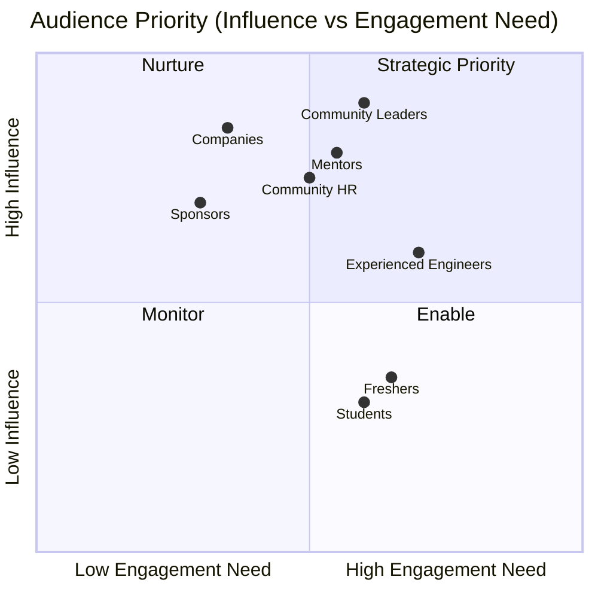
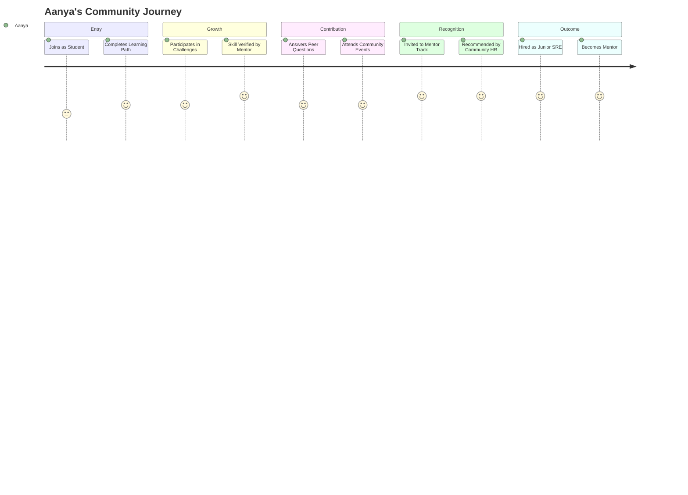
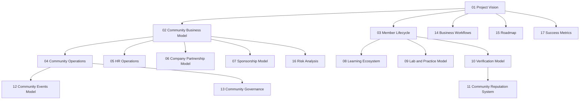

# 01 — Project Vision

> **Document Type:** Strategic Vision Document
> **Series:** Community Talent Ecosystem Platform — Business Documentation Suite
> **Document Owner:** Product Strategy
> **Status:** Draft v1.1 — Problem Validation Addendum added 2026-08-03 (see `00_DISCOVERY_AUDIT.md` §2, Phase 0 row)

---

## 1. Executive Summary

The Community Talent Ecosystem Platform (the "Platform") exists to solve a structural problem in the technical professional world: the disconnect between **real capability** and **visible, trusted proof of that capability**. Today, an infrastructure engineer's professional value is scattered across résumés, certificates, forum posts, conference badges, and private Slack reputations — none of which talk to each other, and none of which a recruiter, mentor, or peer can trust at a glance.

This Platform is not a job board, not a learning management system, and not a professional social network. It is a **living ecosystem** in which technical professionals — across Networking, Cloud, DevOps, Linux, Security, SRE, Infrastructure, Platform Engineering, and Automation — build one continuously evolving professional identity through **learning, practice, contribution, and community trust**, and that identity becomes the basis on which they are discovered, mentored, and hired.

> **Callout — Core Belief**
> *"A resume tells you what someone claims. A community tells you what someone has proven."*

---

## 2. Vision Statement

> **Vision**
> To become the most trusted global community ecosystem where infrastructure and operations professionals grow their skills, prove their capability, and earn opportunity through contribution rather than self-declaration.

The vision is deliberately **community-first**, not platform-first. The technology (out of scope for this document) is a vessel; the community, its trust fabric, and its shared standards of proof are the actual product.

---

## 3. Mission Statement

> **Mission**
> To build a professional ecosystem where every member's growth — from first-time learner to recognized mentor — is visible, verifiable, and valuable to the community and to the industry that depends on it.

The mission is executed through five mechanisms, expanded throughout this document suite:

1. Continuous professional portfolios (see `03_MEMBER_LIFECYCLE.md`)
2. Community-verified skills (see `10_VERIFICATION_MODEL.md`)
3. Structured learning and practice (see `08_LEARNING_ECOSYSTEM.md`, `09_LAB_AND_PRACTICE_MODEL.md`)
4. Reputation earned through contribution (see `11_COMMUNITY_REPUTATION_SYSTEM.md`)
5. Trusted pathways into employment (see `05_HR_OPERATIONS.md`, `06_COMPANY_PARTNERSHIP_MODEL.md`)

---

## 4. Objectives

| # | Objective | Description | Primary Beneficiary |
|---|-----------|--------------|----------------------|
| O1 | Establish a trusted skill economy | Replace self-declared skills with community-verified proof | Members, Companies |
| O2 | Build a continuous professional identity | One evolving portfolio instead of fragmented profiles | Members |
| O3 | Create a mentorship-driven growth pipeline | Every member has access to guidance from more experienced peers | Students, Freshers |
| O4 | Enable community-led hiring | Let Community HR recommend, rather than companies search blindly | Companies, Community HR |
| O5 | Sustain the ecosystem economically | Build durable, community-aligned revenue streams | Platform, Sponsors, Partners |
| O6 | Scale trust globally | Extend the model across chapters, geographies, and disciplines | Community Leaders |

---

## 5. Problems Being Solved

### 5.1 Problem Landscape



### 5.2 Problem Statements

| Problem | Impact | Root Cause |
|---------|--------|------------|
| Resumes are unverifiable | Poor hiring decisions, wasted interview cycles | No mechanism connects claimed skill to demonstrated skill |
| Community contribution is invisible to employers | High-value community members remain undiscovered | No structured translation from contribution to reputation |
| Learning and hiring are disconnected systems | Learners complete courses that don't translate to opportunity | Learning platforms and hiring platforms operate independently |
| Mentorship is informal and inconsistent | Uneven growth outcomes for members | No formal mentor lifecycle or recognition system |
| Community operations are ad hoc | Inconsistent member experience, moderator burnout | No standard operating model for community-run functions |

### 5.3 Problem Validation Status

> **Callout — Honesty About Evidence**
> The problem statements above were originally written as analyst narrative (industry pattern-matching against known SaaS/community/hiring dynamics), not primary research. This section names that gap explicitly rather than let it pass as validated. Per `00_DISCOVERY_AUDIT.md` §2 (Phase 0 row), this was the one substantive weakness identified in this document — everything below is the correction.

| Problem | Validation Status | Evidence Type Today | Confidence | Required to Reach "Validated" |
|---|---|---|---|---|
| Resumes are unverifiable | Assumed | Industry-pattern reasoning; widely cited in HR-tech literature | Medium (well-documented industry problem, but not this platform's specific users) | 8–12 structured interviews with target Companies/Community HR personas confirming this is an active, budgeted pain point, not a background annoyance |
| Community contribution is invisible to employers | Assumed | Anecdotal / founder intuition | Low | Interviews with 5+ "Marcus/Elena"-type senior contributors to confirm they perceive this as a real loss, not a non-issue |
| Learning and hiring are disconnected systems | Assumed | Analyst narrative | Low-Medium | Review of learner drop-off/completion data from comparable learning platforms; interviews with Students/Freshers on what happens after course completion |
| Mentorship is informal and inconsistent | Assumed | Anecdotal | Low | Interviews with 5+ mentors on current mentoring channels (Slack/Discord/ad hoc) and where those break down |
| Community operations are ad hoc | Assumed | Anecdotal / founder intuition | Low | Structured interviews with 3+ community admins/moderators from comparable communities on current operational pain |

**Validation Method (Design Thinking / Customer Development):**
1. **Discovery interviews** — minimum 5–8 per primary persona (Student, Fresher, Experienced Engineer, Mentor, Community HR, Company) using open-ended JTBD-style prompts ("Walk me through the last time you tried to prove a skill / hire for a niche infra role / find a mentor"), not solution-pitching.
2. **Signal triangulation** — cross-check interview findings against secondary data already available (job board time-to-fill data for infra/DevOps/SRE roles, attrition/dropout data from comparable learning platforms, if accessible).
3. **Validation gate** — a problem statement graduates from "Assumed" to "Validated" only when at least 3 independent interview sources describe the same pain **unprompted**, in their own words, without the interviewer naming the platform's proposed solution first.
4. **Re-run cadence** — re-validate annually or upon any major pivot (see `19_PERSONAS.md` §10 "Validate Annually" best practice, which this section operationalizes for problem statements specifically).

> **Decision Note — Proceeding Without Full Validation**
> The Product Discovery Team is proceeding with Phase 1+ documentation despite these problem statements being formally "Assumed" rather than "Validated." This is a conscious lean-startup tradeoff: the cost of blocking all downstream discovery work on primary research is higher than the cost of carrying a clearly labeled assumption forward. This decision is logged in `00_DISCOVERY_AUDIT.md` §6 and must be revisited before capital allocation or full-scale build decisions — assumptions are acceptable for a discovery document; they are not acceptable as the basis for a funding ask or GA launch without at least the "Medium" confidence bar reached above.

---

## 6. Market Need

### 6.1 Why Now

- Infrastructure, cloud, and security roles face a persistent and widening global skills gap.
- Technical hiring has become increasingly noisy: high applicant volume, low signal quality.
- Professionals increasingly value community and peer-verified credibility over generic certifications.
- Companies are actively seeking **pre-vetted, community-endorsed talent pools** to reduce hiring risk and cost.
- Community-led movements (meetups, open-source groups, practitioner forums) already generate enormous informal trust — but this trust is not captured or made discoverable.

### 6.2 Market Need Map

```mermaid
quadrantChart
    title Market Need Positioning
    x-axis Low Trust Signal --> High Trust Signal
    y-axis Low Community Depth --> High Community Depth
    quadrant-1 Target Zone: This Platform
    quadrant-2 Community Forums (untapped trust)
    quadrant-3 Generic Job Boards
    quadrant-4 Certification Bodies
    "Job Boards": [0.2, 0.15]
    "Certification Bodies": [0.65, 0.2]
    "Community Forums": [0.35, 0.75]
    "Professional Networks": [0.5, 0.5]
    "This Platform (Target)": [0.85, 0.85]
```

---

## 7. Business Philosophy

The Platform is anchored on five non-negotiable philosophical pillars. These pillars govern every downstream business decision described in this documentation suite.

| Pillar | Meaning | Where It Applies |
|--------|---------|-------------------|
| **Community First** | The community's health precedes commercial interest | Governance (`13`), Operations (`04`) |
| **Learning Before Hiring** | Growth is the entry point, not a hiring funnel | Learning Ecosystem (`08`) |
| **Trust Before Resume** | Verified proof outranks self-declaration | Verification Model (`10`) |
| **Contribution Before Reputation** | Reputation must be earned through visible contribution | Reputation System (`11`) |
| **Community Driven, Industry Connected** | The community sets standards; industry participates, doesn't dictate | Governance (`13`), Company Partnership (`06`) |

> **Decision Note**
> The order of these pillars is intentional. Any business decision that reverses this order (e.g., prioritizing hiring conversion over learning depth) should be flagged for Governance Committee review (see `13_COMMUNITY_GOVERNANCE.md`).

---

## 8. Value Proposition

### 8.1 Value Proposition Canvas (Business View)

| Stakeholder | Pain Today | Platform Gain |
|-------------|------------|----------------|
| Student / Fresher | No visibility, no proof of ability | Guided growth path + verified early portfolio |
| Experienced Engineer | Underused expertise, no formal recognition | Mentor status, reputation, speaking opportunities |
| Mentor | No structured way to give back at scale | Formal mentor lifecycle with recognition and visibility |
| Community HR | Poor-quality applicant pools | Access to verified, community-vetted talent |
| Company | Expensive, slow, unreliable hiring | Pre-vetted talent pools with reputation history |
| Sponsor | Limited authentic access to technical community | Direct, credible community engagement channel |
| Community Leader | Fragmented tools, no ownership model | A governed chapter structure with real authority |

### 8.2 Value Flow Diagram



---

## 9. Target Audience

### 9.1 Audience Segmentation

| Segment | Description | Primary Need |
|---------|--------------|---------------|
| Students | Early-career, pre-employment learners | Structured learning + first proof of skill |
| Freshers | 0–2 years experience | Visibility + verified foundational skill |
| Experienced Engineers | 2+ years, domain specialists | Recognition, career growth, mentorship opportunity |
| Mentors | Senior practitioners giving back | Structured platform to mentor at scale |
| Community HR | Internal recruiting function of the community | Access to trusted candidate pools |
| Community Admins/Moderators | Operational backbone of the community | Tools and authority to run operations well |
| Companies | Hiring organizations | Reliable, low-risk access to verified talent |
| Sponsors | Brands investing in the community | Authentic technical audience access |
| Training Partners | Organizations delivering learning content | Distribution to an engaged learner base |
| Event Organisers | Meetup/conference leads | Infrastructure to plan and scale events |
| Community Leaders | Chapter heads, senior volunteers | Governance authority and growth tools |

### 9.2 Audience Priority Matrix



---

## 10. Community Principles

1. **Every member starts as a learner** — regardless of seniority, participation begins with contribution to community learning.
2. **Verification is a privilege, not a default** — skills are validated by peers and mentors, not self-certified.
3. **Reputation must be earned publicly** — all contribution that builds reputation is visible to the community.
4. **No pay-to-rank** — sponsorship and revenue never buy reputation, verification, or hiring priority (see `07_SPONSORSHIP_MODEL.md`).
5. **Mentorship is a responsibility of growth** — members who rise in reputation are expected to give back.
6. **Governance is community-elected**, not solely platform-appointed (see `13_COMMUNITY_GOVERNANCE.md`).

> **Quote — Guiding Principle**
> *"The community is not the audience of this platform. The community is the platform."*

---

## 11. Business Outcomes

| Outcome | Description | Linked Metric (see `17_SUCCESS_METRICS.md`) |
|---------|--------------|-----------------------------------------------|
| Higher-quality hiring | Companies hire from a verified, low-risk pool | Placement success rate |
| Reduced time-to-hire | Community HR pre-filters based on verified reputation | Average hiring cycle time |
| Increased community retention | Members stay engaged through growth pathways | Member retention rate |
| Mentor pipeline sustainability | Senior members reliably move into mentor roles | Mentor conversion rate |
| Sponsor satisfaction and renewal | Sponsors gain authentic community access | Sponsor renewal rate |
| Global chapter expansion | Community principles replicate across geographies | Number of active chapters |

---

## 12. Success Story (Illustrative, Future-State Narrative)

> **Illustrative Success Story**
> *Aanya joined the Platform as a final-year student with no professional experience. She completed a guided Cloud Fundamentals learning path, participated in three community practice challenges, and had her first practical skill — Linux system administration — verified by a mentor after a peer-reviewed lab submission. Over eighteen months, she participated in community events, began answering peer questions, and was invited into the Mentor Track. Her verified portfolio — not a resume — was surfaced to Community HR when a partner company opened a Junior SRE requisition. She was hired directly through a Community HR recommendation, with no cold application required. Two years later, she mentors three new community members and speaks at a regional chapter meetup.*

This narrative — learner → contributor → verified professional → mentor → hired → mentor again — is the **circular growth loop** the entire ecosystem is designed to produce at scale.



---

## 13. Vision-to-Document Traceability



---

## 14. Assumptions

- The community will grow organically through founding chapters before formal expansion.
- Verification will rely on a mix of peer review and mentor authority (mechanics defined in `10_VERIFICATION_MODEL.md`).
- Company participation will begin with a small set of committed hiring partners before broad onboarding.
- Sponsorship will not influence verification, reputation, or hiring outcomes under any circumstance.

## 15. Future Scope

- Cross-community federation (partnering with adjacent professional communities).
- Global chapter certification standards.
- Community-run advisory board for industry standards alignment.
- Expansion beyond initial technical domains into adjacent technical disciplines.

## 16. Review Notes

| Reviewer Role | Focus Area | Status |
|----------------|------------|--------|
| Product Strategy | Vision-Mission alignment | Pending Review |
| Community Leadership | Community Principles validation | Pending Review |
| Business Sponsor | Business Outcomes feasibility | Pending Review |
| Product Discovery Team | Problem Validation Status (§5.3) added | Draft — Pending Review |

---

**Cross-References:** `00_DISCOVERY_AUDIT.md` · `02_COMMUNITY_BUSINESS_MODEL.md` · `03_MEMBER_LIFECYCLE.md` · `10_VERIFICATION_MODEL.md` · `17_SUCCESS_METRICS.md`
