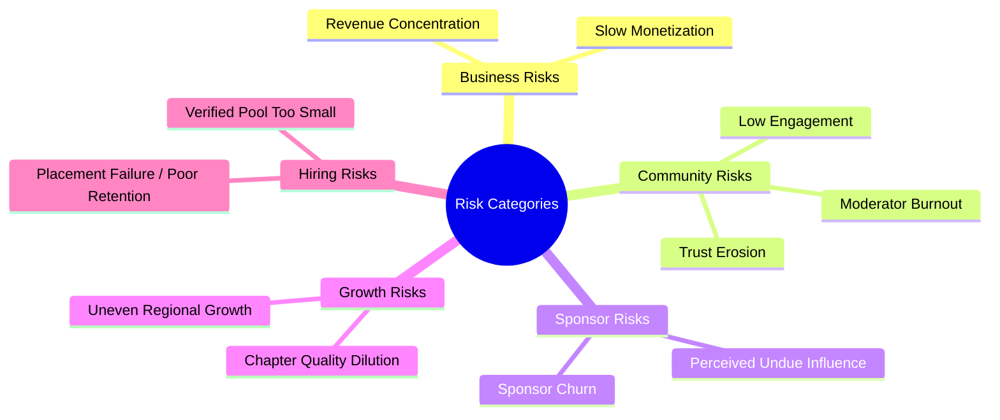
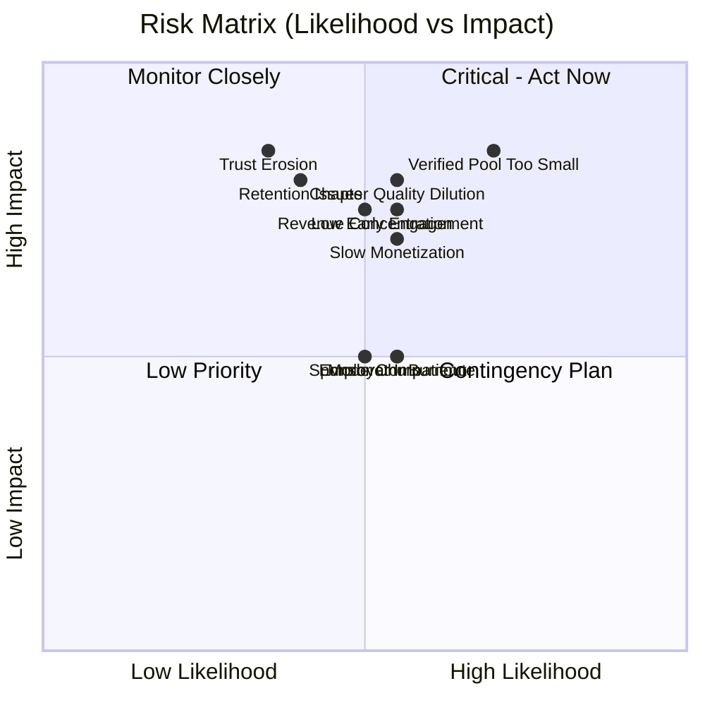
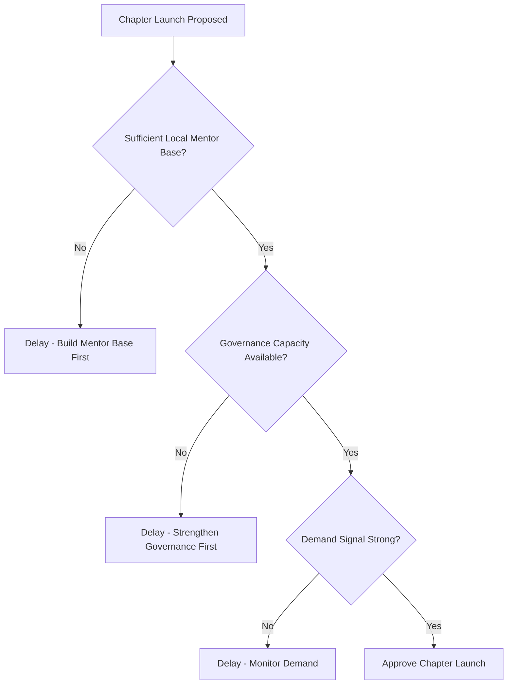
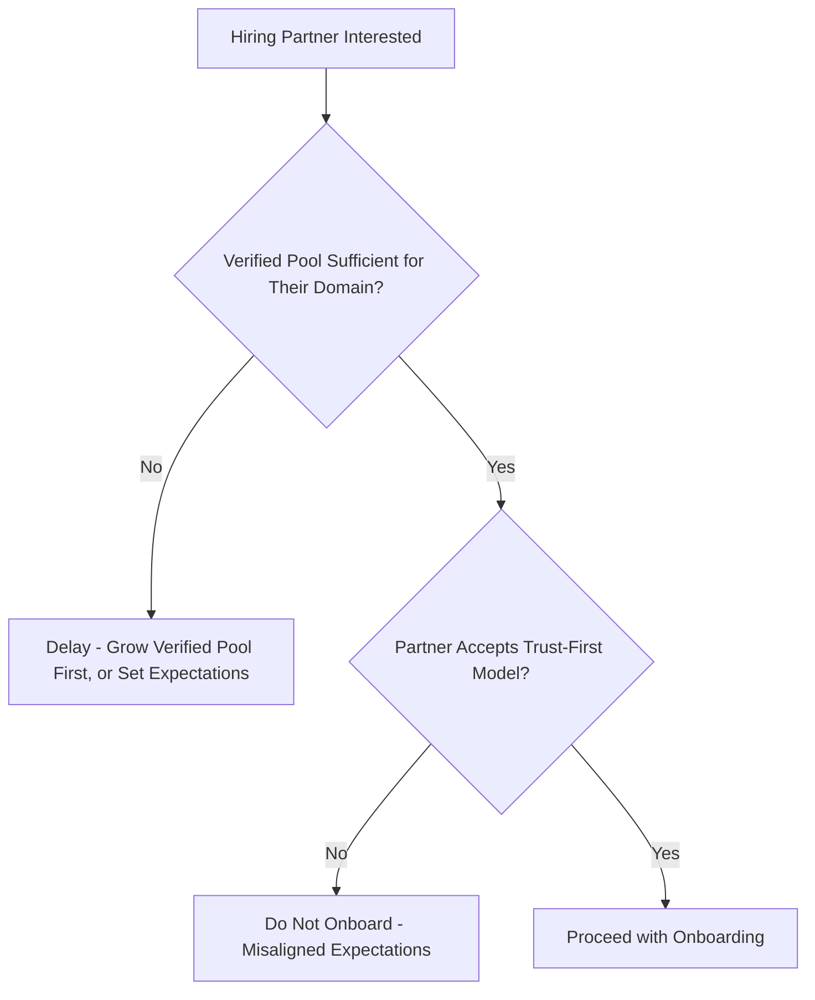

# 16 — Risk Analysis

> **Document Type:** Risk Analysis Document
> **Series:** Community Talent Ecosystem Platform — Business Documentation Suite
> **Cross-Reference:** `02_COMMUNITY_BUSINESS_MODEL.md`, `13_COMMUNITY_GOVERNANCE.md`
> **Status:** Draft v1.1 — Compliance/governance risks from the 2026-08-03 discovery audit added (see `00_DISCOVERY_AUDIT.md`)

---

## 1. Purpose

This document identifies key business, community, sponsor, growth, and hiring risks facing the ecosystem, along with mitigation strategies and decision-support tools.

---

## 2. Risk Categories Overview

---

## 3. Business Risks

| Risk | Description | Likelihood | Impact |
|------|--------------|------------|--------|
| Revenue Concentration | Over-reliance on a small number of hiring partners or sponsors | Medium | High |
| Slow Monetization | Revenue lags community growth, straining sustainability | Medium | High |
| Misaligned Incentives | Commercial pressure erodes "Community First" philosophy | Low-Medium | High |
| **Unregulated Individual Recruiter Commissions** *(added 2026-08-03)* | `F-HR-002` (mocked up in `frontend/recruiting/billing.html` — a design mockup, not built) depicts commission-style billing with no ratified pricing tier, KYC step, or legal/compliance review (`BR-HR-003`, unratified). This is a pre-development risk to close before this mockup is scheduled for engineering, not a live exposure — see `44_MVP_DEFINITION.md`. | Medium (avoidable if closed before development starts) | Medium |
| **Unratified Rules Drafted Ahead of Governance** *(added 2026-08-03)* | `BR-VR-003` (Phase 1 verification) and `BR-HR-003` (recruiter commission) were drafted by the Product Discovery Team to keep the suite internally consistent, but neither has Governance Committee sign-off. Low urgency since nothing is built yet — should be ratified before F-VER-003/F-HR-002 enter development. | Low | Medium |
| **Unscoped Social Feed Moderation** *(added 2026-08-03)* | The `F-COM-004` mockup has no content/moderation business rules behind it; `30_MODERATOR_HANDBOOK.md` and `37_POLICY_MANUAL.md` predate this design idea. Should close before development per `44_MVP_DEFINITION.md`. | Low | Medium |

---

## 4. Community Risks

| Risk | Description | Likelihood | Impact |
|------|--------------|------------|--------|
| Low Early Engagement | New members disengage before reaching verification | Medium | High |
| Trust Erosion | Verification standards perceived as inconsistent or unfair | Low-Medium | High |
| Moderator/Mentor Burnout | Volunteer roles overloaded without support | Medium | Medium |
| Toxic Behavior | Conduct issues damage community reputation | Low | High |

---

## 5. Sponsor Risks

| Risk | Description | Likelihood | Impact |
|------|--------------|------------|--------|
| Perceived Undue Influence | Community suspects sponsors affect outcomes | Low | High |
| Sponsor Churn | Sponsors don't renew due to unclear ROI | Medium | Medium |
| Over-Sponsorship | Community feels commercially saturated | Low-Medium | Medium |

---

## 6. Growth Risks

| Risk | Description | Likelihood | Impact |
|------|--------------|------------|--------|
| Chapter Quality Dilution | Rapid chapter expansion outpaces governance maturity | Medium | High |
| Uneven Regional Growth | Some chapters thrive while others stagnate | Medium | Medium |
| Leadership Gaps | Insufficient qualified chapter leaders as expansion accelerates | Medium | Medium |

---

## 7. Hiring Risks

| Risk | Description | Likelihood | Impact |
|------|--------------|------------|--------|
| Verified Pool Too Small | Insufficient verified talent to meet employer demand | Medium-High | High |
| Placement Failure | Poor role fit despite verification | Low-Medium | Medium |
| Retention Issues | Placed members leave roles quickly, damaging employer trust | Low-Medium | High |
| Employer Impatience | Companies expect faster results than the trust-first model allows | Medium | Medium |

---

## 8. Risk Matrix

---

## 9. Mitigation Strategies

| Risk | Mitigation |
|------|--------------|
| Revenue Concentration | Diversify hiring partners and sponsor base early (see `02_COMMUNITY_BUSINESS_MODEL.md`) |
| Slow Monetization | Secure early funding runway independent of platform revenue |
| Low Early Engagement | Strong onboarding design (see `03_MEMBER_LIFECYCLE.md`), early recognition wins |
| Trust Erosion | Transparent, documented verification standards (see `10_VERIFICATION_MODEL.md`) |
| Moderator/Mentor Burnout | Rotate responsibilities, monitor workload (see `04_COMMUNITY_OPERATIONS.md`) |
| Perceived Sponsor Influence | Strict non-influence clauses and public governance oversight (see `07_SPONSORSHIP_MODEL.md`) |
| Chapter Quality Dilution | Gate chapter expansion behind governance-approved readiness criteria |
| Verified Pool Too Small | Prioritize verification pipeline investment ahead of aggressive employer onboarding |
| Employer Impatience | Set clear expectations on trust-first timelines during partner onboarding (see `06_COMPANY_PARTNERSHIP_MODEL.md`) |

---

## 10. Risk Decision Tree — New Chapter Launch

---

## 11. Risk Decision Tree — New Hiring Partner Onboarding

---

## 12. Risk Monitoring Cadence

| Review | Frequency | Owner |
|-----------|-----------|--------|
| Community Health Risk Review | Quarterly | Community Operations |
| Financial Risk Review | Quarterly | Business Sponsor / Finance |
| Governance Risk Review | Bi-Annual | Governance Committee |
| Hiring Pipeline Risk Review | Monthly | Community HR Lead |

---

## 13. Best Practices

- Review this risk register as a living document; update likelihood/impact as real data emerges.
- Treat "delay" as a valid and often correct mitigation, especially in expansion decisions.
- Involve Governance in any risk mitigation that touches trust or verification integrity.

## 14. Assumptions

- Risk likelihood/impact ratings in this document are illustrative, based on comparable community and marketplace patterns, and should be recalibrated with real operating data.

## 15. Future Scope

- Formal quarterly risk register review process built into Governance Committee cadence.
- Predictive risk indicators once sufficient operating data exists.

## 16. Review Notes

| Reviewer Role | Focus Area | Status |
|----------------|------------|--------|
| Business Sponsor | Business risk prioritization | Pending Review |
| Governance Committee | Community/trust risk mitigation | Pending Review |

---

**Cross-References:** `02_COMMUNITY_BUSINESS_MODEL.md` · `10_VERIFICATION_MODEL.md` · `13_COMMUNITY_GOVERNANCE.md` · `17_SUCCESS_METRICS.md`
