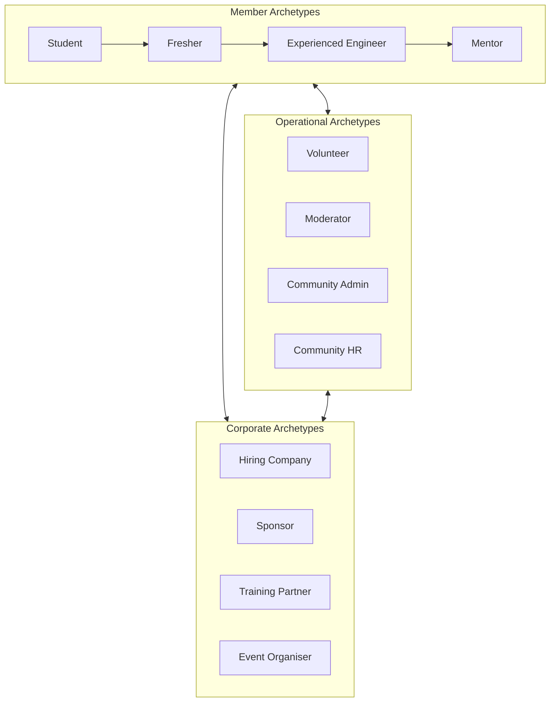
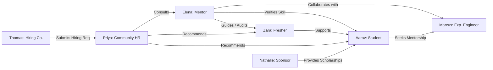

# 19 — Personas

> **Document Type:** Strategic Persona Guide
> **Series:** Community Talent Ecosystem Platform — Business Documentation Suite
> **Document Owner:** Product Strategy & UX Research
> **Status:** Draft v1.1 — JTBD section added 2026-08-03 (see `00_DISCOVERY_AUDIT.md` §2, Phase 1 row)

---

## 1. Executive Summary

This document establishes the canonical user personas for the Community Talent Ecosystem Platform. By defining user archetypes across member, operational, and corporate categories, this guide informs product strategy, capability maps, and process catalogs. The platform bridges the gap between individual professional growth and organizational talent acquisition; therefore, these personas encapsulate both early-career learners and enterprise stakeholders.

---

## 2. Purpose and Scope

### 2.1 Purpose
To provide a single, verified source of truth regarding who uses the platform, their motivations, their bottlenecks, and how they interact. This prevents feature creep and ensures downstream business alignment (e.g., in user stories and feature prioritization).

### 2.2 Scope
Covers all primary members (Students, Freshers, Experienced Engineers, Mentors) and secondary community and corporate actors (Volunteers, Moderators, Admins, Community HR, Partners, Sponsors, and Governance Committees).

---

## 3. Business Principles

1. **Human-Centricity**: Platform decisions must solve a documented user pain point.
2. **Growth Alignment**: Personas represent stages in a lifetime professional journey, not static user types.
3. **Mutual Value creation**: Corporate personas (Sponsors, Partners, Companies) succeed only when member personas grow.
4. **Trust and Integrity**: User data and reputations are protected to preserve trust.

---

## 4. User Archetypes

---

## 5. Detailed Persona Profiles: Primary Members

### 5.1 Student: "Aarav Patel" (Early Learner)
* **Demographics**: 21 years old, Final Year Computer Science Student, Mumbai, India.
* **Goals**:
  - Secure a first internship or junior infrastructure engineer role.
  - Bridge the gap between university theory and real-world infrastructure operations.
* **Pain Points**:
  - No commercial experience to put on a resume.
  - Traditional certifications are expensive and don't prove practical ability.
  - Fragmented learning resources.
* **Motivations**: Career stability, peer validation, access to industry veterans.
* **Behaviour**: Highly active on discord channels, completes labs late at night, highly responsive to feedback.
* **Success Criteria**: Earns first verified badge; passes first peer-reviewed practice challenge.
* **Decision Drivers**: Low-cost (preferably free) learning, high mentorship accessibility, speed of response.
* **Community Journey**: Learns Cloud Fundamentals -> Completes practice challenge -> Receives mentor verification.

#### Empathy Map (Aarav)
| Category | Details |
|---|---|
| **Thinking & Feeling** | "I'm falling behind my peers who have internships." "Will I pass an interview?" |
| **Seeing** | Senior students struggling to find jobs; companies asking for 2+ years of experience for junior roles. |
| **Hearing** | Mentors telling him to build a portfolio; family asking about job offers. |
| **Saying & Doing** | "I did the lab, but I don't know if my configuration is correct." |

---

### 5.2 Fresher: "Zara Chen" (Early Career)
* **Demographics**: 23 years old, Junior DevOps Engineer, Singapore.
* **Goals**:
  - Excel in current junior role and avoid making critical deployment mistakes.
  - Build a professional reputation to secure a mid-level promotion.
* **Pain Points**:
  - Overwhelmed by production infrastructure complexity.
  - Lack of structured guidance within her company.
  - Hard to stand out to industry leaders.
* **Motivations**: Career acceleration, skill mastery, peer connection.
* **Behaviour**: Attends local chapter events, asks high-quality debugging questions, starts helping students.
* **Success Criteria**: Promoted to Mid-Level Engineer; earns "Practitioner" professional level verification.
* **Decision Drivers**: Practical applicability to her day job, credibility of validators.
* **Community Journey**: Solves real labs -> Answers student questions -> Joins study groups.

#### Empathy Map (Zara)
| Category | Details |
|---|---|
| **Thinking & Feeling** | "I have imposter syndrome." "I want to lead projects but don't know if I'm ready." |
| **Seeing** | Experienced engineers talking about complex architectures; recruiters checking LinkedIn. |
| **Hearing** | "Zara is promising but needs more exposure." "Look at her verified portfolio." |
| **Saying & Doing** | Contributes to community docs; documents her learning out loud. |

---

### 5.3 Experienced Engineer: "Marcus Vance" (Domain Specialist)
* **Demographics**: 30 years old, Senior Site Reliability Engineer, Chicago, USA.
* **Goals**:
  - Keep skills sharp in a fast-moving ecosystem.
  - Give back to the community and establish a personal brand as an industry speaker.
* **Pain Points**:
  - Standard recruiter messages are irrelevant and annoying.
  - Professional network is insular.
  - No structured platform to mentor others without heavy administrative overhead.
* **Motivations**: Professional status, intellectual challenge, legacy/mentorship.
* **Behaviour**: Reviews complex peer lab submissions, acts as a guest panelist at chapter events.
* **Success Criteria**: Recognized as a domain expert; invited to speak at global summits.
* **Decision Drivers**: Efficiency of time spent, quality of discussions, alignment with ethical principles.
* **Community Journey**: Contributes advanced practice roadmaps -> Audits verification labs -> Enters Mentor track.

#### Empathy Map (Marcus)
| Category | Details |
|---|---|
| **Thinking & Feeling** | "I want to help the next generation." "I'm tired of standard recruiter spam." |
| **Seeing** | A talent shortage in SRE; lower-quality candidates passing automated tests. |
| **Hearing** | "Marcus is the go-to person for platform engineering." |
| **Saying & Doing** | Mentors three junior engineers; reviews community guidelines. |

---

### 5.4 Mentor: "Elena Rostova" (Ecosystem Guide)
* **Demographics**: 38 years old, Principal Infrastructure Architect, Munich, Germany.
* **Goals**:
  - Drive domain-wide practices and standards.
  - Identify top-tier talent for her organization and partners.
* **Pain Points**:
  - High burden of evaluation; candidate resumes are filled with fluff.
  - Hard to scale her mentorship impact.
* **Motivations**: Strategic industry development, talent discovery, executive leadership.
* **Behaviour**: Leads the Mentor Council, coordinates regional verification sprints, defines master paths.
* **Success Criteria**: 90%+ placement success of her verified mentees; high-quality contributions to learning paths.
* **Decision Drivers**: Governance transparency, ecosystem quality, non-influence from commercial sponsors.
* **Community Journey**: Proposes new learning domains -> Resolves verification disputes -> Guides Governance.

#### Empathy Map (Elena)
| Category | Details |
|---|---|
| **Thinking & Feeling** | "We need to raise the bar for what 'expert' means." "How can I mentor without burnout?" |
| **Seeing** | Unvetted resumes slowing down hiring; community chapters lacking senior guidance. |
| **Hearing** | "Elena's verification is gold standard." "Can you review our learning path?" |
| **Saying & Doing** | Establishes verification rubrics; advocates for community independence. |

---

## 6. Detailed Persona Profiles: Secondary & Operational Personas

### 6.1 Volunteer: "Kenji Tanaka"
* **Goals**: Support local operations, gain visibility, build network.
* **Pain Points**: High manual effort, risk of burnout, lack of clear task descriptions.
* **Community Journey**: Applies to volunteer -> Coordinates check-ins -> Earns volunteer badges.

### 6.2 Moderator: "Sarah Jenkins"
* **Goals**: Maintain a safe, inclusive, constructive community forum.
* **Pain Points**: Resolving toxic interactions, handling spam, vague code of conduct edge cases.
* **Community Journey**: Promoted from Volunteer -> Manages chat channels -> Escales to Governance.

### 6.3 Community Admin: "David Miller"
* **Goals**: Scale chapter operations, onboard local sponsors, run regular events.
* **Pain Points**: Handling logistic issues, coordinating speakers, balancing personal time.
* **Community Journey**: Co-founds regional chapter -> Runs monthly events -> Prepares chapter audits.

### 6.4 Community HR: "Priya Sharma"
* **Goals**: Source and recommend vetted candidates to corporate partners.
* **Pain Points**: Responding to urgent corporate requisitions, managing candidate expectations.
* **Community Journey**: Analyzes verified portfolios -> Conducts soft-skill check -> Recommends candidate.

### 6.5 Corporate User (Company Representative): "Thomas Thorne" (HR Director)
* **Goals**: Fill senior infrastructure roles quickly with verified, low-risk talent.
* **Pain Points**: High cost-per-hire, long screening cycles, false resume declarations.
* **Community Journey**: Onboards company -> Submits hiring request -> Receives pre-vetted shortlist.

### 6.6 Sponsor: "Nathalie Dubois" (Developer Relations Manager)
* **Goals**: Reach technical decision-makers and build brand affinity authentically.
* **Pain Points**: Ineffective traditional advertising, low conversion from event sponsorships.
* **Community Journey**: Funds scholarship block -> Gains authentic brand visibility -> Renews annual contract.

### 6.7 Training Partner: "Dr. James Vance"
* **Goals**: Distribute educational content and assessments to an engaged learner base.
* **Pain Points**: Low student engagement, high student churn, lack of real-world assessment tools.
* **Community Journey**: Licenses learning path -> Integrates practice challenges -> Tracks member completion.

### 6.8 Event Organiser: "Carlos Gomez"
* **Goals**: Run successful conferences and meetups that build local ecosystem value.
* **Pain Points**: Budget shortfalls, securing high-quality speakers, low attendee turnout.
* **Community Journey**: Plans regional conference -> Secures local sponsors -> Oversees attendee experience.

---

### 6.9 Individual Recruiter: "Renee Okafor" (Independent Talent Agent)

> **Callout — New Persona, Added 2026-08-03**
> This persona did not exist in the original suite. It is added to close the gap identified in `00_DISCOVERY_AUDIT.md` §4.3: `frontend/recruiting/` ships an "Individual recruiter" scope toggle and commission billing screen with no supporting persona, pricing, or business rule. This addition is Phase 11 (Revenue Models) discovery work, not a retroactive rewrite of Phase 1 personas.

* **Demographics**: 34 years old, Independent Technical Recruiter, remote / multi-market, previously an in-house recruiter at a mid-size cloud company.
* **Goals**:
  - Place candidates with client companies outside the platform's own hiring-company subscriber base and earn a commission per placement.
  - Build a reputation as a trusted, high-signal recruiter within a niche (infra/SRE/DevOps) rather than compete on volume against generalist agencies.
* **Pain Points**:
  - No formal path exists today to know what commission she is owed, when it's paid, or what dispute process applies if a placement falls through.
  - Unclear whether she is contractually a platform partner, a member, or neither — no persona or rule currently defines her relationship to the platform.
* **Motivations**: Income per placement, access to a pre-vetted, high-trust candidate pool she doesn't have to independently source and verify.
* **Behaviour**: Searches verified talent, builds shortlists, tracks candidates through a placement pipeline, expects timely commission payout.
* **Success Criteria**: Placements convert reliably; commission is paid on a predictable, disputable-if-wrong schedule.
* **Decision Drivers**: Trust in the commission model, quality/verification integrity of the candidate pool, low platform friction versus alternative sourcing channels.
* **Community Journey**: Registers as Individual Recruiter -> Searches verified talent -> Shortlists & introduces candidates -> Tracks placement status -> Receives commission.

#### Empathy Map (Renee)
| Category | Details |
|---|---|
| **Thinking & Feeling** | "Am I even allowed to do this the way the product implies I can?" "Will I actually get paid on time?" |
| **Seeing** | A working search and shortlist UI that implies a real business model exists behind it. |
| **Hearing** | Nothing yet from the platform about terms, compliance, or dispute handling — the product is ahead of the paperwork. |
| **Saying & Doing** | Uses the tool cautiously; hesitant to bring high-value clients until commission terms are contractually clear. |

> **Decision Note — Persona Added Without a Ratified Business Model**
> This persona is deliberately written to reflect the *actual* uncertainty a real individual recruiter would feel today, rather than describing a polished, resolved experience. Per `44_MVP_DEFINITION.md` §3, `F-HR-002` is currently held out of MVP scope precisely because this persona's core needs (clear commission terms, compliance posture) are unmet. This persona profile exists so that resolving those needs has a concrete "who" to design for.

---

## 6A. Jobs-To-Be-Done (JTBD)

> **Callout — Why JTBD, in addition to Personas**
> Personas describe *who*; JTBD describes *what progress they are trying to make*, independent of any feature this platform builds. This section closes the gap flagged in `00_DISCOVERY_AUDIT.md` §2 (Phase 1 row: "JTBD is absent"). Each statement follows the Situation → Motivation → Expected Outcome structure and is written before, not after, the feature set — if a feature can't be traced to one of these jobs, it should be challenged.

| Persona | Job Statement (When... I want to... So I can...) | Functional Job | Emotional Job | Social Job |
|---|---|---|---|---|
| Student (Aarav) | When I have no professional experience to show, I want a way to prove real ability before I have a job title, so I can compete for my first role on merit rather than pedigree. | Produce credible, checkable evidence of skill | Feel confident I'm not falling behind peers | Be seen as employable by people who've never met me |
| Fresher (Zara) | When I'm early in my career and unsure what "good" looks like, I want visible feedback from people more senior than me, so I can close skill gaps before they become a career ceiling. | Get accurate, targeted feedback on real work | Reduce imposter syndrome | Be recognized as someone who's improving, not just junior |
| Experienced Engineer (Marcus) | When my expertise is underused outside my day job, I want a low-overhead way to mentor and be recognized publicly, so I can build a reputation and give back without a heavy time cost. | Mentor/contribute with minimal admin burden | Feel my expertise has a legacy beyond my employer | Be known as a go-to expert in my domain |
| Mentor (Elena) | When resumes don't tell me who's actually capable, I want a trustworthy, low-effort way to evaluate people, so I can spend my scarce time on the candidates worth investing in. | Evaluate capability faster and more accurately than a resume allows | Feel my judgment/standard is respected, not second-guessed | Be seen as a gatekeeper of real quality, not a rubber stamp |
| Community HR (Priya) | When I need to fill a niche infra role fast, I want a pool of people whose skills are already someone else's word, not just their own, so I can shortlist with confidence instead of guessing from a resume. | Shortlist faster with lower false-positive rate | Feel less exposed to a bad hire decision | Be seen internally as a reliable, fast sourcing channel |
| Company (Thomas) | When traditional hiring is slow and resumes are unreliable, I want access to people whose skills a community — not just an algorithm — has already vouched for, so I can reduce hiring risk and cycle time. | Reduce cost-per-hire and time-to-fill | Feel less anxious about a bad senior infra hire | Be seen as an employer that hires well, not just fast |
| Sponsor (Nathalie) | When generic ads don't reach real practitioners, I want authentic visibility with the technical community itself, so I can build brand trust that outlasts a single campaign. | Reach a qualified technical audience directly | Feel the spend is credible, not wasted | Be associated with a community members actually respect |

### 6A.1 JTBD-to-Vision Traceability

Each job above maps to a Vision Objective in `01_PROJECT_VISION.md` §4:

| Job (Persona) | Vision Objective |
|---|---|
| Aarav, Zara — prove/improve skill | O1 (Trusted skill economy), O2 (Continuous professional identity) |
| Marcus, Elena — mentor at scale, evaluate faster | O3 (Mentorship-driven growth pipeline) |
| Priya, Thomas — hire faster/lower-risk | O4 (Community-led hiring) |
| Nathalie — authentic brand access | O5 (Sustain the ecosystem economically) |

> **Decision Note — JTBD Independence from Verification Mechanics**
> These job statements are deliberately written without committing to *how* proof is produced (labs vs. endorsements). This is intentional: the mechanism is a Phase 3 (Trust Framework) decision — see `10_VERIFICATION_MODEL.md` — and JTBD should not be re-written every time the mechanism changes. If a future mechanism stops serving these jobs, that's a signal the mechanism is wrong, not that the jobs changed.

---

## 7. Persona Relationship Matrix

---

## 8. Decision Notes

> **Decision Note — Primary Persona Focus**
> To prevent product dilution, the ecosystem's interface and operations must prioritize the **Student -> Fresher -> Experienced -> Mentor** pathway first. Operational (Moderator, Admin) and Corporate (Company, Sponsor) personas are treated as enablers of this core growth cycle.

---

## 9. Callouts

> **Callout — Empathy Focus**
> A common point of failure in professional communities is the "expert club" bias. All personas must be supported; early learners like Aarav should never feel intimidated by senior members like Marcus or Elena.

---

## 10. Best Practices

- **Validate Annually**: Conduct user interviews to verify if goals and pain points have shifted in the market.
- **Guard against Bias**: Ensure persona descriptions reflect diverse global background geographies.
- **Tie directly to Features**: Every product epic or operational initiative must explicitly call out the target persona it serves.

---

## 11. Assumptions

- Primary member personas have basic computing literacy and access to high-speed internet.
- Corporate partners value validated performance signals over traditional pedigree (e.g., specific universities).
- Mentors are willing to invest 2-4 hours per week without direct financial compensation, driven by reputation and career prestige.

---

## 12. Future Scope

- **AI-Enhanced Persona Profiles**: Dynamically updating persona parameters based on aggregated behavior patterns.
- **Geographic Variants**: Creating localized versions of Aarav and Zara to account for regional hiring customs.

---

## 13. Review Notes

| Reviewer Role | Focus Area | Status |
|---|---|---|
| Lead UX Researcher | Empathy maps & behavioral alignment | Approved |
| Product Director | Alignment with Business Goals | Approved |

---

**Cross-References:** `01_PROJECT_VISION.md` · `03_MEMBER_LIFECYCLE.md` · `04_COMMUNITY_OPERATIONS.md` · `05_HR_OPERATIONS.md`
