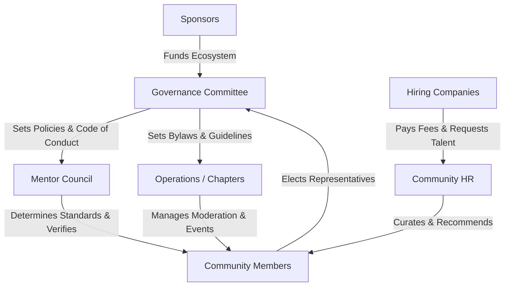

# 20 — Stakeholder Analysis

> **Document Type:** Stakeholder Strategy and Communications Document
> **Series:** Community Talent Ecosystem Platform — Business Documentation Suite
> **Document Owner:** Product Strategy & Operations
> **Status:** Draft v1.0

---

## 1. Executive Summary

This document provides a systematic analysis of all internal and external stakeholders involved in the Community Talent Ecosystem Platform. Successful platform adoption requires managing competing interests: members seek skill verification and employment, companies require vetted talent, and sponsors demand marketing value without compromising community integrity. This guide charts influence, maps power vs. interest, details communication protocols, and identifies governance boundaries to ensure cohesive collaboration.

---

## 2. Purpose and Scope

### 2.1 Purpose
To define strategies for engaging, informing, and aligning every stakeholder group, minimizing friction, and maximizing retention and contribution across the ecosystem.

### 2.2 Scope
Includes all human and organizational entities involved in the community, operations, governance, financial sustainability, and training partnerships.

---

## 3. Business Principles

1. **Transparency**: Decision-making parameters are communicated openly to preserve trust.
2. **Neutrality**: No stakeholder (including sponsors and commercial partners) can buy influence over reputation or verification.
3. **Proactive Communication**: Issues and operational updates are addressed transparently and early.
4. **Shared Governance**: Strategic decisions include elected community representatives.

---

## 4. Stakeholder Register

| Stakeholder Group | Primary Role | Core Expectations | Power | Interest | Engagement Strategy |
|---|---|---|---|---|---|
| **Community Members** | Core Participants | Fair, transparent learning paths, verified proof of skills, career opportunities. | Medium | High | Active engagement, community channels, feedback loops. |
| **Mentors** | Talent Evaluators & Guides | Clear validation rubrics, recognition, time-efficient tools, respect from peers. | High | High | Collaborative leadership, Mentor Council participation. |
| **Community HR** | Talent Curators | Access to verified talent profiles, efficient screening, stable candidate pipeline. | Medium | High | Operations meetings, hiring request dashboards. |
| **Hiring Companies** | Talent Buyers | Lower hiring risks, fast screening, reliable skill signals, compliant hiring process. | High | Medium | Key account management, dedicated partner support. |
| **Sponsors** | Financial Backers | Targeted brand visibility, positive community perception, qualified leads. | Medium | Medium | Clear ROI reporting, alignment on non-influence boundaries. |
| **Training Partners** | Content Providers | High engagement with curricula, validation of content quality, lead generation. | Medium | Medium | Strategic alignment meetings, path licensing support. |
| **Moderators / Volunteers** | Operations Backbone | Clear operational guidelines, recognition of effort, rotation/burnout protection. | Medium | High | Weekly syncs, appreciation programs, escalation paths. |
| **Governance Committee** | Policy Makers | Consistency of platform operations with core principles, ethical compliance. | High | High | Monthly formal reviews, constitutional voting. |

---

## 5. Power vs. Interest Matrix

```mermaid
quadrantChart
    title Stakeholder Power vs. Interest Matrix
    x-axis Low Interest --> High Interest
    y-axis Low Power --> High Power
    quadrant-1 Key Players (Manage Closely)
    quadrant-2 Keep Satisfied
    quadrant-3 Monitor (Minimum Effort)
    quadrant-4 Keep Informed
    "Hiring Companies": [0.65, 0.8]
    "Governance Committee": [0.9, 0.95]
    "Mentors": [0.85, 0.85]
    "Sponsors": [0.55, 0.6]
    "Training Partners": [0.5, 0.55]
    "Community Members": [0.95, 0.45]
    "Moderators / Volunteers": [0.8, 0.48]
    "Community HR": [0.85, 0.5]
```

### 5.1 Matrix Strategies
- **Manage Closely (High Power / High Interest)**: Governance Committee, Mentors. They define the standards; their buy-in is vital.
- **Keep Satisfied (High Power / Medium Interest)**: Hiring Companies. They fund the ecosystem through hiring fees but are less active in day-to-day operations.
- **Keep Informed (Low Power / High Interest)**: Community Members, Community HR, Moderators, and Volunteers. They drive volume and operations; clear communication prevents attrition.
- **Monitor (Low Power / Medium Interest)**: Sponsors, Training Partners. Monitor compliance with non-influence clauses.

---

## 6. Communication Matrix

| Stakeholder Group | Primary Channel | Frequency | Owner | Objective |
|---|---|---|---|---|
| **Community Members** | Community Portal, Discord | Daily / As-needed | Chapter Admins | Share events, learning goals, and verify activities. |
| **Mentors** | Mentor Portal, Council Meet | Weekly / Monthly | Mentor Council Head | Review verification disputes, align on path updates. |
| **Governance Committee**| Board Portal, Live Sync | Monthly | Governance Chair | Constitutional reviews, policy amendments. |
| **Hiring Companies** | Partner Portal, Email | Bi-weekly / Monthly | Key Account Manager | Status updates on candidates, hiring requisitions. |
| **Sponsors** | Direct Business Review | Quarterly | Sponsorship Owner | Demonstrate ROI, review upcoming sponsorships. |
| **Moderators / Volunteers**| Operations Channels | Weekly | Operations Lead | Plan events, review incident reports. |

---

## 7. Influence Analysis and Decision Authority



### 7.1 Decision Authority Levels
- **Level 1 (Constitutional Decisions)**: Governance Committee (Requires a 2/3 voting supermajority).
- **Level 2 (Verification Standards)**: Mentor Council.
- **Level 3 (Operational Execution)**: Chapter Admins and Moderators.
- **Level 4 (Hiring Placements)**: Community HR.

---

## 8. Stakeholder Expectations and Risks

| Stakeholder | Key Risk | Impact | Mitigation Strategy |
|---|---|---|---|
| **Mentors** | Burnout due to heavy validation queue. | High | Implement validation quotas and peer-review pre-screening. |
| **Members** | Delay in verification processing. | Medium | Clear SLAs (Service Level Agreements) for reviews. |
| **Hiring Companies** | Poor candidate quality matches. | High | Maintain rigorous verification audits and soft-skill reviews. |
| **Sponsors** | Perception of commercial bias. | High | Strict enforcement of the Non-Influence Clause. |

---

## 9. RACI Preview

Below is a preview of the roles mapped to standard process areas. The complete operational mapping is detailed in `27_RACI_MATRIX.md`.

* **Governance/Constitution updates**: Accountable: Governance Committee | Consulted: Mentors, Members | Informed: Companies, Sponsors.
* **Skill Verification**: Accountable: Mentor Council | Responsible: Mentors | Consulted: Peers | Informed: Member.
* **Member Recommendations**: Accountable: Community HR | Responsible: Community HR | Consulted: Mentors | Informed: Company.

---

## 10. Decision Notes

> **Decision Note — Non-Influence Enforcement**
> If a sponsor attempts to pressure the platform for faster verification of a specific student or candidate, the case must be escalated immediately to the Governance Committee. The sponsor's contract will be subject to termination without refund.

---

## 11. Callouts

> **Callout — Strategic Focus**
> The platform's long-term value rests on the integrity of the "Verified Skill". If companies lose trust in our signal, the entire ecosystem collapses. Thus, Mentors and Governance hold the highest decision authority.

---

## 12. Best Practices

- **Quarterly Audits**: Review stakeholder satisfaction metrics (e.g., Member NPS, Partner retention).
- **Open Office Hours**: Governance Committee should host monthly open calls for all members.
- **Clear Governance Escalations**: Keep dispute processes transparent and easily accessible.

---

## 13. Assumptions

- Mentors remain motivated by prestige, learning, and network access rather than cash payments.
- Companies are willing to pay a premium for verified talent rather than sourcing from traditional job boards.

---

## 14. Future Scope

- **Federated Governance**: Extending governance models as chapters scale to hundreds of locations worldwide.
- **Decentralized Councils**: Setting up domain-specific sub-councils (e.g., SRE Council, Cloud Security Council).

---

## 15. Review Notes

| Reviewer Role | Focus Area | Status |
|---|---|---|
| Community Lead | Mentor engagement and retention strategy | Approved |
| Legal Counsel | Non-influence clause and sponsor obligations | Approved |

---

**Cross-References:** `02_COMMUNITY_BUSINESS_MODEL.md` · `13_COMMUNITY_GOVERNANCE.md` · `27_RACI_MATRIX.md` · `37_POLICY_MANUAL.md`
