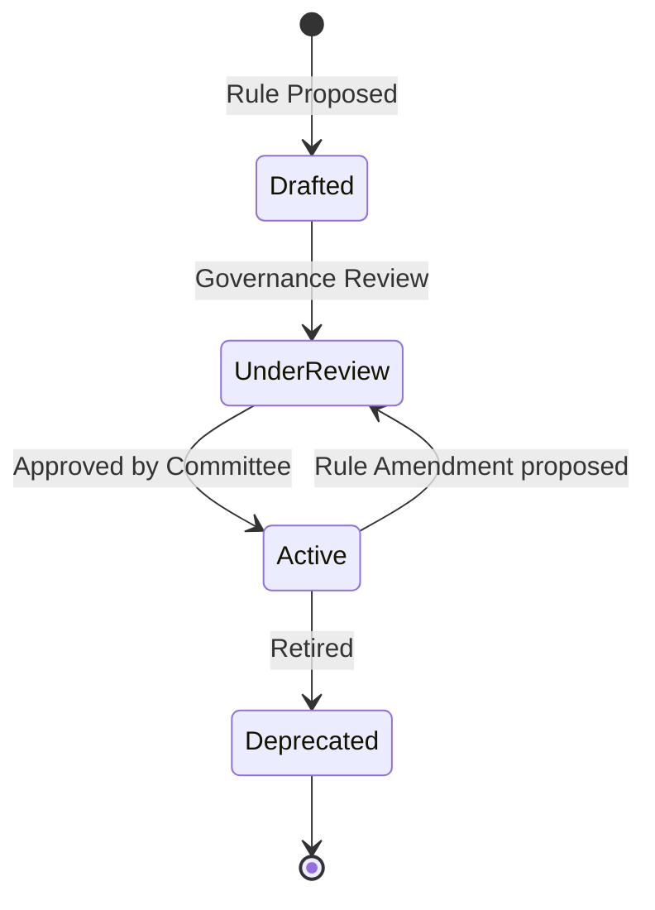

# 21 — Business Rules Catalogue

> **Document Type:** Business Rules Catalogue
> **Series:** Community Talent Ecosystem Platform — Business Documentation Suite
> **Document Owner:** Product Management & Governance Committee
> **Status:** Draft v1.1 — BR-VR-003 (Phase 1 endorsement rule) added 2026-08-03 (see `00_DISCOVERY_AUDIT.md` §4.1, `26_PROCESS_CATALOG.md` P-MBR-002A)

---

## 1. Executive Summary

This document acts as the central repository for all business rules governing the Community Talent Ecosystem Platform. These rules define eligibility, operation boundaries, quality thresholds, and dispute resolutions. Every business capability and system logic flow must adhere to the rules defined herein to maintain consistency, protect member integrity, and guarantee operational quality.

---

## 2. Purpose and Scope

### 2.1 Purpose
To provide a clear, unambiguous catalogue of business constraints, parameters, and exceptions that dictate how operations, learning, hiring, and governance are executed.

### 2.2 Scope
Applies to all domains of the platform: verification, mentorship, hiring partnerships, sponsorship, community engagement, chapter operations, governance, and reputation.

---

## 3. Business Principles

1. **Equitability**: Rules apply equally to all participants without preference or bias.
2. **Quality Preservation**: Rule thresholds must protect the high-fidelity signals of the platform (e.g., verification quality).
3. **Transparency**: All active business rules and their rationales are accessible to the community.
4. **Accountability**: Exceptions are logged, audited, and approved by designated authority roles.

---

## 4. Rule Verification and Lifecycle Flow

---

## 5. Business Rules Catalogue

### 5.1 Verification Rules (VR)

#### Rule ID: BR-VR-001 — Peer Pre-Screening Requirement
* **Description**: A member must have their lab submission reviewed and approved by at least two peer members before it is queued for Mentor review.
* **Business Rationale**: Reduces the workload on Mentors, ensuring they only review submissions that meet basic formatting and completeness criteria.
* **Dependencies**: Peer matching capability, grading rubrics.
* **Exceptions**: None.
* **Impact**: Decreases Mentor workload by ~60%; improves quality of queue.

#### Rule ID: BR-VR-002 — Double-Blind Mentor Verification
* **Description**: Expert-level verifications require independent, blind assessments from two distinct mentors.
* **Business Rationale**: Prevents favoritism or bias in awarding high-level credentials.
* **Dependencies**: Mentor matching engine, double-blind evaluation workflows.
* **Exceptions**: Domain paths with fewer than three active mentors (requires special Governance exemption).
* **Impact**: Ensures absolute trust in Expert-level credentials for employers.

#### Rule ID: BR-VR-003 — Peer Endorsement Threshold (Phase 1)
* **Description**: A skill claim advances from "Self-declared" to "Peer-endorsed" once endorsed by at least 3 distinct peers, and becomes eligible for Admin/Reviewer approval to "Community Verified" thereafter. This rule governs `P-MBR-002A` (`26_PROCESS_CATALOG.md`), the process actually prototyped in Phase 1, distinct from the lab-based BR-VR-001/002 which govern the Phase 2 target-state process (`P-MBR-002`).
* **Business Rationale**: Provides a functioning, human-gated trust signal before the lab/rubric infrastructure exists, without compromising the "no self-declaration alone" principle in `10_VERIFICATION_MODEL.md` §2.
* **Dependencies**: Endorsement Inbox capability, Admin Review Queue.
* **Exceptions**: None defined yet — Governance Committee review recommended before this rule is treated as final (currently a discovery-stage rule, not yet ratified).
* **Impact**: Unblocks a working trust signal for Phase 1 launch; must be formally superseded or merged with BR-VR-001/002 once Phase 2 lab infrastructure ships (see `10_VERIFICATION_MODEL.md` §1A, "grandfathering" requirement).

---

### 5.2 Mentor Rules (MR)

#### Rule ID: BR-MR-001 — Mentor Council Election
* **Description**: Mentors must be nominated by the Mentor Council and approved by a simple majority vote of the active member base in their chapter.
* **Business Rationale**: Ensures mentors possess both technical competence and community trust.
* **Dependencies**: Member voting registry, reputation status.
* **Exceptions**: Founding mentors appointed during chapter launch (active for max 6 months).
* **Impact**: Maintains a community-aligned, high-integrity mentorship pool.

#### Rule ID: BR-MR-002 — Mentor Inactivity Revocation
* **Description**: Mentors who fail to perform at least 2 reviews or participate in 1 mentor sync over a rolling 90-day period are moved to "Inactive" status.
* **Business Rationale**: Ensures verification queue SLAs are met by active, engaged mentors.
* **Dependencies**: Activity monitoring metrics.
* **Exceptions**: Written sabbatical requests approved by the Mentor Council (up to 180 days).
* **Impact**: Keeps the mentor roster clean and active.

---

### 5.3 HR and Hiring Rules (HR)

#### Rule ID: BR-HR-001 — Verified Candidate Match Priority
* **Description**: Only members who have at least one community-verified skill can be included in the candidate shortlist recommended by Community HR.
* **Business Rationale**: Protects the core value proposition to employers: "Trust Before Resume".
* **Dependencies**: Verification status data, Community HR matching workflow.
* **Exceptions**: Junior graduate internship programs specifically designed for early learners (requires company approval).
* **Impact**: Retains employer trust in candidates' abilities.

#### Rule ID: BR-HR-002 — Hiring Fee Rebate Period
* **Description**: If a member placed through the platform leaves the company within 90 days due to performance issues, the hiring fee is credited back or a free replacement is sourced.
* **Business Rationale**: Aligns the platform's financial success with placement quality.
* **Dependencies**: Placement records, hiring contracts.
* **Exceptions**: Restructuring or redundancies initiated by the company.
* **Impact**: Lowers hiring risk for employer partners.

#### Rule ID: BR-HR-003 — Individual Recruiter Commission Eligibility (Proposed, Not Ratified)
* **Description**: An Individual Recruiter (`19_PERSONAS.md` §6.9) may only receive commission on a placement if they (a) completed KYC/identity verification, and (b) the placed candidate held at least one community-verified skill at time of introduction (mirrors BR-HR-001).
* **Business Rationale**: Prevents commission fraud and keeps the individual-recruiter channel aligned with the same "Trust Before Resume" standard as company hiring.
* **Dependencies**: KYC verification capability (not yet built), Verification status data.
* **Exceptions**: None proposed.
* **Impact**: Without this rule, `F-HR-002` has no eligibility gate at all — this rule is the minimum bar before that feature can be considered for MVP inclusion per `44_MVP_DEFINITION.md` §3.
* **Status**: **Proposed by Product Discovery Team, 2026-08-03 — pending Governance Committee and Legal ratification.** Not yet enforceable.

---

### 5.4 Community Rules (CR)

#### Rule ID: BR-CR-001 — Code of Conduct Enforcement
* **Description**: Any member who receives three warnings within a 12-month period is automatically suspended for a minimum of 30 days.
* **Business Rationale**: Protects community safety and professional behavior.
* **Dependencies**: Warning ledger, moderation processes.
* **Exceptions**: Extreme violations result in immediate permanent ban (Governance decision).
* **Impact**: Fosters a respectful, professional learning environment.

---

### 5.5 Governance Rules (GR)

#### Rule ID: BR-GR-001 — Constitutional Amendments
* **Description**: Amendments to the Community Constitution require a 2/3 supermajority vote from the Governance Committee and a simple majority vote from the active member base.
* **Business Rationale**: Prevents sudden or unstable policy changes.
* **Dependencies**: Constitutional registry, platform-wide voting capability.
* **Exceptions**: Minor typographical corrections approved by the Governance Chair.
* **Impact**: Guarantees institutional stability and community buy-in.

---

### 5.6 Chapter Rules (CH)

#### Rule ID: BR-CH-001 — Chapter Launch Minimum Viable Size
* **Description**: A new chapter must have a minimum of 10 registered members and 1 certified Mentor to launch formal operations.
* **Business Rationale**: Prevents under-resourced chapters from launching and failing.
* **Dependencies**: Geographic member registry.
* **Exceptions**: Virtual-only chapters (requires special Governance approval).
* **Impact**: Ensures sustainable chapter health.

---

### 5.7 Learning Rules (LR)

#### Rule ID: BR-LR-001 — Path Pre-requisites
* **Description**: A member must complete and verify all pre-requisite courses/labs before accessing advanced learning paths.
* **Business Rationale**: Ensures learners have the necessary foundation, reducing frustration and drop-out rates.
* **Dependencies**: Learning path mappings, verification registry.
* **Exceptions**: Direct test-out via a baseline verification challenge.
* **Impact**: Enhances learning path completion rates and outcomes.

---

### 5.8 Badge Rules (BD)

#### Rule ID: BR-BD-001 — Badge Expiry
* **Description**: Verified skill badges expire after 24 months unless the member completes a re-verification assessment or logs continuous advanced practice.
* **Business Rationale**: Technology changes fast; verified skills must remain current to be trusted by employers.
* **Dependencies**: Badge registry, re-verification paths.
* **Exceptions**: Core foundational badges (e.g., Linux Basics, Git Essentials).
* **Impact**: Protects the validity of the skill signal.

---

### 5.9 Reputation Rules (RR)

#### Rule ID: BR-RR-001 — Reputation Point Decay
* **Description**: Non-verified contribution points (e.g., forum answers) decay at a rate of 10% annually if the member is inactive.
* **Business Rationale**: Encourages continuous engagement and updates.
* **Dependencies**: Reputation ledger.
* **Exceptions**: Badges and verified skill levels do not decay.
* **Impact**: Ensures active members remain top on leaderboards.

---

### 5.10 Event Rules (ER)

#### Rule ID: BR-ER-001 — Free Member Ticketing
* **Description**: A minimum of 70% of tickets for any chapter meetup must be allocated to verified and active community members for free.
* **Business Rationale**: Prevents events from becoming profit-driven corporate seminars, keeping them community-centric.
* **Dependencies**: Event ticketing system, member registries.
* **Exceptions**: Large-scale national conferences (which require separate budget models).
* **Impact**: Keeps events accessible to learners.

---

### 5.11 Sponsor Rules (SR)

#### Rule ID: BR-SR-001 — Non-Influence Enforcement
* **Description**: Under no circumstances can a sponsor influence, fast-track, or change the status of any member's skill verification or reputation score.
* **Business Rationale**: Protects platform neutrality and reputation integrity.
* **Dependencies**: Sponsorship contracts, verification processes.
* **Exceptions**: None.
* **Impact**: Preserves the credibility of the entire platform's trust system.

---

### 5.12 Escalation and Conflict Rules (EC)

#### Rule ID: BR-EC-001 — Verification Appeal Window
* **Description**: A member has 14 calendar days from the receipt of a failed verification decision to file a formal appeal.
* **Business Rationale**: Provides recourse for members while preventing indefinite open disputes.
* **Dependencies**: Appeal registry, Verification Council workflows.
* **Exceptions**: Extenuating medical/family emergencies.
* **Impact**: Maintains a fair, standardized review system.

---

## 6. Decision Notes

> **Decision Note — 24-Month Expiry Rule**
> The decision to expire badges after 24 months was debated. Some argued it might frustrate members. However, in infrastructure and operations (Cloud/Kubernetes/DevOps), a skill from two years ago is often outdated. Maintaining recruiter trust necessitates this standard.

---

## 7. Callouts

> **Callout — Rule Integrity**
> If any business rule is bypassed or ignored by operations without formal approval, it constitutes a compliance breach. These breaches are reported directly to the Governance Committee.

---

## 8. Best Practices

- **Bi-annual Audit**: The Governance Committee should review the active rules catalogue every six months to identify obsolete rules.
- **Automated Alerts**: Provide proactive notifications to members whose badges are nearing expiration (e.g., 90-day warning).

---

## 9. Assumptions

- Chapters possess sufficient volunteer and mentor resources to execute local rules.
- Recruiter partners understand the business rules regarding match priority and non-influence.

---

## 10. Future Scope

- **Smart Rules**: Implementing context-aware rule execution to dynamically adapt thresholds based on regional market needs.

---

## 11. Review Notes

| Reviewer Role | Focus Area | Status |
|---|---|---|
| Governance Chair | Alignment with Constitution | Approved |
| Product Operations | Operational feasibility of rules | Approved |

---

**Cross-References:** `04_COMMUNITY_OPERATIONS.md` · `10_VERIFICATION_MODEL.md` · `13_COMMUNITY_GOVERNANCE.md` · `37_POLICY_MANUAL.md`
