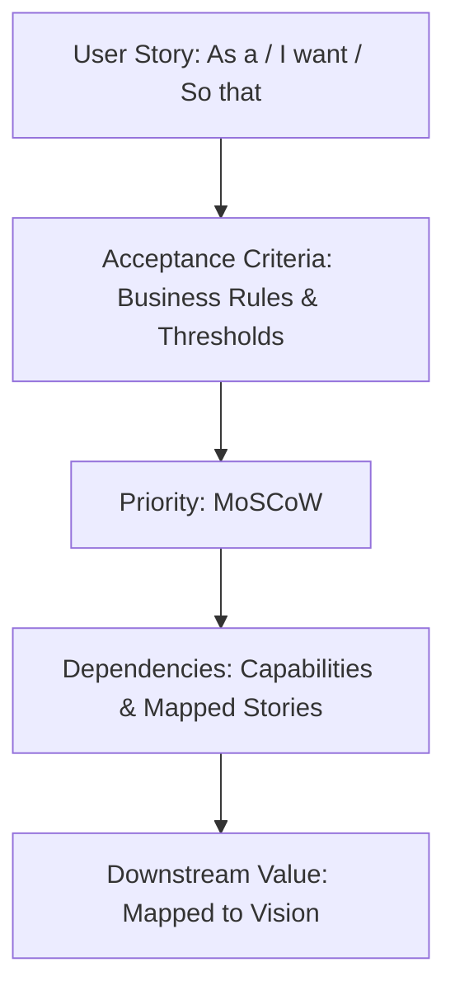

# 22 — User Stories

> **Document Type:** User Story Catalogue (Business View)
> **Series:** Community Talent Ecosystem Platform — Business Documentation Suite
> **Document Owner:** Product Owner & Business Analysis
> **Status:** Draft v1.1 — Epic layer + Phase 1 prototyped-feature stories added 2026-08-03 (see `00_DISCOVERY_AUDIT.md` §6, `42_PRODUCT_REQUIREMENTS_DOCUMENT.md` §6)

---

## 1. Executive Summary

This document details the business-level user stories representing the core requirements of all stakeholders on the Community Talent Ecosystem Platform. These stories are written from the perspective of users (learners, mentors, administrators, and enterprise partners) and focus strictly on the *business value* and *outcomes* of features. They provide the functional foundation for downstream Product Requirement Documents (PRDs) and engineering specifications.

---

## 2. Purpose and Scope

### 2.1 Purpose
To translate the project vision and business rules into actionable, user-centric requirements, ensuring that every feature has a clear beneficiary, defined acceptance criteria, and explicit dependencies.

### 2.2 Scope
Covers user stories for Member, Student, Fresher, Engineer, Mentor, Volunteer, Moderator, Community Admin, Community HR, Company, Sponsor, Training Partner, Event Organiser, and Governance Committee.

---

## 3. Business Principles

1. **Value Focus**: Every user story must deliver a clear, measurable business outcome.
2. **Pedigree Independence**: Features must reward demonstrated ability and contribution rather than formal resumes.
3. **Operational Clarity**: Acceptance criteria must define clear boundaries and operational expectations.
4. **Safety & Moderation**: Member safety, data privacy, and ethical compliance are non-negotiable baselines.

---

## 4. User Story Flow Model

---

## 4A. Epic Layer

> **Callout — Closing a Roadmap Gap**
> `00_DISCOVERY_AUDIT.md` §2 (Phase 10 row) noted "no explicit Epic layer above Feature ID." This section adds it — each Epic groups the Feature IDs (`38_FEATURE_CATALOG.md`) and User Stories (§5 below) that jointly deliver one strategic outcome.

| Epic ID | Epic | Vision Objective | Feature IDs | User Story IDs |
|---|---|---|---|---|
| E-01 | Build a Trusted Professional Identity | O2 | F-COM-001 | US-FRE-001 |
| E-02 | Establish a Community-Verified Skill Economy (Phase 1: Endorsement) | O1 | F-VER-003 | US-MBR-002 |
| E-03 | Establish a Community-Verified Skill Economy (Phase 2: Lab/Rubric) | O1 | F-VER-001, F-VER-002 | US-MBR-001 |
| E-04 | Enable Community-Led Hiring | O4 | F-HR-001 | US-CHR-001, US-COM-001 |
| E-05 | Build a Mentorship-Driven Growth Pipeline | O3 | F-LRN-001 (Phase 2) | US-ENG-001, US-MNT-001 |
| E-06 | Drive Engagement via Community Feed | — (not yet mapped to a Vision Objective; see §6 Decision Note below) | F-COM-004 | US-MBR-003 |
| E-07 | Independent Recruiter Monetization | O5 (partial — not yet ratified) | F-HR-002 | **Intentionally unspecified — see §6 Decision Note** |

---

## 5. User Story Catalogue

### 5.1 Member Stories (General)

#### Story ID: US-MBR-001 — Skill Verification Request
* **Story**: **As a** registered community member, **I want to** submit my completed practice lab for review, **so that** my skill can be verified and added to my public portfolio.
* **Acceptance Criteria**:
  - The submission must pass automated basic validation (files complete, format correct) before queuing.
  - The submission must be assigned to two peer members for pre-screening.
  - Upon peer approval, the lab is assigned to a mentor.
  - The member is notified of approval/rejection with constructive feedback.
* **Priority**: High (Must Have).
* **Dependencies**: Peer pre-screening workflow, Mentor assignment capability.
* **Stage**: Phase 2 (target-state) — see US-MBR-002 for the Phase 1 prototyped equivalent.

#### Story ID: US-MBR-002 — Peer Endorsement Request (Phase 1)
* **Story**: **As a** registered community member, **I want to** request peer endorsements for a skill I claim, **so that** my skill can advance to "Community Verified" without waiting for lab infrastructure to exist.
* **Acceptance Criteria**:
  - Member can add a skill claim and select a peer to request endorsement from, with an optional message.
  - Once the endorsement threshold (BR-VR-003, `21_BUSINESS_RULES.md`) is met, the claim routes to the Admin Review Queue.
  - Admin/Reviewer approves or rejects with a required reason; approval advances the label to "Community Verified," rejection returns the claim with the reason shown to the member.
  - Member can resubmit or request more evidence after a rejection.
* **Priority**: High (Must Have) — this is the verification path depicted in the Phase 1 UI mockups (not yet built).
* **Dependencies**: Endorsement Inbox (`frontend/member/inbox.html`), Admin Review Queue (`frontend/admin/review-queue.html`).
* **Stage**: Phase 1 (prototyped). Governing rule BR-VR-003 is not yet ratified by Governance Committee — this story should not be marked "Approved" in Review Notes (§11) until that ratification happens.

#### Story ID: US-MBR-003 — Community Feed Engagement (Phase 1, Beta)
* **Story**: **As a** community member, **I want to** post updates and see a feed of activity from people I follow, **so that** I stay engaged with the community between formal learning/verification milestones.
* **Acceptance Criteria**:
  - Member can create a post, like, and comment.
  - Member can follow/unfollow other members and see a connections list.
  - Feed content must be subject to the same moderation escalation path as other community content (BR-CR-001) once moderation rules for feed content exist — **this criterion is currently unmet**, see `44_MVP_DEFINITION.md` §3.
* **Priority**: **Unclassified** — matches `38_FEATURE_CATALOG.md` F-COM-004 classification. Per `44_MVP_DEFINITION.md`, this feature ships to beta/limited audience only until moderation rules are ratified.
* **Dependencies**: `frontend/member/home.html`, `connections.html`.
* **Stage**: Phase 1 (prototyped, conditional).

---

### 5.2 Student Stories

#### Story ID: US-STU-001 — Guided Learning Path Selection
* **Story**: **As a** student learner, **I want to** enroll in a structured, domain-specific learning path, **so that** I know exactly which skills to study to prepare for junior infrastructure roles.
* **Acceptance Criteria**:
  - The path lists all required modules, practice challenges, and expected time commitments.
  - It clearly shows pre-requisite relationships.
  - Progress tracking is visible on the student’s profile.
* **Priority**: High (Must Have).
* **Dependencies**: Learning path database structure, member profile indicators.

---

### 5.3 Fresher Stories

#### Story ID: US-FRE-001 — Foundational Portfolio Showcase
* **Story**: **As a** fresher seeking a job, **I want to** generate a shareable verified skill portfolio, **so that** I can show hiring companies concrete proof of my infrastructure capability despite having no work experience.
* **Acceptance Criteria**:
  - The portfolio shows verified badges, trust score, and community contributions.
  - Self-declared details are clearly separated from verified skills.
  - The member can generate a secure, public shareable link.
* **Priority**: High (Must Have).
* **Dependencies**: Portfolio builder capability, verification records.

---

### 5.4 Engineer Stories (Experienced)

#### Story ID: US-ENG-001 — Mentor Track Nomination
* **Story**: **As an** experienced engineer, **I want to** apply to join the Mentor Track once I meet reputation and verification thresholds, **so that** I can begin reviewing peer submissions and guiding learners.
* **Acceptance Criteria**:
  - The system checks if the applicant has a "Practitioner" level verification and >500 reputation points.
  - Upon meeting requirements, a notification is sent to the Mentor Council for review.
  - If approved, the member's profile is updated to "Mentor-in-Training".
* **Priority**: Medium (Should Have).
* **Dependencies**: Reputation ledger, verification data.

---

### 5.5 Mentor Stories

#### Story ID: US-MNT-001 — Submission Review and Validation
* **Story**: **As a** community mentor, **I want to** review pre-screened member lab submissions, **so that** I can evaluate their technical capabilities and approve or reject their verification request.
* **Acceptance Criteria**:
  - The mentor has access to the grading rubric and the candidate's code/logs.
  - The mentor can write detailed feedback and mark the submission as "Pass", "Needs Revision", or "Fail".
  - The decision is logged and signed by the mentor's reputation ID.
* **Priority**: High (Must Have).
* **Dependencies**: Verification portal, review queue.

---

### 5.6 Volunteer Stories

#### Story ID: US-VOL-001 — Event Support Task Sign-up
* **Story**: **As a** community volunteer, **I want to** sign up for specific operational tasks for a local chapter meetup, **so that** I can help run the event and earn community reputation.
* **Acceptance Criteria**:
  - Volunteers can view open tasks (e.g., registration check-in, AV coordination).
  - Volunteers can reserve a task.
  - Upon successful event completion, the Chapter Admin confirms task completion and reputation points are awarded.
* **Priority**: Medium (Should Have).
* **Dependencies**: Event model, reputation award workflows.

---

### 5.7 Moderator Stories

#### Story ID: US-MOD-001 — Conduct Violation Warning Issue
* **Story**: **As a** community moderator, **I want to** issue a warning to a member who violates the Code of Conduct, **so that** we maintain a professional and respectful environment.
* **Acceptance Criteria**:
  - The moderator can select the violation category and log details.
  - The warning is sent to the member privately.
  - The warning count is incremented on the member's private profile.
* **Priority**: High (Must Have).
* **Dependencies**: Moderation dashboard, user profiles.

---

### 5.8 Community Admin Stories

#### Story ID: US-ADM-001 — Chapter Audit Report Submission
* **Story**: **As a** Chapter Admin, **I want to** compile and submit our chapter's quarterly operational and financial audit report, **so that** the Governance Committee can review our chapter's health and renew our charter.
* **Acceptance Criteria**:
  - Admins can aggregate metrics: events hosted, active members, local sponsorships, and expenses.
  - The report must be submitted via the governance channel.
* **Priority**: Medium (Should Have).
* **Dependencies**: Chapter metrics dashboard, governance workflows.

---

### 5.9 Community HR Stories

#### Story ID: US-CHR-001 — Candidate Sourcing and Shortlisting
* **Story**: **As a** Community HR manager, **I want to** filter the verified member database based on skills, reputation, and availability, **so that** I can shortlist qualified candidates for partner company openings.
* **Acceptance Criteria**:
  - Filtering must exclude personal identifying data (demographics, names) to prevent bias.
  - Shortlisted candidates must meet the skill levels requested by the company.
  - Shortlist is saved and queued for soft-skill verification before sending to the company.
* **Priority**: High (Must Have).
* **Dependencies**: Verification databases, search capability.

---

### 5.10 Company Stories

#### Story ID: US-COM-001 — Hiring Request Submission
* **Story**: **As a** hiring partner company, **I want to** submit a hiring request with specific skill verification requirements, **so that** Community HR can curate a pre-vetted candidate list for us.
* **Acceptance Criteria**:
  - The company specifies job details and required verified badges.
  - The request is routed to the Community HR queue.
  - The company receives notifications when candidates are curated.
* **Priority**: High (Must Have).
* **Dependencies**: Corporate portal.

---

### 5.11 Sponsor Stories

#### Story ID: US-SPO-001 — Scholarship Block Funding
* **Story**: **As a** community sponsor, **I want to** fund a block of learning scholarships, **so that** I can support underrepresented members while gaining brand visibility on the platform.
* **Acceptance Criteria**:
  - Sponsors can specify the scholarship quantity and demographic/focus criteria.
  - The platform distributes scholarships to eligible members automatically.
  - The sponsor's logo is displayed on the scholarship program landing page.
* **Priority**: Medium (Should Have).
* **Dependencies**: Sponsorship model, learning eligibility workflows.

---

### 5.12 Training Partner Stories

#### Story ID: US-TRN-001 — Content Engagement Reporting
* **Story**: **As a** training partner, **I want to** view anonymized engagement analytics for our learning paths, **so that** we can optimize our materials and assess their effectiveness.
* **Acceptance Criteria**:
  - Reports show completion rates, lab average pass scores, and feedback ratings.
  - No individual member data is exposed in reports.
* **Priority**: Low (Nice to Have).
* **Dependencies**: Analytics engine.

---

### 5.13 Event Organiser Stories

#### Story ID: US-EVN-001 — Meetup Lifecycle Planning
* **Story**: **As a** chapter event organiser, **I want to** publish a new meetup page, track registrations, and manage speaker proposals, **so that** I can coordinate the event successfully.
* **Acceptance Criteria**:
  - The page lists date, location, agenda, and speakers.
  - Speaker proposals can be submitted and reviewed by the organiser.
  - Members can register for free tickets based on availability.
* **Priority**: High (Must Have).
* **Dependencies**: Events portal, ticketing engine.

---

### 5.14 Governance Committee Stories

#### Story ID: US-GOV-001 — Dispute Resolution and Appeal Review
* **Story**: **As a** Governance Committee member, **I want to** review and vote on escalated verification appeals and moderation incidents, **so that** disputes are resolved fairly and in line with our policies.
* **Acceptance Criteria**:
  - The committee has access to all logs, comments, and decisions.
  - Each committee member can cast a vote.
  - The final vote and decision rationale are recorded and made public.
* **Priority**: High (Must Have).
* **Dependencies**: Governance voting workspace.

---

## 6. Decision Notes

> **Decision Note — Why F-HR-002 Has No User Story**
> `44_MVP_DEFINITION.md` §3 excludes the Individual Recruiter & Commission Billing feature (`F-HR-002`) from MVP scope pending persona, pricing, and compliance work (`00_DISCOVERY_AUDIT.md` §4.3). Writing a user story for it now — "As an individual recruiter, I want to..." — would imply the actor, business rule, and acceptance criteria are settled when they are not. This document intentionally leaves E-07 (§4A) without a story rather than fabricate acceptance criteria for an unratified feature. A story should be written as part of the Phase 11 closure work, not before it.

> **Decision Note — Anonymity in Sourcing**
> To combat structural bias, search filters for Community HR (US-CHR-001) must anonymize candidates (removing names, pictures, gender, and school names) until a formal interview invitation is extended by the hiring partner.

---

## 7. Callouts

> **Keep Stories Business-Focused**
> All stories must avoid technical dependencies like databases or UI elements (e.g., "click a blue button"). Focus on what the user needs to achieve from a business logic standpoint.

---

## 8. Best Practices

- **Validate Acceptance Criteria**: Ensure all acceptance criteria are written in a binary (Pass/Fail) manner.
- **Regular Backlog Grooming**: The Product Owner should review user stories monthly to align with roadmap milestones.

---

## 9. Assumptions

- Users have access to basic notification interfaces (email or community portal alerts).
- Community HR has the capacity to manually verify soft-skills before final candidate recommendation.

---

## 10. Future Scope

- **AI Shortlisting Assistance**: Providing smart mapping suggestions to Community HR, highlighting candidate matches based on past successful hires.

---

## 11. Review Notes

| Reviewer Role | Focus Area | Status |
|---|---|---|
| Lead Business Analyst | Story completeness & alignment | Approved |
| Governance Auditor | Policy compliance of story logic | Approved |

---

**Cross-References:** `03_MEMBER_LIFECYCLE.md` · `05_HR_OPERATIONS.md` · `14_BUSINESS_WORKFLOWS.md` · `38_FEATURE_CATALOG.md`
