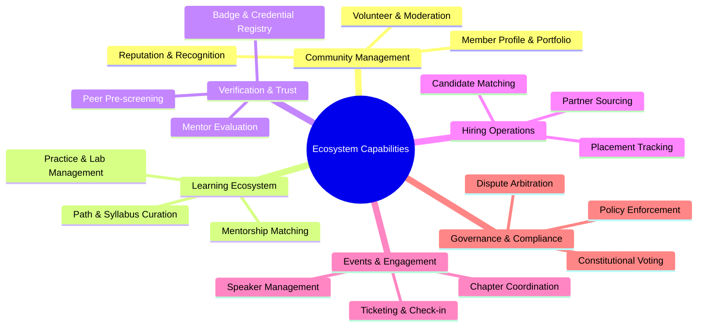
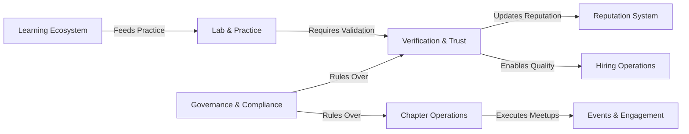

# 23 — Business Capability Map

> **Document Type:** Enterprise Business Capability Map
> **Series:** Community Talent Ecosystem Platform — Business Documentation Suite
> **Document Owner:** Enterprise Architecture & Product Strategy
> **Status:** Draft v1.0

---

## 1. Executive Summary

This document defines the Business Capability Map (BCM) for the Community Talent Ecosystem Platform. The map provides a structured taxonomy of what the platform *does* (its core business capabilities) independent of how it is technically implemented or organized. This serves as the blueprint for aligning business strategy with product feature releases, operational structures, and financial investments.

---

## 2. Purpose and Scope

### 2.1 Purpose
To provide a logical taxonomy of business capabilities across three levels of granularity, identifying strategic priorities, capabilities dependencies, and maturity milestones.

### 2.2 Scope
Covers the entire enterprise footprint: community management, learning, verification, placement/hiring, events, governance, partnerships, analytics, financial systems, and operations support.

---

## 3. Business Principles

1. **Stability**: Capabilities represent stable business functions; processes or systems change, but capabilities remain.
2. **Exclusivity**: Capabilities must be mutually exclusive and collectively exhaustive (MECE) at each level.
3. **Business-Centricity**: Defined strictly in business terms (what we do), not technical tools (how we do it).
4. **Maturity Alignment**: Investments should prioritize strategic capabilities that are currently low-maturity.

---

## 4. Level 1 & Level 2 Capability Taxonomy

---

## 5. Level 3 Business Services Directory

| Level 1 Capability | Level 2 Capability | Level 3 Business Service | Description |
|---|---|---|---|
| **1. Community** | 1.1 Portfolio Management | 1.1.1 Public Profile Gen | Creates public-facing professional profiles. |
| | | 1.1.2 Portfolio Export | Generates exportable verified resumes. |
| | 1.2 Reputation System | 1.2.1 Point Ledgering | Tracks and logs points earned by contribution. |
| | | 1.2.2 Badge Issuance | Awards verified badges for completed achievements. |
| **2. Learning** | 2.1 Path Management | 2.1.1 Syllabus Definition | Establishes domain curriculums. |
| | 2.2 Mentorship | 2.2.1 Mentor Matching | Matches learners with domain-relevant mentors. |
| | 2.3 Labs & Practice | 2.3.1 Lab Environment Provision | Allocates sandbox environments for practice. |
| **3. Verification** | 3.1 Review Pipeline | 3.1.1 Peer Evaluation | Facilitates early peer reviews of labs. |
| | | 3.1.2 Mentor Auditing | Handles final evaluation by certified mentors. |
| | 3.2 Trust Ledger | 3.2.1 Trust Score Calc | Computes candidate credibility metrics. |
| **4. Hiring** | 4.1 Talent Sourcing | 4.1.1 Requisition Intake | Ingestion of company hiring requirements. |
| | | 4.1.2 Anonymized Filtering | Filters candidate pools without bias. |
| **5. Events** | 5.1 Meetups & Conf | 5.1.1 Chapter Ticketing | Distributes free and paid attendee tickets. |
| **6. Governance** | 6.1 Policy & Compliance | 6.1.1 Incident Escalation | Routes code of conduct issues for arbitration. |

---

## 6. Capability Maturity Map

We assess capability maturity across five levels: 1 (Initial/Ad-hoc), 2 (Repeatable), 3 (Defined), 4 (Managed), 5 (Optimizing).

| Capability Area | Current Maturity | Target Maturity (Yr 1) | Strategic Priority | Gap Action |
|---|---|---|---|---|
| **Community Portfolio** | 3 (Defined) | 4 (Managed) | High | Integrate peer reputation signals into portfolio views. |
| **Skill Verification** | 2 (Repeatable) | 4 (Managed) | Critical | Automate lab validation checks before peer queue. |
| **Mentorship Matching** | 1 (Initial) | 3 (Defined) | Medium | Create structured mentor onboarding and guidelines. |
| **Candidate Matching** | 2 (Repeatable) | 4 (Managed) | High | Implement anonymized search capability for partners. |
| **Chapter Operations** | 3 (Defined) | 4 (Managed) | Medium | Standardize chapter launch playbooks globally. |
| **Governance Voting** | 1 (Initial) | 3 (Defined) | High | Implement platform constitutional voting mechanics. |

---

## 7. Capability Dependency Map

---

## 8. Decision Notes

> **Decision Note — Verification Strategic Priority**
> Verification and Trust are classified as "Critical" priority with a target maturity of Level 4 within 12 months. All other capabilities (like Events or Partnerships) depend on the credibility of the verification signal; thus, we prioritize its maturity over others.

---

## 9. Callouts

> **Callout — Maturity Target**
> A capability is not considered Level 4 (Managed) until its KPIs are monitored daily and its processes are documented, standardized, and trained.

---

## 10. Best Practices

- **Quarterly Alignment**: Map all roadmap initiatives to Level 2 capabilities to check for strategic alignment.
- **Role-to-Capability mapping**: Ensure every business role (defined in RACI) corresponds to at least one Level 2 capability.

---

## 11. Assumptions

- Level 1 capabilities are comprehensive and cover the entire platform's business model.
- Third-party training partners can integrate their curriculums into our Level 1 "Learning" capability structure.

---

## 12. Future Scope

- **Federated Verification**: Empowering external professional bodies to act as validators within our verification capability framework.

---

## 13. Review Notes

| Reviewer Role | Focus Area | Status |
|---|---|---|
| Enterprise Architect | Structural MECE alignment | Approved |
| COO | Operational mapping validity | Approved |

---

**Cross-References:** `02_COMMUNITY_BUSINESS_MODEL.md` · `10_VERIFICATION_MODEL.md` · `15_ROADMAP.md` · `26_PROCESS_CATALOG.md`
