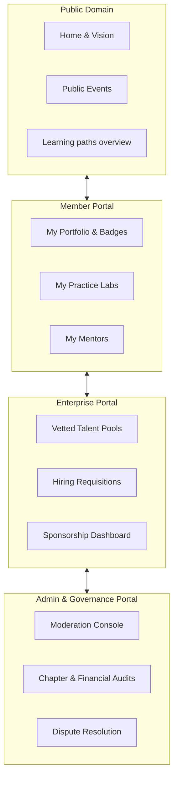

# 24 — Information Architecture

> **Document Type:** Business Information Architecture & Taxonomy
> **Series:** Community Talent Ecosystem Platform — Business Documentation Suite
> **Document Owner:** Product Strategy & Information Architecture
> **Status:** Draft v1.0

---

## 1. Executive Summary

This document defines the Business Information Architecture (IA) and content taxonomies for the Community Talent Ecosystem Platform. IA defines how information is structured, grouped, and accessed across different portals. Keeping information structures intuitive, clean, and secure ensures that learners can find content, mentors can verify skills efficiently, and companies can search candidate pools without friction or structural bias.

---

## 2. Purpose and Scope

### 2.1 Purpose
To provide a logical map of the platform’s business domains, portal views, content classification schemes, search parameters, and core business objects.

### 2.2 Scope
Applies to all public and private portals (Member, Mentor, Company, Sponsor, Admin, Governance) and content types (Knowledge, Events, Learning Paths, Verification records, and Reports).

---

## 3. Business Principles

1. **Accessibility**: Information must be discoverable within three navigation steps.
2. **Contextual Security**: Sensitive data (private details, salary targets, audit trails) must be visible only to authorized roles.
3. **Consistency**: Terminology and taxonomies must align across all portals and documents.
4. **Bias Mitigation**: Sourcing and hiring databases must hide identifying candidate fields in preliminary searches.

---

## 4. Information Domain Model

---

## 5. Portal Navigation Hierarchy

* **Public Portal**:
  - Landing / Philosophy Page
  - Events Directory (Meetups, Summits)
  - Learning Catalog (Paths description, Syllabi overview)
  - Shared Public Portfolios (Anonymized or explicit share links)
* **Member Portal (Private)**:
  - Personal Dashboard (Progress, stats)
  - Learning Center (My paths, active courseware)
  - Lab Sandbox (Active tasks, queue submissions)
  - Reputation Ledger (My badges, points log)
* **Mentor Portal**:
  - Verification Queue (Labs assigned to me)
  - Mentee Dashboard (My assigned students)
  - Resource Hub (Grading rubrics, guidelines)
* **Enterprise Portal (Partners/Sponsors/Companies)**:
  - Sourcing Engine (Talent pools, anonymized candidates)
  - Requisition Center (My jobs, shortlist progress)
  - Sponsor Center (Scholarship allocations, banner metrics)
* **Admin & Governance Portal**:
  - Moderation Board (Report logs, warnings log)
  - Chapter Management (Chapter health, leader rosters)
  - Resolution Center (Escalated appeals, policy overrides)

---

## 6. Content Taxonomy & Tagging

To keep content discoverable and uniform, the ecosystem uses a strict tagging structure.

| Category | Subcategory | Core Tags (Examples) | Usage |
|---|---|---|---|
| **Technology Domain** | Infrastructure / Cloud | AWS, Kubernetes, Terraform, Platform Engineering | Applied to learning paths, labs, portfolios. |
| | Systems / Networking | Linux, BGP, TCP/IP, DNS, SRE | Applied to skills, practice challenges. |
| **Verification Level** | Foundational / Pro | Emerging, Practitioner, Expert, Distinguished | Defines difficulty and portfolio tier. |
| **Event Type** | Operations | Meetup, Panel, Workshop, Conference, Hackathon | Applied to calendar listings. |
| **Resource Type** | Education | Syllabus, Guide, Rubric, Lab Exercise | Defines publication type. |

---

## 7. Business Object Definitions

### 7.1 Core Objects
* **Member Profile**: Holds account details, points tally, and reputation level.
* **Lab Submission**: Tracks candidate code, configuration files, and mentor assignment status.
* **Verification Record**: Holds the audit trail of peer and mentor reviews, rubrics, and the resulting badge status.
* **Hiring Request**: Details role description, required badges, salary boundaries, and shortlist progress.
* **Sponsorship Contract**: Records funding amount, target program (e.g., event, scholarship), and ROI metrics.
* **Chapter Charter**: Represents a regional chapter’s status, leaders, boundaries, and audit history.
* **Event Page**: Records meetup schedules, speaker lists, registrations, and volunteer tasks.

---

## 8. Decision Notes

> **Decision Note — Separating Portfolios from Resumes**
> Traditional resumes are unstructured text files. On this platform, the portfolio object is built entirely from verified achievement records, badges, and contribution points. Self-declared text is structurally separated to ensure clear distinction for hiring managers.

---

## 9. Callouts

> **Callout — Access Control**
> Governance audits, moderation warning logs, and member personal details (e.g., physical address, salary expectations) are strictly compartmentalized and inaccessible to recruiters or sponsors.

---

## 10. Best Practices

- **Keep Taxonomy Slim**: Avoid tag clutter; new tags must be approved by the Chapter Admins or Product Owner.
- **Dynamic Portals**: Navigation links should dynamically adapt to the user's role (e.g., showing "Mentor Queue" only to verified mentors).

---

## 11. Assumptions

- Users understand basic tabbed navigation.
- Recruiter search uses standardized technology filters rather than free-form query fields to minimize unstructured search errors.

---

## 12. Future Scope

- **Federated Search**: Allowing companies to search both local and global chapter directories through unified filtering.

---

## 13. Review Notes

| Reviewer Role | Focus Area | Status |
|---|---|---|
| Information Architect | Navigation depth and taxonomy logic | Approved |
| Security Lead | Data privacy domains | Approved |

---

**Cross-References:** `03_MEMBER_LIFECYCLE.md` · `08_LEARNING_ECOSYSTEM.md` · `10_VERIFICATION_MODEL.md` · `23_BUSINESS_CAPABILITY_MAP.md`
