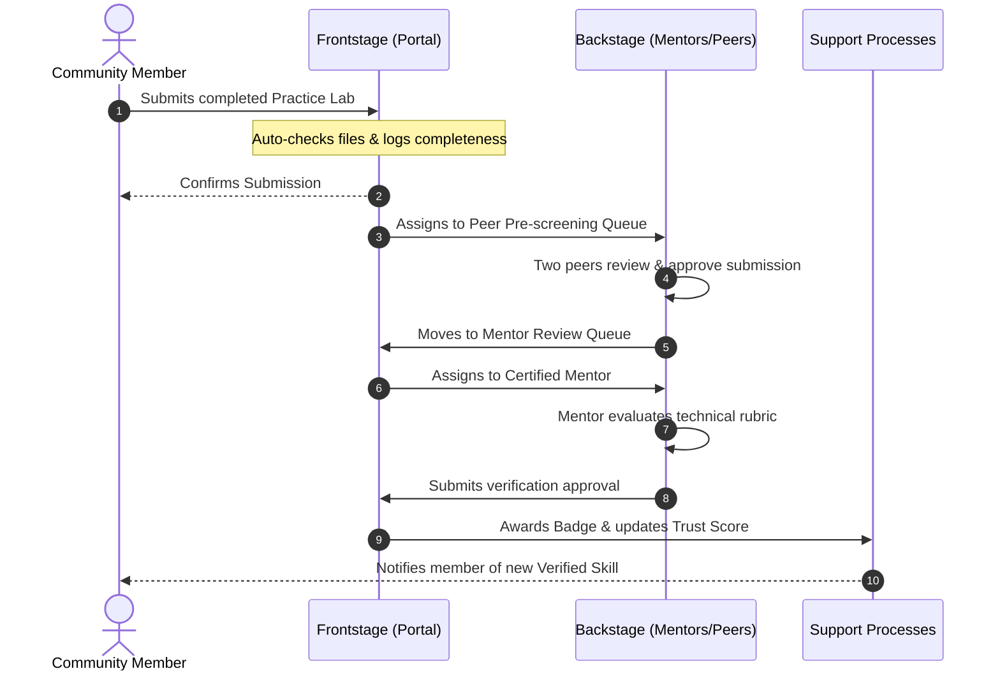

# 25 — Service Blueprint

> **Document Type:** Operational Service Blueprint
> **Series:** Community Talent Ecosystem Platform — Business Documentation Suite
> **Document Owner:** Product Operations & Service Design
> **Status:** Draft v1.1 — Phase 1 (prototyped) blueprint added 2026-08-03 (see `00_DISCOVERY_AUDIT.md` §4.1, `10_VERIFICATION_MODEL.md` §1A)

---

## 1. Executive Summary

This document presents the Service Blueprint for the Community Talent Ecosystem Platform, mapping the end-to-end service delivery lifecycle for two primary customer journeys: **Member Skill Verification** and **Enterprise Talent Placement**. The blueprint coordinates frontstage interactions, backstage operations, support processes, and partner integrations, highlighting operational bottlenecks and service-level targets.

---

## 2. Purpose and Scope

### 2.1 Purpose
To provide a complete operational map of how different actors and processes interact over time to deliver value, enabling staff, volunteers, and mentors to coordinate their actions.

### 2.2 Scope
Maps the frontstage, backstage, support processes, and failure points of the verification and hiring processes.

---

## 3. Business Principles

1. **Clear Boundaries**: Customer actions must trigger clear backstage responses with defined time thresholds (SLAs).
2. **Support Enablement**: Backstage operators (Mentors, Admins) must be provided with high-quality guidelines and rubrics.
3. **Failure Mitigation**: Operational failure modes (e.g., mentor delays, disputable grading) must have standard mitigation flows.
4. **Partner Alignment**: Third-party integrations (Sponsors, Partners) must not interrupt core member service pathways.

---

## 4. Service Blueprint Diagram: Skill Verification Pathway



---

## 4A. Service Blueprint Diagram: Phase 1 Endorsement Pathway (Prototyped)

> **Callout — This is the pathway the Phase 1 mockups depict**
> Section 4 above describes the Phase 2 target-state lab/mentor pipeline. The pathway below is what `frontend/member/skills.html`, `inbox.html`, and `frontend/admin/review-queue.html` depict per `docs/packetpulse_Page_Inventory.md` — these are UI mockups converted from design files to communicate the product idea to the team; no development has started. Per `10_VERIFICATION_MODEL.md` §1A, both are the same trust framework at different maturity stages — this is not a competing design, it is the intended near-term build sequence.

```mermaid
sequenceDiagram
    autonumber
    actor Member as Community Member
    participant Front as Frontstage (Portal)
    participant Peer as Peer (Endorser)
    participant Admin as Backstage (Chapter Admin/Reviewer)

    Member->>Front: Adds skill claim to profile
    Member->>Front: Requests endorsement from a peer (select peer + message)
    Front->>Peer: Delivers request to Endorsement Inbox
    Peer->>Front: Endorses, Declines, or asks for more context

    Note over Front: Skill label auto-advances Self-declared -> Peer-endorsed once threshold met
    Front->>Admin: Routes to Verification Review Queue once endorsement threshold is crossed
    Admin->>Admin: Reviews evidence + endorser list (`review-detail.html`)
    Admin->>Front: Approves or Rejects (with required reason)

    alt Approved
        Front-->>Member: Skill label advances to "Community Verified"
    else Rejected
        Front-->>Member: Rejection reason shown; member may resubmit / request more evidence
    end
```

### 4A.1 Phase 1 Service Blueprint Matrix

| Service Phase | Customer Actions (Member) | Frontstage (Visible Systems) | Backstage (Invisible Staff/Actors) | Support Processes |
|---|---|---|---|---|
| **Onboarding** | Member signs up, optionally imports GitHub/LinkedIn history. | Sign-up screen, Profile Editor. | Roster update checks. | Welcome automation. |
| **Trust Building** | Member adds skills, requests peer endorsements. | Skills & Endorsements screen, Endorsement Inbox. | Peers responding to requests. | Notification delivery. |
| **Verification** | Member monitors status; may appeal a rejection. | Verification Status screen. | Chapter Admin/Reviewer working the Review Queue. | SLA tracking (see 4A.2). |
| **Sourcing & Match** | Recruiter searches verified talent, shortlists candidates. | Verified Talent Search, Candidate Detail. | Recruiter's own due diligence (no Community HR soft-skill intake step exists yet in this pathway). | Shortlist tracking, commission tracking (`recruiting/billing.html`). |

### 4A.2 Phase 1 Operational SLAs (Proposed — not yet formally approved)

- **Endorsement Threshold Wait**: No defined maximum; unlike the Phase 2 blueprint's 48-hour peer-review auto-escalation, Phase 1 has **no escalation path** if a member's endorsement requests go unanswered. This is a genuine service gap — flagged for `21_BUSINESS_RULES.md` and `26_PROCESS_CATALOG.md` follow-up.
- **Admin Manual Review**: Recommend adopting the same 5-business-day target as the Phase 2 Mentor Final Review SLA (§7), since the human decision step is structurally equivalent.
- **Rejection Appeal**: Recommend the same 10-business-day Verification Council pathway (§7) rather than inventing a separate Phase 1 appeal process — appeals should not depend on which trust mechanism produced the rejection.

> **Decision Note — No Community HR Soft-Skill Intake in Phase 1**
> The Phase 2 blueprint's Hiring row includes a mandatory Community HR soft-skills intake before a candidate is recommended (§6, "Hiring" failure mode mitigation). The Phase 1 Recruiting portal (`packetpulse_Page_Inventory.md` Portal 4) has no equivalent step — recruiters search and shortlist directly. This is a risk carried forward from `00_DISCOVERY_AUDIT.md` §4.3 (individual-recruiter gap) and should be resolved in the same follow-up work, not treated as a separate issue.

---

## 5. Service Blueprint Matrix

| Service Phase | Customer Actions (Member/Company) | Frontstage (Visible Systems) | Backstage (Invisible Staff/Actors) | Support Processes |
|---|---|---|---|---|
| **Onboarding** | Member signs up, selects Cloud learning path. | Account creation screens, syllabus catalog views. | Roster update checks. | Welcome automation, database tagging. |
| **Learning & Practice** | Member runs practice labs, requests help in study channels. | Sandbox reservation view, forum boards. | Moderators answering basic questions. | Lab resource allocation, environment cleanup. |
| **Verification** | Submits lab, monitors review progress. | Verification status bar, notifications. | Peer pre-reviewers, assigned Mentor checking rubrics. | SLA tracking, mentor reward allocation. |
| **Sourcing & Match** | Recruiter submits job request, reviews candidate shortlist. | Job entry portal, anonymous talent search page. | Community HR vetting soft skills of the candidates. | Shortlist generation, scheduling coordination. |

---

## 6. Pain Points and Failure Modes

| Phase | Service Failure Mode | Business Impact | Mitigation Strategy |
|---|---|---|---|
| **Verification** | Peer pre-screening takes >7 days due to low peer response. | Learner frustration, drops out of verification path. | Implement points incentive for peer reviews; auto-escalate to Mentor after 48 hours. |
| **Verification** | Mentor disagrees with peer pre-screening, rejects lab without detail. | Member feels treated unfairly, creates dispute. | Mandatory feedback templates for rejections; clear 14-day appeal pathway. |
| **Hiring** | Recruiter receives candidate who fails basic soft-skills test. | Company loses trust in Community HR recommendations. | Community HR must conduct a mandatory 30-min intake screen before recommending. |
| **Sponsorship** | Sponsor demands fast-tracking of their student cohort. | Compromises merit-based model, angers community. | Explicitly reiterate non-influence clause; automate cohort tracking without speed priority. |

---

## 7. Operational Service Level Agreements (SLAs)

* **Lab Automated Validation**: Completed within 5 minutes of submission.
* **Peer Pre-Screening**: Completed within 48 hours of submission.
* **Mentor Final Review**: Completed within 5 business days of peer approval.
* **Verification Appeal Review**: Resolved by Verification Council within 10 business days.
* **Community HR Shortlisting**: Delivered to partner companies within 3 business days of hiring request intake.

---

## 8. Decision Notes

> **Decision Note — Auto-escalating Peer Reviews**
> To prevent queue blockages, if peer reviews are not completed within 48 hours, the system automatically bypasses the peer queue and flags the lab for Mentor review. However, peer reviewers who regularly miss deadlines lose their "Reviewer-in-Training" status.

---

## 9. Callouts

> **Callout — High Integrity Signal**
> The backstage evaluation rubric is public. Transparency reduces member frustration and ensures they understand *exactly* why they passed or failed, lowering appeal volumes.

---

## 10. Best Practices

- **Rubric Calibration**: Host monthly alignment sessions for mentors to ensure grading consistency.
- **Fail-Safe Check-ins**: Chapter Admins must run weekly checks on delayed tickets.

---

## 11. Assumptions

- Peer reviewers have access to clear checking templates.
- Sandboxed lab environments record complete session logs for mentors to audit when cheating is suspected.

---

## 12. Future Scope

- **AI Pre-Grading Assist**: Using LLM pattern matching backstage to flag common configuration mistakes for the learner before they submit.

---

## 13. Review Notes

| Reviewer Role | Focus Area | Status |
|---|---|---|
| Service Designer | User flow and backstage touchpoints | Approved |
| Operations Lead | SLA feasibility and volunteer workloads | Approved |

---

**Cross-References:** `03_MEMBER_LIFECYCLE.md` · `04_COMMUNITY_OPERATIONS.md` · `05_HR_OPERATIONS.md` · `14_BUSINESS_WORKFLOWS.md`
