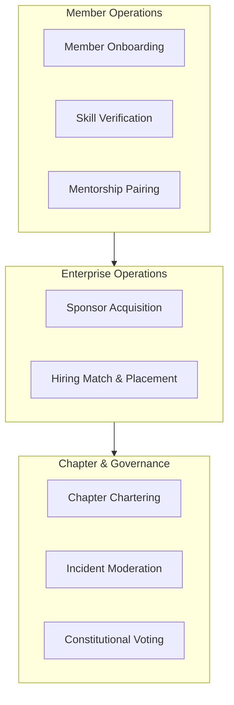

# 26 — Process Catalog

> **Document Type:** Business Process Catalog
> **Series:** Community Talent Ecosystem Platform — Business Documentation Suite
> **Document Owner:** Operations & Process Excellence
> **Status:** Draft v1.0

---

## 1. Executive Summary

This document serves as the master registry of all business processes within the Community Talent Ecosystem Platform. Defining inputs, outputs, triggers, owners, frequencies, and KPIs for each process guarantees consistent execution across local chapters and corporate portals, establishing operational guardrails for all stakeholders.

---

## 2. Purpose and Scope

### 2.1 Purpose
To provide operational clarity by documenting the exact flow of every key business process, ensuring there are no gaps in accountability or service delivery.

### 2.2 Scope
Covers all processes within Member Lifecycle, Verification, Mentorship, HR/Hiring, Chapter Operations, Events, Governance, and Sponsorship.

---

## 3. Business Principles

1. **Clear Ownership**: Every business process has a single designated owner role responsible for its performance and quality.
2. **Measurability**: Process execution is tracked via quantifiable KPIs.
3. **Traceability**: Every process must map directly to a business capability and support the core vision.
4. **Standardization**: Processes must be executed identically across all global chapters unless a regional exception is formally approved.

---

## 4. Process Category Map

---

## 5. Business Process Catalog

### 5.1 Member Operations

#### Process ID: P-MBR-001 — Member Onboarding
* **Owner**: Chapter Admin
* **Trigger**: A new user registers on the platform.
* **Inputs**: User registration form (profile details, technology interests, regional location).
* **Outputs**: Activated Member Profile, Welcome onboarding guide, default Trust Score initialization.
* **Frequency**: Real-time.
* **Dependencies**: Verification of basic contact details.
* **KPIs**: Registration-to-profile completeness rate (>90%), Time-to-onboard (<24 hours).
* **Linked Documents**: `03_MEMBER_LIFECYCLE.md`, `18_APPENDIX.md`.

#### Process ID: P-MBR-002 — Skill Verification
* **Owner**: Mentor Council Lead
* **Trigger**: A member submits a completed practice lab.
* **Inputs**: Lab files, system logs, evaluation grading rubrics.
* **Outputs**: Verified skill badge added to portfolio, updated Trust Score, reputation points awarded.
* **Frequency**: As submitted.
* **Dependencies**: Peer pre-screening approval.
* **KPIs**: Review cycle time (<7 days), Verification accuracy rate (>95%).
* **Linked Documents**: `10_VERIFICATION_MODEL.md`, `11_COMMUNITY_REPUTATION_SYSTEM.md`.

#### Process ID: P-MBR-003 — Mentorship Pairing
* **Owner**: Mentor Council Head
* **Trigger**: A member requests a mentor in a specific technology domain.
* **Inputs**: Mentee profile, mentor availability logs, focus areas.
* **Outputs**: Confirmed mentorship pairing, initial alignment template.
* **Frequency**: Weekly batches.
* **Dependencies**: Mentor capacity data.
* **KPIs**: Match success rate (>85%), Average match latency (<10 days).
* **Linked Documents**: `08_LEARNING_ECOSYSTEM.md`, `29_MENTOR_HANDBOOK.md`.

---

### 5.2 Enterprise Operations

#### Process ID: P-COR-001 — Sponsor Acquisition
* **Owner**: Business Development Manager
* **Trigger**: Enterprise lead expresses interest or contract renewal date approaches.
* **Inputs**: Sponsor marketing pack, sponsorship guidelines, contract template.
* **Outputs**: Executed Sponsorship Contract, scholarship funding block allocation.
* **Frequency**: As needed.
* **Dependencies**: Compliance check on non-influence clauses.
* **KPIs**: Sponsor contract renewal rate (>80%), Average contract value ($).
* **Linked Documents**: `07_SPONSORSHIP_MODEL.md`, `35_PRICING_STRATEGY.md`.

#### Process ID: P-COR-002 — Hiring Match & Placement
* **Owner**: Community HR Director
* **Trigger**: A partner company submits a formal hiring request.
* **Inputs**: Job specifications, required badges, salary boundaries.
* **Outputs**: Pre-screened, anonymized candidate shortlist.
* **Frequency**: Active on requisition.
* **Dependencies**: Availability of verified candidates matching requirements.
* **KPIs**: Requisition-to-shortlist delivery (<3 days), Candidate interview conversion rate (>50%).
* **Linked Documents**: `05_HR_OPERATIONS.md`, `06_COMPANY_PARTNERSHIP_MODEL.md`.

---

### 5.3 Chapter & Governance Operations

#### Process ID: P-ADM-001 — Chapter Chartering
* **Owner**: Operations Director
* **Trigger**: Local member group submits a chapter application.
* **Inputs**: Application form, local founder biographies, minimum member list (10 members).
* **Outputs**: Approved Chapter Charter, Chapter Admin panel access, local portal page.
* **Frequency**: On demand.
* **Dependencies**: Background review of chapter leaders.
* **KPIs**: Chapter survival rate at 12 months (>90%), Founder satisfaction rating (>80%).
* **Linked Documents**: `02_COMMUNITY_BUSINESS_MODEL.md`, `28_CHAPTER_PLAYBOOK.md`.

#### Process ID: P-ADM-002 — Incident Moderation
* **Owner**: Community Moderation Lead
* **Trigger**: A member flags a post or code of conduct violation.
* **Inputs**: Reported item link, witness comments, moderation rules.
* **Outputs**: Investigation log, action taken (warning, suspension, ban).
* **Frequency**: Immediate on trigger.
* **Dependencies**: Access logs, member profiles.
* **KPIs**: Time-to-resolution (<12 hours), Escalation-to-arbitration rate (<5%).
* **Linked Documents**: `04_COMMUNITY_OPERATIONS.md`, `30_MODERATOR_HANDBOOK.md`.

#### Process ID: P-ADM-003 — Constitutional Voting
* **Owner**: Governance Committee Chair
* **Trigger**: A formal amendment proposal is tabled.
* **Inputs**: Amendment text, rationale, active member registry.
* **Outputs**: Voting results tally, amendment implementation plan.
* **Frequency**: Ad-hoc (max twice per year).
* **Dependencies**: Verification of active member status for voting eligibility.
* **KPIs**: Voter turnout percentage (>40%), Voting compliance audit (100% correct).
* **Linked Documents**: `13_COMMUNITY_GOVERNANCE.md`, `32_COMMUNITY_CONSTITUTION.md`.

---

## 6. Decision Notes

> **Decision Note — Anonymity in Sourcing (P-COR-002)**
> The community HR sourcing process (P-COR-002) is designed to generate anonymized shortlists. Names, pictures, and other biographical data are removed before sending candidate summaries to partners to ensure skills are evaluated impartially.

---

## 7. Callouts

> **Callout — Process Compliance**
> Executing any process outside the defined guidelines (e.g., skip-assigning verification labs to bypass peers) will result in automatic audit logs and review by the Governance Committee.

---

## 8. Best Practices

- **Process Walkthroughs**: Conduct training sessions for new chapter leaders to ensure consistent execution of P-ADM-001 and P-MBT-002.
- **Continuous Monitoring**: Dashboard KPIs must be set up to highlight delayed tasks automatically.

---

## 9. Assumptions

- Operators have been trained on the system tools and possess basic documentation standards.
- Hiring partners provide prompt feedback within 48 hours of receiving shortlists.

---

## 10. Future Scope

- **Process Automation**: Automating candidate shortlisting via semantic matching algorithms that align job badges with member portfolios.

---

## 11. Review Notes

| Reviewer Role | Focus Area | Status |
|---|---|---|
| Process Auditor | Compliance with COBIT/ITIL principles | Approved |
| Community Director | Operational feasibility for volunteer roles | Approved |

---

**Cross-References:** `03_MEMBER_LIFECYCLE.md` · `05_HR_OPERATIONS.md` · `14_BUSINESS_WORKFLOWS.md` · `27_RACI_MATRIX.md`
