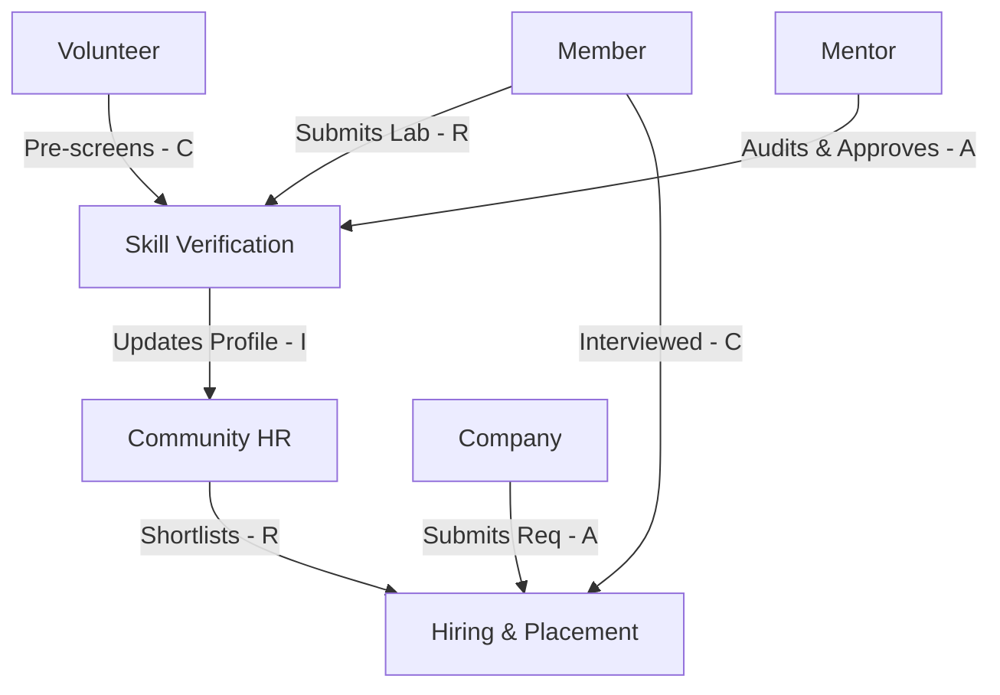

# 27 — RACI Matrix

> **Document Type:** Governance & Responsibility Matrix
> **Series:** Community Talent Ecosystem Platform — Business Documentation Suite
> **Document Owner:** Governance Committee
> **Status:** Draft v1.0

---

## 1. Executive Summary

This document presents the RACI (Responsible, Accountable, Consulted, Informed) Matrix for the Community Talent Ecosystem Platform. By mapping key business processes to specific operational, community, and corporate roles, this matrix removes ambiguity, defines decision-making authority, and guarantees compliance with governance and quality policies.

---

## 2. Purpose and Scope

### 2.1 Purpose
To define role assignments for every key business process, ensuring clear accountability and efficient execution across all regional chapters and platform operations.

### 2.2 Scope
Maps every business process in the Process Catalog (`26_PROCESS_CATALOG.md`) against eleven community and enterprise roles.

---

## 3. Business Principles

1. **Single Point of Accountability**: Every process must have exactly one Accountable (A) role.
2. **Action Ownership**: Responsible (R) roles are tasked with executing the process activities.
3. **Collaboration (Consulted)**: Input from Consulted (C) roles is gathered before decisions or changes are finalized.
4. **Transparency (Informed)**: Informed (I) roles are updated upon process completion or milestones.

---

## 4. Operational Roles definitions

* **MBR**: Community Member (Student, Fresher, Experienced Engineer)
* **MNT**: Certified Mentor (Member of Mentor Council)
* **VOL**: Community Volunteer
* **MOD**: Content/Conduct Moderator
* **ADM**: Chapter Admin / Community Leader
* **CHR**: Community HR Team / Placement Specialist
* **COM**: Partner Company Representative
* **SPO**: Corporate Sponsor
* **TRN**: Training Partner
* **EVN**: Event Organiser / Meetup Lead
* **GOV**: Governance Committee Members

---

## 5. RACI Matrix

| Process ID & Name | MBR | MNT | VOL | MOD | ADM | CHR | COM | SPO | TRN | EVN | GOV |
|---|---|---|---|---|---|---|---|---|---|---|---|
| **P-MBR-001: Member Onboarding** | R | I | I | I | A | I | I | I | I | I | I |
| **P-MBR-002: Skill Verification** | R | A | C | I | I | C | I | I | I | I | C |
| **P-MBR-003: Mentorship Pairing**| C | R | I | I | C | I | I | I | I | I | A |
| **P-COR-001: Sponsor Acquisition**| I | I | I | I | C | I | C | R | I | I | A |
| **P-COR-002: Hiring & Placement**| C | C | I | I | I | R | A | I | I | I | I |
| **P-ADM-001: Chapter Chartering** | C | C | I | I | R | I | I | I | I | I | A |
| **P-ADM-002: Incident Moderation**| C | I | I | R | C | I | I | I | I | I | A |
| **P-ADM-003: Const. Voting** | C | C | I | I | R | I | I | I | I | I | A |

### 5.1 Matrix Code Guide
- **R (Responsible)**: The role that does the work to achieve the task.
- **A (Accountable)**: The role with final approval and answerability for the activity. Only one 'A' is allowed per process.
- **C (Consulted)**: The roles whose inputs are sought, providing two-way communication.
- **I (Informed)**: The roles that are kept up-to-date on progress or outcomes, representing one-way communication.

---

## 6. Responsibility Dependency Flow

---

## 7. Decision Notes

> **Decision Note — Accountable Role for Verification**
> While mentors (MNT) perform the actual reviews (R), the Mentor Council (represented by the Governance Committee's validation delegation) is Accountable (A) for the verification process. This ensures that individual mentors cannot be pressured or held personally liable for rejection disputes.

---

## 8. Callouts

> **Callout — Auditing RACI Compliance**
> Any process bypass (e.g., a Chapter Admin approving a sponsorship agreement without Governance Committee accountability) constitutes a violation of platform bylaws, resulting in immediate suspension of permissions.

---

## 9. Best Practices

- **RACI Reviews**: Review role assignments annually during strategic planning to adjust for operational scaling.
- **Onboarding Training**: Every newly appointed Chapter Admin or Moderator must complete a training course covering their RACI responsibilities.

---

## 10. Assumptions

- Named roles have active, verified accounts and sufficient permission settings to execute their tasks.
- Governance Committee members are elected and hold active mandates.

---

## 11. Future Scope

- **RACI Automation**: Integrating workflow status indicators that automatically direct tasks based on RACI role definitions.

---

## 12. Review Notes

| Reviewer Role | Focus Area | Status |
|---|---|---|
| Governance Auditor | Integrity of Accountability boundaries | Approved |
| Operations Lead | Resource allocation feasibility | Approved |

---

**Cross-References:** `04_COMMUNITY_OPERATIONS.md` · `13_COMMUNITY_GOVERNANCE.md` · `26_PROCESS_CATALOG.md` · `32_COMMUNITY_CONSTITUTION.md`
