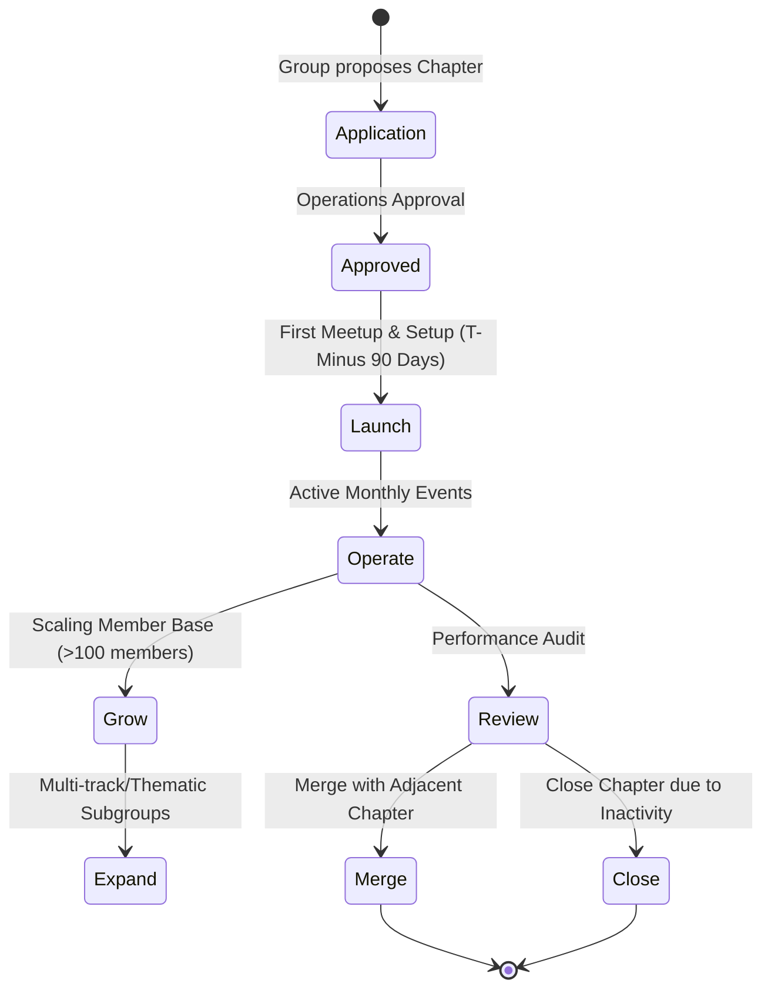

# 28 — Chapter Playbook

> **Document Type:** Operational Playbook
> **Series:** Community Talent Ecosystem Platform — Business Documentation Suite
> **Document Owner:** Community Operations
> **Status:** Draft v1.0

---

## 1. Executive Summary

This playbook defines the business model, operational rules, and lifecycle workflows for Community Chapters. Chapters are the local engines of the platform, organizing meetups, onboarding members, and building relationships with local hiring partners. Standardizing chapter lifecycle phases — Launch, Operate, Grow, Review, Expand, Merge, and Close — ensures a consistent experience for members and protects the platform's brand global reputation.

---

## 2. Purpose and Scope

### 2.1 Purpose
To provide Chapter Admins and local leaders with clear operating procedures, compliance checklists, and growth strategies.

### 2.2 Scope
Applies to all geographic (city-based or regional) and thematic chapters.

---

## 3. Business Principles

1. **Local Empowerment, Global Standard**: Chapters run local events independently but must follow global policies and code of conduct.
2. **Non-Profit Bias**: Chapters exist to grow skills and foster community, not to generate commercial profit.
3. **Open Access**: Meetups must remain free or low-cost for all verified members.
4. **Accountability**: Chapters must submit quarterly reports to maintain their charter.

---

## 4. Chapter Lifecycle Model

---

## 5. Chapter Tier System and Requirements

| Chapter Tier | Active Members | Required Mentors | Event Frequency | Financial Authority |
|---|---|---|---|---|
| **Tier 1: Seed** | 10 – 50 | 1 | Bi-monthly meetups | Low (Expenses pre-approved by Global) |
| **Tier 2: Growth** | 51 – 250 | 3 | Monthly meetups | Medium (Fixed local budget allocation) |
| **Tier 3: Enterprise** | 250+ | 10 | Monthly meetups + 1 annual summit | High (Autonomous local sponsor management) |

---

## 6. Chapter Lifecycle Operational Workflows

### 6.1 Phase 1: Launch
1. **Application**: Minimum 10 members and 1 certified Mentor submit an application.
2. **Onboarding**: Operations team trains the designated Chapter Admin on playbook procedures.
3. **Launch Event**: Host first meetup within 60 days of charter approval.

### 6.2 Phase 2: Operate
1. **Event Schedule**: Maintain a minimum frequency of one event every two months.
2. **Ticketing compliance**: Ensure 70%+ of tickets are free to verified members.
3. **Sponsor compliance**: Re-state the Non-Influence Clause in all local sponsor agreements.

### 6.3 Phase 3: Grow & Expand
1. **Mentorship scale**: Promote experienced engineers to the Mentor Track.
2. **Co-working/Partnership**: Form alliances with local tech hubs or universities.
3. **Thematic Groups**: Build sub-groups (e.g., local SRE group, local Cloud Security track).

### 6.4 Phase 4: Review & Audit
1. **Quarterly Audit**: Submit member feedback, attendance rates, and financial reports.
2. **Health Check**: Chapters with failing engagement metrics receive a 90-day recovery plan.

### 6.5 Phase 5: Merge or Close
1. **Merger**: Adjacent chapters with low activity can merge to pool resources.
2. **Closure**: Chapters that remain inactive for six consecutive months are officially closed, and assets/roles are retired.

---

## 7. Decision Notes

> **Decision Note — Seed Chapter Support**
> Seed chapters are not permitted to manage sponsor funds directly. All sponsorship transactions must be handled by the Global Finance team to protect early-stage operations from financial compliance risks.

---

## 8. Callouts

> **Callout — Safety and Code of Conduct**
> Event organizers must print and display the Code of Conduct at every physical chapter event, and designate a Moderator to handle incidents.

---

## 9. Best Practices

- **Automated Check-Ins**: Use portal tools to automate attendee check-in and award reputation points immediately.
- **Mentor Recruitment**: Keep a list of potential mentors and invite them to help with lab reviews.

---

## 10. Assumptions

- Local venues (like co-working spaces or partner offices) are willing to provide event space for free or in exchange for community visibility.
- Chapter leaders are volunteers and do not receive financial salaries from local budgets.

---

## 11. Future Scope

- **Global Chapter Exchanges**: Facilitating cross-chapter speaking slots and study groups.

---

## 12. Review Notes

| Reviewer Role | Focus Area | Status |
|---|---|---|
| Community Operations Lead | Playbook practicality and SLA targets | Approved |
| Finance Director | Compliance boundaries for Tier 2/3 chapters | Approved |

---

**Cross-References:** `02_COMMUNITY_BUSINESS_MODEL.md` · `04_COMMUNITY_OPERATIONS.md` · `12_COMMUNITY_EVENTS_MODEL.md` · `30_MODERATOR_HANDBOOK.md`
