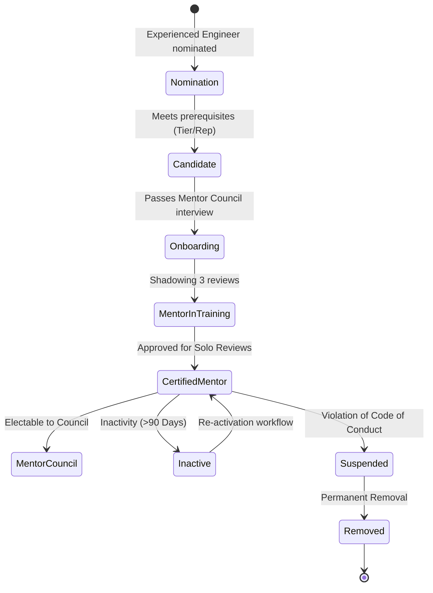

# 29 — Mentor Handbook

> **Document Type:** Role Handbook / Operational Guide
> **Series:** Community Talent Ecosystem Platform — Business Documentation Suite
> **Document Owner:** Mentor Council
> **Status:** Draft v1.0

---

## 1. Executive Summary

This handbook serves as the operational guide for Certified Mentors on the Community Talent Ecosystem Platform. Mentors are the quality keepers of the platform: they guide learners, review practice labs, and verify skill portfolios. This handbook details the mentor lifecycle (onboarding, service, recognition, and removal), responsibilities, grading expectations, and escalation channels.

---

## 2. Purpose and Scope

### 2.1 Purpose
To provide mentors with clear, standardized guidelines on review timelines, grading rubrics, ethical responsibilities, and dispute handling processes.

### 2.2 Scope
Applies to all certified mentors, mentors-in-training, and members of the Mentor Council globally.

---

## 3. Business Principles

1. **Academic Rigor**: Verifications must reflect actual candidate capabilities; compromises undermine the ecosystem’s integrity.
2. **Neutrality and Impartiality**: Mentors evaluate submissions based on rubrics, ignoring personal bias, corporate connections, or sponsorship status.
3. **Constructive Feedback**: Every rejection must include actionable, encouraging feedback.
4. **Time Respect**: The platform values mentors' volunteer hours and protects them from administrative overhead.

---

## 4. Mentor Lifecycle Model

---

## 5. Mentor Responsibilities and Standards

| Responsibility | Activity | Target SLA | KPI / Metric |
|---|---|---|---|
| **Lab Verification** | Review pre-screened labs, run logs check, apply grading rubrics. | 5 business days | Average review cycle time, rubric compliance rate. |
| **Mentorship** | Guide up to 3 mentees, review study plans, run monthly check-ins. | 1 monthly call | Mentee satisfaction rating, learning path completion rate. |
| **Community QA** | Answer advanced questions, write practice guides. | Ad-hoc | Contribution points, peer appreciation flags. |
| **Council Support** | Participate in dispute reviews and syllabus updates. | Monthly sync | Attendance, vote contribution. |

---

## 6. Mentor Code of Conduct

* **Strict Neutrality**: Never review a submission from a close colleague, relative, or direct subordinate (flag as a conflict of interest).
* **Respectful Communication**: Written reviews must be professional, clear, and encouraging. Demeaning language results in immediate suspension.
* **Integrity**: Never accept payment, perks, or hiring priority in exchange for verification approvals.
* **No Plagiarism / Cheat Toleration**: Report suspected cheating or copied code immediately using the escalation pathway.

---

## 7. Escalation Workflows

### 7.1 Suspected Cheating
1. **Flag Submission**: The mentor marks the lab submission as "Flagged for Plagiarism".
2. **Backstage Audit**: The system aggregates logs and code similarity data.
3. **Council Review**: The Mentor Council reviews the case within 5 days. If cheating is confirmed, the member’s trust score is reset to 0, and they receive a 90-day learning suspension.

### 7.2 Verification Dispute
1. **Appeal Submission**: Member submits an appeal within 14 days of rejection.
2. **Assigned Auditor**: An independent, third-party mentor is assigned to review the lab.
3. **Resolution**: The auditor's decision is final and updated in the system.

---

## 8. Decision Notes

> **Decision Note — Mentor Limits**
> A mentor is restricted to reviewing a maximum of 5 lab submissions per week and guiding no more than 3 mentees concurrently. This limit prevents burnout and protects verification quality.

---

## 9. Callouts

> **Callout — The "Why" of Rejections**
> A simple "Fail" does not help a learner grow. Mentors must point out which parts of the rubric were missed, and suggest specific practice labs to address the gaps.

---

## 10. Best Practices

- **Shadowing**: Ensure mentors-in-training spend their first month shadowing senior mentors before reviewing independently.
- **Bi-annual Calibration**: Participate in the bi-annual Mentor Calibration meeting to align on grading guidelines.

---

## 11. Assumptions

- Mentors maintain a high level of expertise in their certified technology domains.
- Mentors have access to the Mentor Portal and communication tools.

---

## 12. Future Scope

- **Mentor Sabbaticals**: Formalizing temporary leaves of absence while preserving historical mentor levels and records.

---

## 13. Review Notes

| Reviewer Role | Focus Area | Status |
|---|---|---|
| Mentor Council Head | Verification alignment & SLA feasibility | Approved |
| Community Director | Volunteer appreciation & recognition schemes | Approved |

---

**Cross-References:** `03_MEMBER_LIFECYCLE.md` · `08_LEARNING_ECOSYSTEM.md` · `10_VERIFICATION_MODEL.md` · `30_MODERATOR_HANDBOOK.md`
