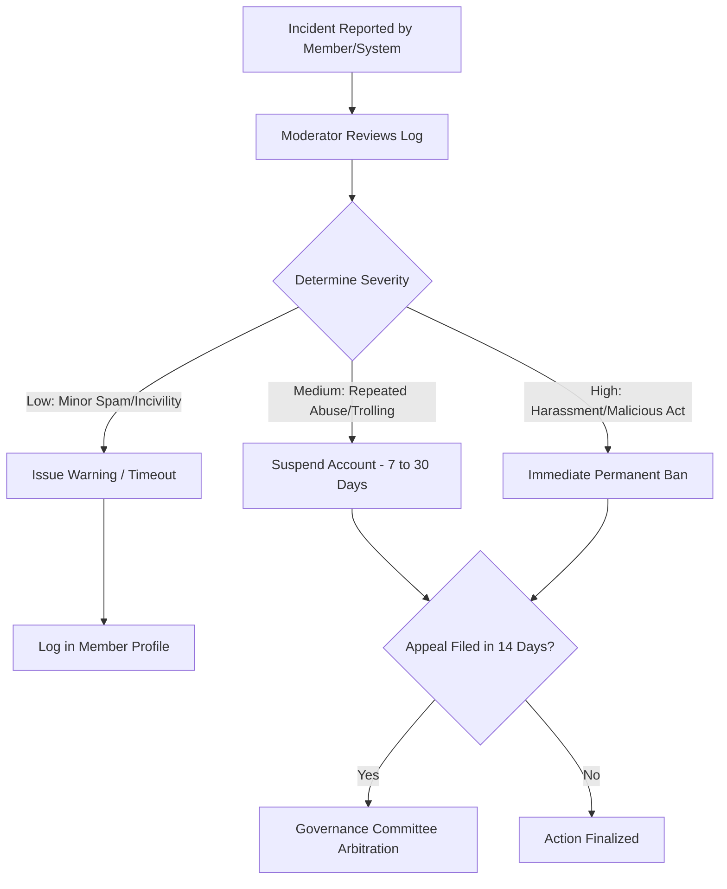

# 30 — Moderator Handbook

> **Document Type:** Role Handbook / Operational Guide
> **Series:** Community Talent Ecosystem Platform — Business Documentation Suite
> **Document Owner:** Community Operations
> **Status:** Draft v1.0

---

## 1. Executive Summary

This handbook details the operational rules, incident response pathways, and communication standards for Community Moderators. Moderators protect the community's learning environment by enforcing the Code of Conduct across all public, private, and chapter channels. This guide details warning thresholds, suspension guidelines, appeal flows, and moderation best practices.

---

## 2. Purpose and Scope

### 2.1 Purpose
To provide moderators with standardized decision-making rubrics, preventing erratic or biased moderation actions and protecting members' rights to fair treatment.

### 2.2 Scope
Applies to all volunteer and professional moderators across global and local chapter community boards, chat servers, and event forums.

---

## 3. Business Principles

1. **Safety First**: The community must remain free from harassment, discrimination, spam, and toxic behavior.
2. **De-escalation**: Moderators act to resolve conflicts, not to inflame them.
3. **Impartiality**: Rules apply equally regardless of reputation score, badge levels, or sponsorship affiliations.
4. **Proportionality**: Mod actions (warnings, timeouts, bans) must fit the severity of the violation.

---

## 4. Moderation Incident Response Flow

---

## 5. Violation Severity and Action Matrix

| Violation Category | Severity | Initial Action | Repeat Action |
|---|---|---|---|
| **Minor incivility / off-topic spam** | Low | Delete post, issue private warning. | 3-day account timeout. |
| **Plagiarism / code copying** | Medium | Delete submission, reset trust score to 0. | 90-day learning path suspension. |
| **Harassment, hate speech, or abuse** | High | Immediate 30-day suspension, log case. | Permanent ban (requires Governance approval). |
| **Malicious scraping, data theft, hacking**| Critical | Immediate permanent ban, legal audit. | Permanent ban, cooperate with authorities. |

---

## 6. Warnings and Suspensions Policy

* **Warning Expiry**: Warnings expire after 12 months. If a member receives three active warnings, an automatic 30-day suspension is applied.
* **Appeal Window**: Members have 14 days to appeal any suspension or ban. Appeals are routed to the Governance Committee.
* **Notification SLA**: Suspended members must be notified in writing within 2 hours, receiving a detailed description of the violating behavior.

---

## 7. Escalation Channels

### 7.1 Moderator to Chapter Admin
* **Trigger**: A local meetup incident requires coordination with venue staff, or a regional member is repeatedly disruptive.
* **Action**: Moderator files a ticket in the admin console. Chapter Admin takes physical or account actions.

### 7.2 Moderator to Governance Committee
* **Trigger**: Suspected corporate partner bias, moderator conflict of interest, or high-severity appeals.
* **Action**: Route logs and communication to the Governance Chair for formal review.

---

## 8. Decision Notes

> **Decision Note — Public vs Private Actions**
> Moderation actions (warnings, bans) are executed privately. Public naming-and-shaming is strictly prohibited as it damages professional reputations and triggers toxic community arguments.

---

## 9. Callouts

> **Callout — Neutrality Rule**
> If a moderator has a personal relationship or dispute with a member, they must recuse themselves and assign the moderation ticket to another moderator.

---

## 10. Best Practices

- **Log Everything**: Always include screenshots and text links when issuing warnings or suspensions.
- **De-escalate First**: Use private channels to resolve minor arguments before they require formal flags.

---

## 11. Assumptions

- Moderators have active moderator dashboard access.
- Members understand the Code of Conduct during onboarding.

---

## 12. Future Scope

- **Automated Spam Detection**: Integrating automated business pattern checks to flag common recruiter and commercial spam in study rooms.

---

## 13. Review Notes

| Reviewer Role | Focus Area | Status |
|---|---|---|
| Community Manager | Code of conduct enforcement guidelines | Approved |
| Legal Counsel | Fair notice policies and appeal procedures | Approved |

---

**Cross-References:** `04_COMMUNITY_OPERATIONS.md` · `13_COMMUNITY_GOVERNANCE.md` · `29_MENTOR_HANDBOOK.md` · `37_POLICY_MANUAL.md`
