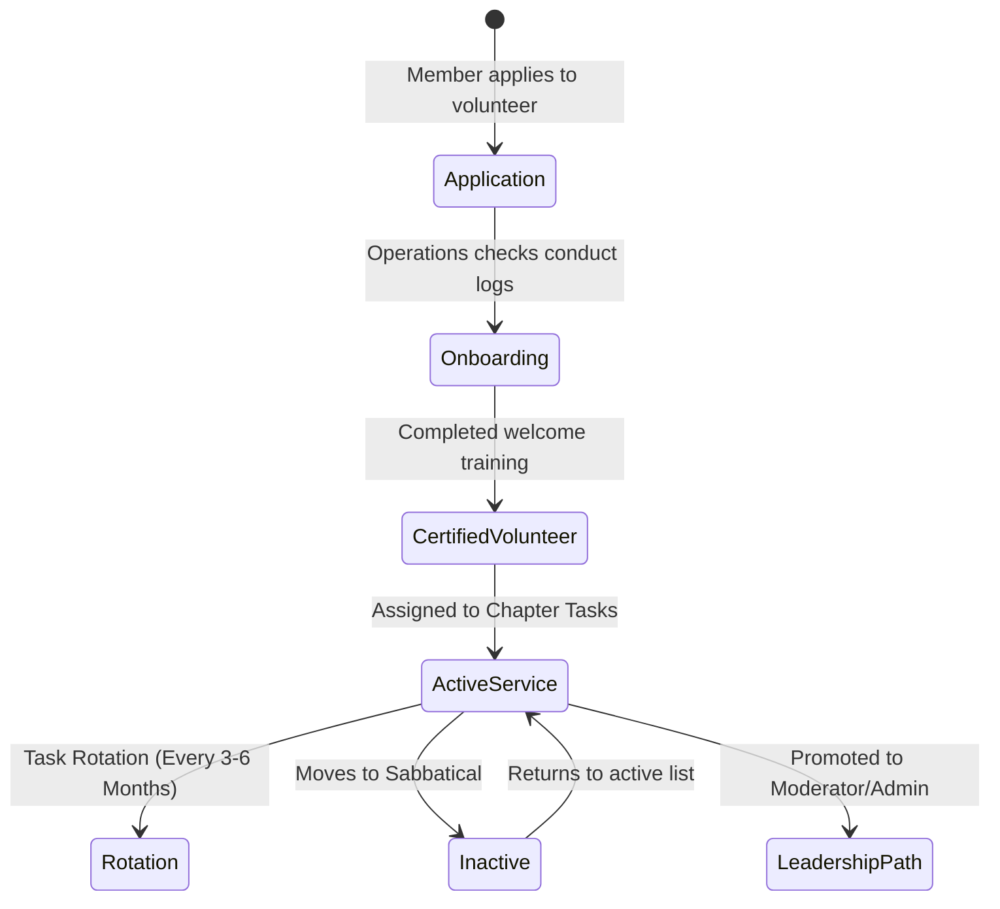

# 31 — Volunteer Handbook

> **Document Type:** Role Handbook / Operational Guide
> **Series:** Community Talent Ecosystem Platform — Business Documentation Suite
> **Document Owner:** Community Operations
> **Status:** Draft v1.0

---

## 1. Executive Summary

This handbook governs the Volunteer lifecycle, roles, and support structures within the Community Talent Ecosystem Platform. Volunteers represent the front-line energy of local chapters and global study rooms: they coordinate event logistics, write community documentation, and support new members. This guide establishes clear pathways for training, recognition, reward points, and volunteer task rotation to avoid operational burnout.

---

## 2. Purpose and Scope

### 2.1 Purpose
To provide volunteers with a clear overview of operational duties, reward systems, career development pathways, and burnout prevention guidelines.

### 2.2 Scope
Applies to all registered volunteers, chapter logistics helpers, study group leaders, and content contributors.

---

## 3. Business Principles

1. **Clear Pathways**: Volunteering is a structured development path towards leadership roles (e.g., Moderator, Chapter Admin).
2. **Burnout Protection**: Volunteer roles are designed with built-in task rotation and workload caps.
3. **Appreciation & Value**: While unpaid, volunteer contributions are publicly logged and count toward reputation levels and partner referrals.
4. **Skills First**: Volunteering should provide members with real-world leadership and coordination skills.

---

## 4. Volunteer Lifecycle Model

---

## 5. Volunteer Roles and Contribution Points

| Volunteer Role | Core Responsibilities | Weekly Time | Reputation Points Awarded |
|---|---|---|---|
| **Event Logistics Aide** | Registering attendees, venue setup, speaker timing. | 2 – 4 hours | 50 points per event. |
| **Study Group Facilitator** | Scheduling study meetups, keeping groups on track. | 3 – 5 hours | 30 points per week. |
| **Content Contributor** | Updating FAQs, writing path study guides, formatting docs. | 2 – 3 hours | 40 points per guide. |
| **Welcome Ambassador** | Greeting new members on forums, guiding to paths. | 1 – 2 hours | 20 points per week. |

---

## 6. Recognition, Rewards, and Promotion

* **Reputation Badges**: Special profile badges are awarded for milestones (e.g., "50 Hours Volunteer Service").
* **Reference Letters**: Members who log >100 hours of volunteer service with positive Chapter Admin feedback can request a formal community reference letter for their job hunt.
* **Intake Match Priority**: Volunteers receive a +5% trust score bonus on candidate dashboards, signaling strong leadership and communication skills to hiring partners.
* **Moderator Track Promotion**: Vacant Moderator and Chapter Admin roles are sourced from the active volunteer pool.

---

## 7. Task Rotation Policy

To prevent burnout and expose volunteers to diverse skills, the platform enforces a **180-day rotation policy**:
1. **Duration**: A volunteer can hold a single role (e.g., Event Logistics) for a maximum of 6 months.
2. **Rotation**: After 6 months, the volunteer is encouraged to switch to another area (e.g., Study Group Facilitator or Content Contributor) or take a 30-day sabbatical.
3. **Re-assignment**: Chapter Admins coordinate rotations during quarterly planning.

---

## 8. Decision Notes

> **Decision Note — No Financial Pay for Volunteers**
> To preserve the non-profit community spirit and comply with tax regulations across multiple jurisdictions, volunteers are not paid in cash. Value is returned through trust score benefits, career references, and free access to premium learning events.

---

## 9. Callouts

> **Callout — The Burnout Alert**
> If a volunteer is active more than 10 hours a week, the Chapter Admin must schedule a check-in to ensure they are managing their studies or day-job balance.

---

## 10. Best Practices

- **Pair Volunteers**: Always assign at least two volunteers to any event task so they have backup.
- **Monthly Huddles**: Host a monthly informal huddle to gather feedback and thank volunteers.

---

## 11. Assumptions

- Volunteers are active members in good standing (no warnings on profile).
- Volunteers have basic communication tools and access to local event venues.

---

## 12. Future Scope

- **Volunteer Academy**: Developing micro-courses on event management, technical writing, and conflict resolution to upskill volunteers.

---

## 13. Review Notes

| Reviewer Role | Focus Area | Status |
|---|---|---|
| Volunteer Coordinator | Burnout guidelines and task structures | Approved |
| HR Operations Lead | Career reference and talent dashboard integration | Approved |

---

**Cross-References:** `03_MEMBER_LIFECYCLE.md` · `04_COMMUNITY_OPERATIONS.md` · `11_COMMUNITY_REPUTATION_SYSTEM.md` · `28_CHAPTER_PLAYBOOK.md`
