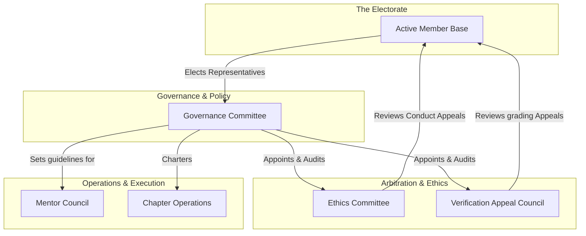

# 32 — Community Constitution

> **Document Type:** Foundational Governance Charter
> **Series:** Community Talent Ecosystem Platform — Business Documentation Suite
> **Document Owner:** Governance Committee
> **Status:** Draft v1.0

---

## 1. Executive Summary

This Constitution stands as the supreme governing charter of the Community Talent Ecosystem Platform. It codifies the platform's mission, defines the fundamental rights and responsibilities of members, outlines the checks and balances of governance, establishes democratic voting structures, and defines the procedures for constitutional amendments. All operations, corporate models, and regional chapter guidelines must comply with this Constitution.

---

## 2. Purpose and Scope

### 2.1 Purpose
To bind all members, operators, mentors, and corporate partners to a shared social contract, protecting the community from polarization, corporate capture, and governance decay.

### 2.2 Scope
Establishes the supreme governance framework globally. No local chapter rule, product feature, or commercial agreement may conflict with the articles defined herein.

---

## 3. Core Community Values

* **Community First**: The long-term vitality of the community overrides short-term commercial gains.
* **Capability over Pedigree**: Capability is proven by deeds and verified by peers, not declared on paper.
* **Integrity and Neutrality**: Evaluation systems remain free from financial bias, corporate influence, and personal interest.
* **Supportive Growth**: Senior members hold a natural responsibility to guide and support junior learners.

---

## 4. Governance Structure Model

---

## 5. Bill of Member Rights

1. **Right to Fair Evaluation**: Every member is entitled to a transparent, rubric-based evaluation of their submissions without discrimination.
2. **Right to Appeal**: Members have the right to challenge any moderation warning, suspension, or failed verification decision through formal appeal channels.
3. **Right to Data Privacy**: Members retain ownership of their personal data. Portfolio sharing and recruiter visibility are strictly opt-in.
4. **Right to Representation**: Active members have the right to vote for representatives on the Governance Committee and participate in community referendums.
5. **Right of Expression**: Members can speak and debate freely within professional bounds, provided communications remain respectful and non-harassing.

---

## 6. Member Responsibilities

1. **Adherence to Conduct**: Every member must follow the Code of Conduct in all community spaces.
2. **Growth Contribution**: As members gain seniority and reputation, they are expected to participate in peer reviews and volunteer activities.
3. **Guard the Signal**: Members must report plagiarism, cheating, or any attempt to manipulate the reputation system.

---

## 7. Voting Systems and Legislative Authority

To ensure democratic legitimacy, the platform uses two forms of voting: **Governance Committee Votes** and **Ecosystem-Wide Referendums**.

| Action Type | Electorate | Passing Threshold | Quorum |
|---|---|---|---|
| **Standard Policy Change** | Governance Committee | Simple Majority (>50%) | 60% of seats |
| **Constitutional Amendment** | Governance Committee + Member Base | 2/3 Committee Supermajority + Simple Member Majority | 75% Committee / 30% Members |
| **Chapter Leader Election** | Local Chapter Members | Simple Majority (>50%) | 20% of Local Members |
| **Trustee Recall** | Global Member Base | 2/3 Supermajority (>66.6%) | 40% of Global Members |

---

## 8. Constitutional Amendment Procedure

Changing this Constitution is a deliberate, multi-stage process:
1. **Proposal**: An amendment can be proposed by either a 1/3 vote of the Governance Committee or a petition signed by at least 5% of active global members.
2. **Review**: The Ethics Committee reviews the proposal to ensure it does not compromise core values (e.g., non-influence).
3. **Debate**: The proposal is published in the community forum for a minimum of 30 days of public debate.
4. **Vote**: The proposal is put to a formal vote according to the thresholds in Section 7.
5. **Enactment**: Approved changes are logged in `CHANGELOG.md` and compiled into the Constitution document.

---

## 9. Decision Notes

> **Decision Note — Non-Influence as an Unalterable Core**
> Section C of this Constitution (Neutrality of Verification) is declared an *eternal clause*. Under no circumstances can a future amendment alter or remove the Non-Influence Clause that prevents sponsors or hiring companies from buying reputation or verification outcomes.

---

## 10. Callouts

> **Callout — The Checks and Balances**
> The Governance Committee creates policies, the Mentor Council executes technical verifications, and the Ethics Committee arbitrates disputes. This separation of powers prevents any single actor from gaining total control.

---

## 11. Best Practices

- **Publish Votes**: Record and publish the voting details of all Governance Committee sessions to maintain transparency.
- **Maintain a Constitution Log**: Ensure any approved changes are clearly annotated with proposal IDs and voting dates.

---

## 12. Assumptions

- The platform provides secure, cryptographically validated voting tools to prevent ballot manipulation.
- Members keep their profile registration active to remain eligible to vote.

---

## 13. Future Scope

- **Liquid Democracy**: Exploring delegative voting systems, allowing members to delegate their vote on specialized technical issues to domain experts.

---

## 14. Review Notes

| Reviewer Role | Focus Area | Status |
|---|---|---|
| Governance Chair | Alignment with charter standards | Approved |
| Legal Counsel | Constitutional rights compliance | Approved |

---

**Cross-References:** `01_PROJECT_VISION.md` · `13_COMMUNITY_GOVERNANCE.md` · `20_STAKEHOLDER_ANALYSIS.md` · `37_POLICY_MANUAL.md`
