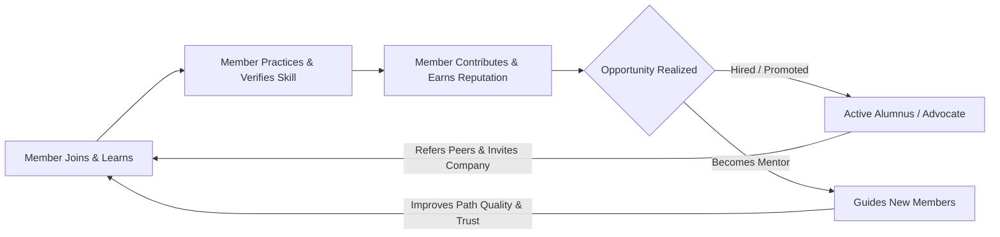

# 33 — Go-To-Market Strategy

> **Document Type:** Strategic Go-To-Market (GTM) Document
> **Series:** Community Talent Ecosystem Platform — Business Documentation Suite
> **Document Owner:** Product Strategy & Marketing
> **Status:** Draft v1.1 — Reconciled against actual Phase 1 launch scope 2026-08-03

---

## 1. Executive Summary

This document outlines the Go-To-Market (GTM) Strategy for the Community Talent Ecosystem Platform. Achieving sustainable growth requires a balanced ecosystem approach: we must acquire members (the supply of talent) and companies (the demand for talent) in lockstep. This GTM strategy details market entry, community growth loops, chapter expansion frameworks, corporate partner acquisition, and branding position.

---

## 2. Purpose and Scope

### 2.1 Purpose
To provide a strategic roadmap for driving user acquisition, corporate partnerships, and geographical expansions, ensuring all operations align to build market trust.

### 2.2 Scope
Covers launch strategy, growth loops, B2B partner acquisition, marketing messaging, and chapter expansion plans.

---

## 3. Business Principles

1. **Organic First**: Prioritize peer-to-peer viral growth and community trust over paid ads.
2. **Quality-Driven Growth**: We measure success by placement and verification rates, not simple register counts.
3. **Double-Sided Balance**: Local chapter expansion must align with local employer partner acquisition.
4. **Authenticity in Marketing**: Developer-focused marketing must remain technical, transparent, and direct, avoiding corporate buzzwords.

---

## 3A. Reconciliation Note — GTM Assumes the Track A Sequence

> **Callout — Check This Before Launch Messaging Ships**
> `39_RELEASE_PLANNING.md` §3A documents that the platform actually shipped an endorsement-based, labs-deferred Phase 1 (Release Track B), not the labs-first sequence this GTM document's "Quality-Driven Growth" principle (§3) may assume. Marketing messaging built around "verified through hands-on labs" would overstate what a new member actually experiences at launch — messaging should describe the real Phase 1 trust mechanism (`10_VERIFICATION_MODEL.md` §1A) accurately, not the Phase 2 target-state, until labs actually ship. This is a launch-messaging risk, not just a documentation one — recommend GTM/Marketing sign-off before public launch copy is finalized.

---

## 4. Community Growth Loop Model

---

## 5. Market Entry and Launch Phases

The platform launches in three sequential phases to ensure stability before scale.

| Phase | Duration | Focus Area | Milestone / Target |
|---|---|---|---|
| **Phase 1: Seed Cohort** | Months 1 – 3 | Onboard 3 founding chapters (Mumbai, Singapore, Munich). | 300 active members, 15 certified mentors. |
| **Phase 2: Partner Pilot** | Months 4 – 6 | Secure 5 local hiring partners; launch early verification loops. | 20 placements, 1,000 members. |
| **Phase 3: Chapter Scale** | Months 7 – 12 | Launch chapter application portal; expand to 15 chapters globally. | 5,000 members, 100 placements. |

---

## 6. Corporate Acquisition Strategy

### 6.1 Employer Partners (Hiring Companies)
* **Value Prop**: Zero upfront search fees, zero resume filtering cost, pre-screened technical capabilities.
* **Acquisition Channel**: Direct B2B outreach, community references (placing alumni in new companies), and case studies showing lower time-to-hire.
* **Pilot Model**: Offer 1 free placement to partner companies to prove validation quality.

### 6.2 Sponsors and Training Partners
* **Value Prop**: Credible access to a highly engaged, technical audience, supporting developer education.
* **Acquisition Channel**: Developer relations teams of major tech providers (Cloud providers, tool makers).

---

## 7. Positioning and Core Messaging

| Audience | Competitor Alternative | Platform Positioning | Core Message |
|---|---|---|---|
| **Student / Fresher** | Expensive certifications, cold applications. | Zero-cost, peer-guided growth with verified portfolios. | *"Don't write a resume. Prove your capability."* |
| **Experienced SRE** | Unsolicited recruiter spam on LinkedIn. | Expert community, mentorship prestige, high-quality hiring. | *"Mentor the next generation. Skip the recruiter."* |
| **Hiring Manager** | Resume screeners, tech challenge portals. | Immediate access to pre-vetted candidate pools. | *"Stop screening claims. Hire proven talent."* |

---

## 8. Decision Notes

> **Decision Note — No Paid Advertising for Member Acquisition**
> We do not allocate budget to paid member acquisition (e.g., social ads). Developer and infrastructure communities are highly skeptical of paid advertisements. Growth must be driven by technical content, free high-quality labs, and word-of-mouth success.

---

## 9. Callouts

> **Callout — The Cold Start Problem**
> A double-sided marketplace fails if one side is empty. In new cities, we launch member study groups *first* (60 days prior), building verified profiles before pitch-onboarding local employer partners.

---

## 10. Best Practices

- **Developer Advocacy**: Hire Developer Advocates to speak at industry conferences, explaining our verification model.
- **Celebrate Placements**: Publish success stories of members who transitioned from student to SRE to inspire the community.

---

## 11. Assumptions

- Major cloud and software companies are willing to sponsor learning pathways without demanding proprietary ownership of the community.
- The demand for infrastructure, DevOps, and SRE talent remains high globally.

---

## 12. Future Scope

- **Global Tech Conferences**: Hosting annual ecosystem conferences in partnership with major developer operations bodies (e.g., CNCF).

---

## 13. Review Notes

| Reviewer Role | Focus Area | Status |
|---|---|---|
| Marketing Director | Brand positioning and growth loop metrics | Approved |
| Partnership Lead | B2B employer acquisition workflows | Approved |

---

**Cross-References:** `02_COMMUNITY_BUSINESS_MODEL.md` · `05_HR_OPERATIONS.md` · `15_ROADMAP.md` · `34_COMPETITOR_ANALYSIS.md`
