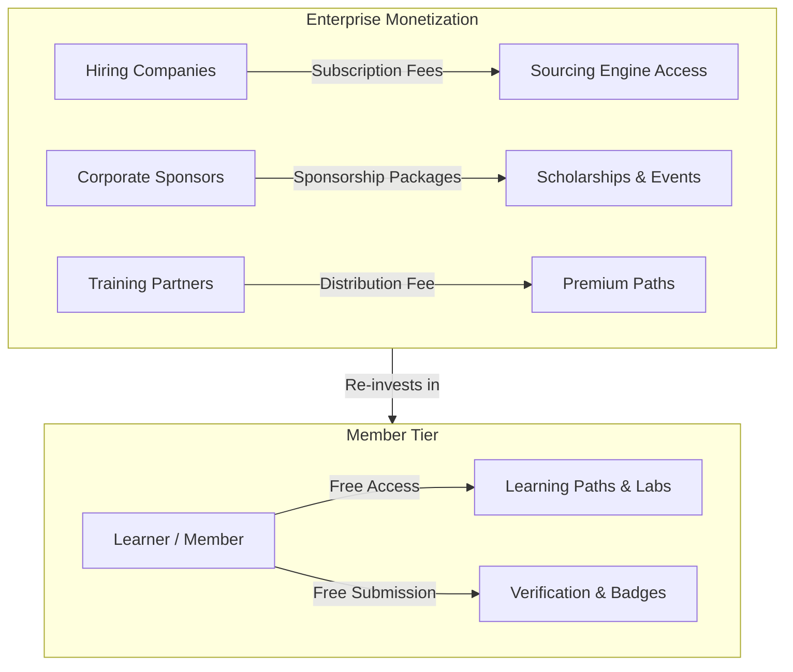

# 35 — Pricing Strategy

> **Document Type:** Business Pricing & Revenue Strategy
> **Series:** Community Talent Ecosystem Platform — Business Documentation Suite
> **Document Owner:** Finance & Business Strategy
> **Status:** Draft v1.0

---

## 1. Executive Summary

This document establishes the Pricing Strategy for the Community Talent Ecosystem Platform. The pricing architecture is designed to support our "Community First" and "Non-Influence" principles: member learning, practice, and basic verification remain **free of cost**, while platform monetization is driven by enterprise value, including corporate talent sourcing subscriptions, branded sponsorships, training partner distribution fees, and corporate event tickets.

---

## 2. Purpose and Scope

### 2.1 Purpose
To define the commercial structures and fee models that guarantee the platform's financial sustainability without compromising community trust.

### 2.2 Scope
Covers corporate hiring plans, sponsorship tiers, training partner licenses, meetup ticketing policies, and member scholarship guidelines.

---

## 3. Business Principles

1. **Free for Learners**: Core learning paths, practice challenges, and verification submissions must remain free for members.
2. **Monetize Enterprise Value**: Revenue is generated from recruiters who benefit from verified talent.
3. **Strict Non-Influence**: Financial contributions from sponsors or partners cannot buy priority, fast-track, or change verification outcomes.
4. **Value-Aligned Pricing**: Tier pricing scales with the size of the talent pool accessed or the amount of brand visibility.

---

## 4. Revenue Model Architecture

---

## 5. Enterprise Pricing Models

### 5.1 Company Hiring Plans (Subscriptions)
* **Tier 1: Growth Partner ($5,000 / Year)**:
  - Access to local chapter talent pools.
  - Active search for up to 3 roles simultaneously.
  - Standard placement fee (10% of candidate's starting salary).
* **Tier 2: Enterprise Partner ($15,000 / Year)**:
  - Access to global talent pools.
  - Unlimited active roles.
  - Premium placement fee (8% of starting salary).
  - Dedicated Community HR matching coordinator.

### 5.2 Sponsor Tiers
* **Tier 1: Chapter Sponsor ($3,000 / Year per Chapter)**:
  - Logo placement on chapter event pages.
  - 1 presentation slot per year at a local meetup.
* **Tier 2: Global Path Sponsor ($25,000 / Year per Domain Path)**:
  - Logo placement on specific learning path (e.g., Cloud Fundamentals).
  - Funding goes directly to member lab sandboxes and scholarship blocks.

### 5.3 Training Partner Plans
* **Rev-Share Model**: Training partners list premium courses. The platform retains 30% of sales, while 70% goes to the content creator.
* **Verification Integration ($10,000 / Year)**: Training partner’s proprietary certificate is mapped to a community verification lab, verifying it against our rubrics.

---

## 6. Event Ticketing and Scholarships

* **Local Meetups**: 70%+ of tickets are free to verified members. Non-member guest tickets are priced at $20 to filter attendance and cover catering costs.
* **Annual Conferences**: General tickets are $200. Members with high reputation scores receive a 50% discount. Certified Mentors attend for free.
* **Scholarships**: Sponsors fund scholarship blocks ($1,000 covers 50 learners' advanced lab sandbox fees). Scholarship selection is managed by the Chapter Admins based on member merit and need.

---

## 7. Revenue Assumptions (Annual Target)

| Category | Unit Metric | Annual Target | Revenue Contribution (%) |
|---|---|---|---|
| **Hiring Subscriptions** | 100 partner companies | $1,000,000 | 40% |
| **Placement Fees** | 150 placements (Avg. fee $8k) | $1,200,000 | 48% |
| **Global Path Sponsorships** | 8 technology domains | $200,000 | 8% |
| **Meetups / Conferences** | 20 local events, 1 global event | $100,000 | 4% |

---

## 8. Decision Notes

> **Decision Note — Rejection of a Pay-To-Verify Model**
> We explicitly reject a "Pay-to-Verify" model (where members pay to speed up or take a verification test). Charging members for verification creates a financial conflict of interest and compromises the objectivity of our mentors.

---

## 9. Callouts

> **Callout — Non-Influence Contract Clause**
> All enterprise contracts contain a mandatory **Non-Influence Clause**. A violation of this clause results in immediate contract cancellation with no refunds.

---

## 10. Best Practices

- **Quarterly Pricing Reviews**: Check alignment of placement fee metrics with market recruitment rates.
- **Provide Tier Upgrades**: Offer introductory trials to potential enterprise partners (e.g., first placement at 5% fee).

---

## 11. Assumptions

- Placement fee models are accepted by target corporate HR departments.
- Local corporate sponsors value community developer relations visibility over standard digital advertisements.

---

## 12. Future Scope

- **Enterprise Training Certification**: Custom verification tracks paid for by large companies to upskill their internal teams.

---

## 13. Review Notes

| Reviewer Role | Focus Area | Status |
|---|---|---|
| CFO | Revenue feasibility and tax compliance | Approved |
| Partnership Lead | Sales model alignment with target partners | Approved |

---

**Cross-References:** `02_COMMUNITY_BUSINESS_MODEL.md` · `06_COMPANY_PARTNERSHIP_MODEL.md` · `07_SPONSORSHIP_MODEL.md` · `36_FINANCIAL_MODEL.md`
