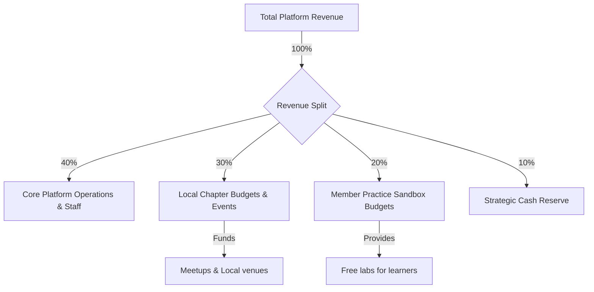

# 36 — Financial Model

> **Document Type:** Business Financial Model & Projections
> **Series:** Community Talent Ecosystem Platform — Business Documentation Suite
> **Document Owner:** Chief Financial Officer / Finance Strategy
> **Status:** Draft v1.1 — Individual Recruiter commission revenue flagged 2026-08-03 (see `35_PRICING_STRATEGY.md` §5.2A)

---

## 1. Executive Summary

This document presents the Financial Model for the Community Talent Ecosystem Platform. The financial structure aims to support the community's operations while generating sustainable returns for stakeholders. Revenue is driven by corporate talent subscriptions and placement fees, while key operational expenses consist of sandbox lab costs, developer relations support, and local chapter funding. This guide details budget allocations, runway requirements, unit economics, and 5-year illustrative forecasts.

---

## 2. Purpose and Scope

### 2.1 Purpose
To establish financial boundaries, cash flow projections, and runway calculations that guide operational budgets and pricing policies.

### 2.2 Scope
Covers revenue, operational expenses, capital expenditures, unit economics, and illustrative financial forecasts.

---

## 3. Business Principles

1. **Re-Investment Cycle**: A minimum of 30% of net B2B revenues must be re-invested into member lab environments and local chapter budgets.
2. **Predictable Cash Flow**: Prioritize recurring corporate subscription revenues over transactional placement fees to ensure financial stability.
3. **Runway Safety**: Maintain a cash reserve equivalent to 6 months of operational expenses (burn rate) at all times.
4. **Frugal Operations**: Maximize volunteer efficiency to keep administrative overhead low.

---

## 4. Cash Flow & Budget Allocation Model

---

## 5. Expense Categories

* **Operational Expenses (OpEx)**:
  - **Core Staff Salaries**: Operations, developer advocates, Community HR placement coordinators.
  - **Sandbox Lab Provisioning**: Costs associated with hosting active practice environments.
  - **Chapter Grants**: Discretionary budgets sent to local chapters to run meetups.
  - **Insurance & Legal**: Liability coverage for events and corporate contract management.
* **Capital Expenditures (CapEx)**:
  - Equipment for core staff and regional chapter event kits (AV, branding materials).
* **Cost of Goods Sold (COGS)**:
  - Payment gateway fees, registration gift bags, and local meetup food and beverages.

---

## 6. Illustrative 5-Year Financial Forecast (USD)

| Category | Year 1 | Year 2 | Year 3 | Year 4 | Year 5 |
|---|---|---|---|---|---|
| **Chapters Active** | 5 | 15 | 30 | 50 | 100 |
| **Members (Active)** | 1,500 | 5,000 | 15,000 | 40,000 | 100,000 |
| **B2B Subscriptions** | $250,000 | $750,000 | $2,000,000 | $4,500,000 | $9,000,000 |
| **Placement Fees** | $300,000 | $900,000 | $2,400,000 | $5,000,000 | $10,000,000 |
| **Sponsorships** | $50,000 | $150,000 | $400,000 | $800,000 | $1,500,000 |
| **Total Revenue** | **$600,000** | **$1,800,000** | **$4,800,000** | **$10,300,000** | **$20,500,000** |
| **OpEx (incl. Labs)** | $450,000 | $1,200,000 | $3,100,000 | $6,500,000 | $13,000,000 |
| **Net Income** | **$150,000** | **$600,000** | **$1,700,000** | **$3,800,000** | **$7,500,000** |

---

## 7. Ecosystem Unit Economics

To ensure profitability at scale, we track unit economics on a per-member and per-partner basis:
* **Member Acquisition Cost (MAC)**: $12 (primarily driven by developer relations outreach and content creation).
* **Monthly Sandbox Lab Cost per Active Learner**: $4.50.
* **Annual Revenue per Active Member**: $400 (allocated from B2B hiring revenues divided by total member base).
* **Corporate Customer Acquisition Cost (CAC)**: $1,500 (B2B sales and onboarding support costs).
* **Corporate Lifetime Value (LTV)**: $45,000 (assumes 3-year retention, $10k annual sub, and 2 placements per year at $15k total fee).

> **Note — Individual Recruiter Commission Not Yet Modeled**
> The 5-Year Forecast (§6) and unit economics above do not include revenue impact from `35_PRICING_STRATEGY.md` §5.2A's proposed 15% recruiter commission split, because that tier is unratified (`BR-HR-003`, `21_BUSINESS_RULES.md`). Per the "Predictable Cash Flow" principle (§3), a commission-split model that reduces net placement fee capture per deal should be modeled explicitly before ratification — do not assume it is additive to Placement Fees in §6 without first checking whether it is a *split of* or *addition to* that line.

---

## 8. Decision Notes

> **Decision Note — Funding of the Sandboxed Lab Environment**
> The cost of hosting running infrastructure for labs is the largest variable expense. To mitigate this risk, we set a monthly usage quota of 20 hours per member. Members who require extra hours must request a scholarship or wait for their monthly limits to reset.

---

## 9. Callouts

> **Callout — Financial Buffer Rule**
> If the cash reserve drops below the 6-month burn threshold, the platform halts new chapter launch approvals and freezes core hiring until reserves are restored.

---

## 10. Best Practices

- **Dynamic Lab Scaling**: Monitor lab environment usage hours to adjust budgets weekly.
- **Auditing Chapter Grants**: Audit Tier 2/3 chapter expense logs monthly before releasing the next month's funds.

---

## 11. Assumptions

- Placement salary baselines average $80,000 per year globally across our target technical fields.
- Cloud providers continue to provide promotional grants to support our sandbox environments.

---

## 12. Future Scope

- **Global Foundations Integration**: Setting up regional non-profit structures (e.g., US 501(c)(3)) to optimize chapter tax liabilities.

---

## 13. Review Notes

| Reviewer Role | Focus Area | Status |
|---|---|---|
| Business Sponsor | ROI and investment horizons | Approved |
| Finance Manager | Budget models and unit economics | Approved |

---

**Cross-References:** `02_COMMUNITY_BUSINESS_MODEL.md` · `07_SPONSORSHIP_MODEL.md` · `17_SUCCESS_METRICS.md` · `35_PRICING_STRATEGY.md`
