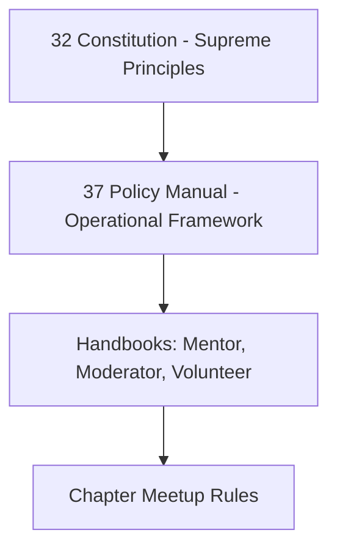
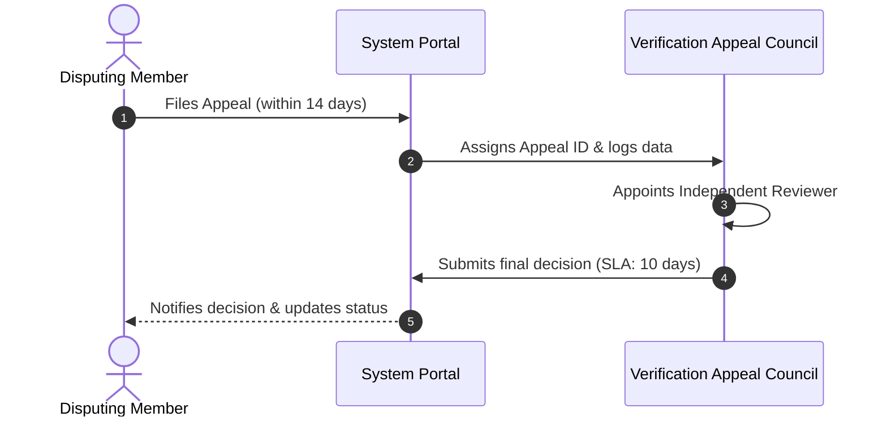

# 37 — Policy Manual

> **Document Type:** Operational Policy Manual
> **Series:** Community Talent Ecosystem Platform — Business Documentation Suite
> **Document Owner:** Governance Committee
> **Status:** Draft v1.0

---

## 1. Executive Summary

This Policy Manual consolidates the operational policies, ethical guardrails, and compliance regulations governing the Community Talent Ecosystem Platform. These policies protect the rights of members, ensure fair skill verification, enforce strict corporate neutrality, and secure compliance with global data protection standards. All volunteers, moderators, mentors, and corporate partners must comply with these guidelines.

---

## 2. Purpose and Scope

### 2.1 Purpose
To provide a clear, operational reference for handling disputes, protecting data privacy, managing events, and arbitrating ethics violations.

### 2.2 Scope
Covers Community Policies, Verification Policies, Ethics and Recusals, Privacy and Data Protections, Appeals Procedures, Content and Plagiarism Policies, and Local Chapter Event Rules.

---

## 3. Policy Hierarchy Model

---

## 4. Community & Conduct Policies

* **Professional Environment**: Community channels are spaces for professional growth. Off-topic debates (politics, religion) are prohibited.
* **Inclusion & Harassment**: The platform enforces a zero-tolerance policy for harassment, discrimination, or abusive behavior based on gender, race, age, religion, or ability.
* **Recruiter Engagement**: Direct outreach from recruiters is restricted. Recruiter spam in study channels results in account suspensions.

---

## 5. Verification & Ethics Policies

* **Evaluation Neutrality**: Mentors must evaluate lab submissions strictly using the public grading rubrics.
* **Recusal Requirement**: Mentors must recuse themselves from reviewing any candidate where a personal, family, or direct corporate reporting relationship exists.
* **Credentials Revocation**: The Verification Council can revoke verified badges if subsequent investigation reveals cheating, code copying, or a pattern of unethical behavior.
* **Non-Influence Guarantee**: No partner, sponsor, or company can pay to bypass, fast-track, or change the outcome of a member's verification process.

---

## 6. Privacy & Data Protections

* **Opt-In Sourcing**: Member profiles are hidden from the hiring sourcing dashboard by default. Members must actively choose to enter the candidate pool.
* **Anonymized Sourcing**: Search matches for recruiters must display anonymized summaries (verified badges, trust score, country) first. Personal details are revealed only when the candidate accepts an interview request.
* **Global Compliance**: Operations must follow GDPR, CCPA, and regional data protection regulations (e.g., right to be forgotten, exportable data packets).

---

## 7. Dispute & Appeals Procedure

### 7.1 Appeals Window and Rules
1. **Window**: Appeals must be filed within 14 calendar days of receiving a verification rejection or moderation warning.
2. **Review**: The independent reviewer must evaluate the case without contact with the original evaluator or moderator.
3. **Outcome**: The council's decision is final and logged on the audit trail.

---

## 8. Event and Chapter Policies

* **Local Approvals**: All chapter meetups must have safety coordinators, venue permissions, and check-in procedures.
* **Financial Integrity**: Local sponsors must make payments directly to the Global Finance team. No Chapter Admin can accept direct cash sponsorships.
* **Ticketing compliance**: At least 70% of tickets must remain free for verified members.

---

## 9. Decision Notes

> **Decision Note — Anonymity as Policy**
> The decision to enforce anonymized talent sourcing was made to support meritocracy. While some recruiters initially requested direct access, anonymization has proven to lower hiring bias and increase placement diversity.

---

## 10. Callouts

> **Callout — Mandatory Reporting**
> Any moderator, volunteer, or mentor who suspects a breach of the Non-Influence Clause must report it directly to the Ethics Committee.

---

## 11. Best Practices

- **Bi-annual Policy Audits**: The Governance Committee should review this manual every six months to align with updated regional data regulations.
- **Accessible Appeals**: Ensure the appeals link is clearly visible on every rejection notice.

---

## 12. Assumptions

- Members review and accept the Privacy Policy and Code of Conduct during onboarding.
- Local laws allow for the collection and processing of professional portfolio metrics under user consent.

---

## 13. Future Scope

- **Self-Sovereign Identity (SSI)**: Integrating decentralized credential standards to allow members to export and prove their verified badges on external networks securely.

---

## 14. Review Notes

| Reviewer Role | Focus Area | Status |
|---|---|---|
| Ethics Committee Chair | Policy alignment with Core Values | Approved |
| Legal Counsel | GDPR/CCPA and liability compliance | Approved |

---

**Cross-References:** `04_COMMUNITY_OPERATIONS.md` · `10_VERIFICATION_MODEL.md` · `13_COMMUNITY_GOVERNANCE.md` · `32_COMMUNITY_CONSTITUTION.md`
