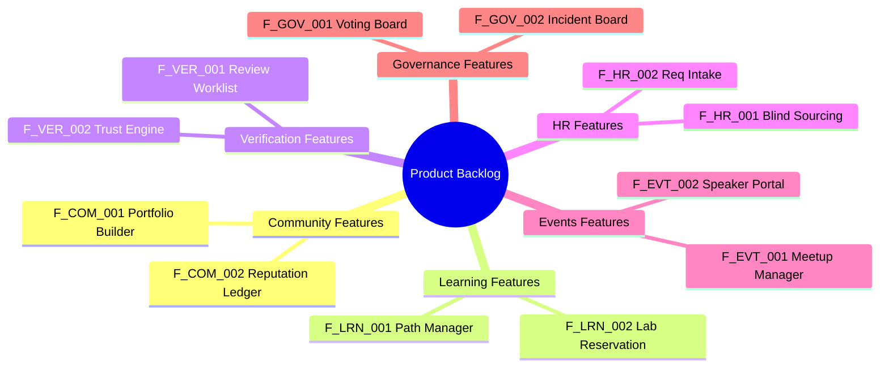

# 38 — Feature Catalogue

> **Document Type:** Product Feature Catalogue
> **Series:** Community Talent Ecosystem Platform — Business Documentation Suite
> **Document Owner:** Product Management
> **Status:** Draft v1.0

---

## 1. Executive Summary

This document presents the Business Feature Catalogue for the Community Talent Ecosystem Platform. The catalogue groups product capabilities into eight operational domains: Community, Learning, Verification, HR/Hiring, Events, Governance, Analytics, and Administration. Each feature is defined by its business goals, target actors, governing business rules, and dependencies to align product delivery with our strategic goals.

---

## 2. Purpose and Scope

### 2.1 Purpose
To provide product managers, designers, and engineers with a clear, business-validated backlog of features, preventing feature creep and ensuring that every system requirement supports a defined user outcome.

### 2.2 Scope
Covers all business features across the platform’s public, member, mentor, corporate, and administrative interfaces.

---

## 3. Business Principles

1. **Impact Prioritization**: Features are prioritized based on their contribution to member growth and verification credibility.
2. **Minimalist Architecture**: Avoid complex workflows that volunteer moderators or mentors cannot easily manage.
3. **No Technical Leakage**: Features are described at the business logic level, avoiding database, programming, or specific framework requirements.
4. **Consistency**: Feature names and definitions must align with the capability map and user stories.

---

## 4. Product Feature Taxonomy

---

## 5. Product Feature Catalogue

### 5.1 Community Features

#### Feature ID: F-COM-001 — Verified Portfolio Builder
* **Feature Name**: Verified Portfolio Builder
* **Business Goal**: Allow members to showcase verified badges and contributions to employers.
* **Actors**: Member (Student, Fresher, Engineer), Company.
* **Business Rules**: Self-declared elements must be visually separated from verified badges.
* **Dependencies**: Verification Database.
* **Priority**: High (Must Have).
* **Future Scope**: Direct PDF/Resume export capability.

#### Feature ID: F-COM-002 — Reputation Ledger
* **Feature Name**: Reputation Point Ledger
* **Business Goal**: Track, display, and reward member community contributions.
* **Actors**: Member, Volunteer, Moderator, Chapter Admin.
* **Business Rules**: Apply annual decay rules for non-verified points.
* **Dependencies**: Points Ledger.
* **Priority**: Medium (Should Have).
* **Future Scope**: Leaderboards with regional category filters.

---

### 5.2 Learning Features

#### Feature ID: F-LRN-001 — Learning Path Tracker
* **Feature Name**: Learning Path tracker
* **Business Goal**: Guide learners through structured, domain-specific curriculums.
* **Actors**: Member, Training Partner.
* **Business Rules**: Enforce prerequisite course completion.
* **Dependencies**: Curriculum database.
* **Priority**: High (Must Have).
* **Future Scope**: Dynamic recommendations based on skill gaps.

#### Feature ID: F-LRN-002 — Lab Environment Allocator
* **Feature Name**: Lab Sandbox Allocator
* **Business Goal**: Allocate sandbox environment time slots for practice labs.
* **Actors**: Member.
* **Business Rules**: Limit members to 20 practice hours per month.
* **Dependencies**: Lab environments.
* **Priority**: High (Must Have).
* **Future Scope**: Automatic environment cleanup on timeout.

---

### 5.3 Verification Features

#### Feature ID: F-VER-001 — Peer-to-Mentor Review Pipeline
* **Feature Name**: Verification Worklist
* **Business Goal**: Manage and assign submissions through peer and mentor review stages.
* **Actors**: Peer reviewer, Certified Mentor, Mentor Council.
* **Business Rules**: Enforce two-peer pre-screening before mentor assignment.
* **Dependencies**: Peer matching queue.
* **Priority**: High (Must Have).
* **Future Scope**: Automatic load balancing for active mentors.

#### Feature ID: F-VER-002 — Trust Score Engine
* **Feature Name**: Trust Score Calculator
* **Business Goal**: Calculate and display candidate credibility metrics.
* **Actors**: Member, Community HR, Company.
* **Business Rules**: Trust score decreases on conduct violations or cheating.
* **Dependencies**: Warning database.
* **Priority**: High (Must Have).
* **Future Scope**: Custom weighting adjustments for specialized roles.

---

### 5.4 HR & Hiring Features

#### Feature ID: F-HR-001 — Anonymized Talent Search
* **Feature Name**: Blind Sourcing Engine
* **Business Goal**: Filter candidate databases without demographic bias.
* **Actors**: Community HR, Company.
* **Business Rules**: Anonymize names, gender, school names, and pictures in search views.
* **Dependencies**: Verification databases.
* **Priority**: High (Must Have).
* **Future Scope**: Auto-suggest shortlists to recruiters.

---

### 5.5 Governance & Operations Features

#### Feature ID: F-GOV-001 — Constitutional Voting Portal
* **Feature Name**: Governance Ballot Board
* **Business Goal**: Facilitate secure voting on constitutional amendments and elections.
* **Actors**: Member, Governance Committee.
* **Business Rules**: Active member status checks to prevent double-voting.
* **Dependencies**: Member registry.
* **Priority**: Medium (Should Have).
* **Future Scope**: Delegate representation proxy voting.

---

## 6. Decision Notes

> **Decision Note — Priority of Blind Sourcing (F-HR-001)**
> Blind sourcing (F-HR-001) is classified as a "Must Have" for the first release. This supports our "Trust Before Resume" principle and differentiates our B2B hiring portal from traditional job boards.

---

## 7. Callouts

> **Callout — Feature Dependencies**
> A "Must Have" feature cannot go live if any of its listed "Must Have" dependencies are missing or incomplete. Ensure dependencies are developed first during release planning.

---

## 8. Best Practices

- **Avoid Feature Creep**: Validate every feature proposal against the Capability Map (`23_BUSINESS_CAPABILITY_MAP.md`) before inclusion.
- **Write Binary Acceptance Criteria**: Keep criteria clear (Pass/Fail) to support verification.

---

## 9. Assumptions

- Users have access to basic internet browsers to access these features.
- External learning partners can format their syllabus content to match our Learning Path templates.

---

## 10. Future Scope

- **Global Integration Plugins**: Plugins that allow members to display their verified badges directly on LinkedIn.

---

## 11. Review Notes

| Reviewer Role | Focus Area | Status |
|---|---|---|
| Product Director | Alignment with Release Priorities | Approved |
| Operations Lead | Feature usability and training needs | Approved |

---

**Cross-References:** `05_HR_OPERATIONS.md` · `10_VERIFICATION_MODEL.md` · `22_USER_STORIES.md` · `39_RELEASE_PLANNING.md`
