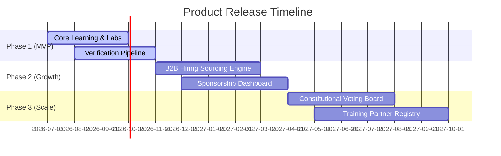

# 39 — Release Planning

> **Document Type:** Strategic Release Planning
> **Series:** Community Talent Ecosystem Platform — Business Documentation Suite
> **Document Owner:** Product Strategy & Operations
> **Status:** Draft v1.0

---

## 1. Executive Summary

This document presents the Release Plan for the Community Talent Ecosystem Platform. The platform will roll out in three phases to manage development risk, align with GTM phases, and ensure verification quality is stable before scaling. Phase 1 focuses on core learning and verification; Phase 2 introduces B2B hiring and partner monetization; Phase 3 expands global governance, chapter tools, and advanced integrations.

---

## 2. Purpose and Scope

### 2.1 Purpose
To align product development cycles with business milestones and marketing launch targets, ensuring that all teams work toward a single release roadmap.

### 2.2 Scope
Maps product releases from early launch prep through 24 months of operations, covering Phase 1 (MVP), Phase 2 (Growth), and Phase 3 (Scale).

---

## 3. Business Principles

1. **Verification-First Delivery**: Release schedules must prioritize the verification pipeline; without this core trust signal, other features have no value.
2. **Phase Gates**: Each phase must meet defined business milestones (member count, placement success) before starting the next phase.
3. **Operational Readiness**: Features cannot be released until local moderators, volunteers, and mentors have been trained.
4. **Stable Funding**: Product releases are budgeted using cash reserves and committed sponsor contracts to avoid financial risk.

---

## 4. Release Roadmap Timeline

---

## 5. Release Phases and Deliverables

### 5.1 Phase 1: MVP (Months 1 – 4)
* **Strategic Goal**: Establish the core learning, practice, and verification loops in founding chapters.
* **Core Deliverables**:
  - **F-COM-001 Portfolio Builder**: Member profiles showing verified badges.
  - **F-LRN-001 Path Tracker**: Curriculum pathways and course lists.
  - **F-LRN-002 Lab Allocator**: Sandbox reservation interface for practice.
  - **F-VER-001 Review Worklist**: Peer and mentor verification queue.
* **Success Gate**: 300 active members, 15 certified mentors, >50 verified badges awarded.

### 5.2 Phase 2: Growth (Months 5 – 10)
* **Strategic Goal**: Onboard corporate partners, monetize talent sourcing, and scale chapters.
* **Core Deliverables**:
  - **F-HR-001 Blind Sourcing**: Anonymized candidate searches for recruiters.
  - **F-COM-002 Reputation Ledger**: Contribution points and lead tracking.
  - **Sponsor center**: Scholarship block distributions and metrics tracking.
  - **Chapter Admin Portal**: Local member and event managers.
* **Success Gate**: 5 hiring partners onboarded, 15 chapters, 20 candidate placements.

### 5.3 Phase 3: Scale (Months 11 – 24)
* **Strategic Goal**: Build global governance tools, integrate external providers, and host large events.
* **Core Deliverables**:
  - **F-GOV-001 Voting Portal**: Constitutional amendment and election ballots.
  - **Incident Board**: Formal moderation dispute tracking logs.
  - **Partner APIs**: Content integrations for third-party platforms.
* **Success Gate**: 50 chapters, 100 placements, 10,000+ active members globally.

---

## 6. Release Dependencies Matrix

| Feature | Pre-requisite | Critical Path Dependency | Impact of Delay |
|---|---|---|---|
| **F-HR-001 Blind Sourcing** | F-VER-002 Trust Engine | Recruiters cannot search until candidate Trust Scores are calibrated. | High (Postpones B2B monetization). |
| **F-VER-001 Review Worklist**| F-LRN-002 Lab Allocator | Mentors cannot review labs until the sandbox logs can be verified. | Critical (Postpones first verifications). |
| **F-GOV-001 Voting Portal** | Member Registry | Member verification must be active to prevent duplicate voting. | Medium (Delays governance elections). |

---

## 7. Decision Notes

> **Decision Note — Postponing the Voting Portal**
> We postponed the Voting Portal (F-GOV-001) to Phase 3. During the initial pilot chapters (Phase 1/2), governance is managed by the founding committees. Building voting features early takes resources away from the core verification pipeline.

---

## 8. Callouts

> **Callout — The Gold Standard Rule**
> The transition from Phase 1 to Phase 2 is strictly conditional on the verification pipeline SLA. If lab review turnarounds exceed 7 business days, the Phase 2 launch will be delayed until mentor capacity is expanded.

---

## 9. Best Practices

- **Validate Training**: Chapter leaders must run simulated test sessions before new moderation or admin tools are deployed.
- **Roll Out Slowly**: Deploy major feature releases to seed chapters (e.g., Singapore) first, testing operations before global rollout.

---

## 10. Assumptions

- Seed chapters provide sufficient member feedback to validate Phase 1 workflows.
- Corporate partners accept the B2B dashboard and the anonymized candidate search format.

---

## 11. Future Scope

- **Global Talent Exchanges**: Enabling cross-border hiring compliance checks on candidate dashboards.

---

## 12. Review Notes

| Reviewer Role | Focus Area | Status |
|---|---|---|
| Product Manager | Feature dependencies and timelines | Approved |
| Community Director | Chapter operational readiness gates | Approved |

---

**Cross-References:** `02_COMMUNITY_BUSINESS_MODEL.md` · `05_HR_OPERATIONS.md` · `15_ROADMAP.md` · `38_FEATURE_CATALOG.md`
