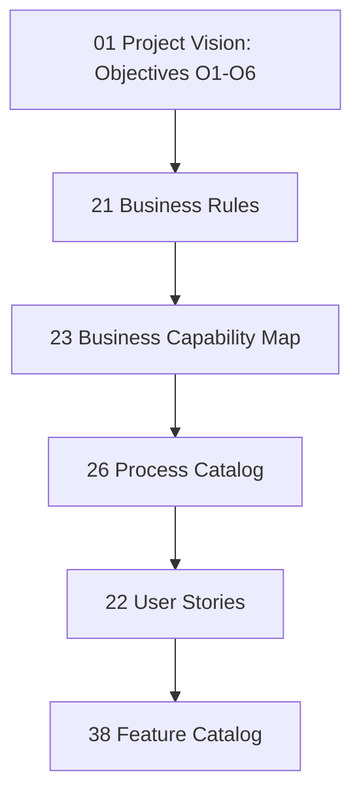

# 40 — Traceability Matrix

> **Document Type:** Business Requirements Traceability Matrix (RTM)
> **Series:** Community Talent Ecosystem Platform — Business Documentation Suite
> **Document Owner:** Product Management & Quality Assurance
> **Status:** Draft v1.0

---

## 1. Executive Summary

This Requirements Traceability Matrix (RTM) maps the relationships between the platform's core strategic assets. It connects Vision Objectives, Business Rules, Capabilities, Processes, User Stories, and Product Features. This mapping ensures that every feature developed is justified by a business objective and that every strategic goal has a concrete operational path to delivery.

---

## 2. Purpose and Scope

### 2.1 Purpose
To provide a complete verification map for the product development lifecycle, ensuring that no orphan requirements are built and no strategic objectives are missed.

### 2.2 Scope
Maps the relationships across documents `01_PROJECT_VISION.md` (Vision & Objectives), `21_BUSINESS_RULES.md` (Business Rules), `23_BUSINESS_CAPABILITY_MAP.md` (Capabilities), `26_PROCESS_CATALOG.md` (Processes), `22_USER_STORIES.md` (User Stories), and `38_FEATURE_CATALOG.md` (Features).

---

## 3. Business Principles

1. **Strategic Justification**: Every product feature must trace back to at least one Vision Objective.
2. **Operational Coverage**: Every Business Rule must be enforced by a Capability, Process, or Feature.
3. **No Orphan Requirements**: Product Backlog items that do not map to the Traceability Matrix are removed.
4. **Verifiability**: RTM links must be verifiable via functional reviews.

---

## 4. Traceability Hierarchy Model

---

## 5. Requirements Traceability Matrix

| Objective ID | Business Rule ID | Capability ID | Process ID | User Story ID | Feature ID |
|---|---|---|---|---|---|
| **O1: Trust Skill Economy** | BR-VR-001, BR-VR-002 | Level 2: Review Pipeline | P-MBR-002: Verification | US-MBR-001, US-MNT-001 | F-VER-001: Worklist |
| | BR-BD-001: Expiry | Level 2: Trust Ledger | | | F-VER-002: Trust Engine |
| **O2: Continuous Identity**| BR-RR-001: Decay | Level 2: Portfolio Mgmt | P-MBR-001: Onboarding | US-FRE-001: Portfolio | F-COM-001: Portfolio |
| | | Level 2: Reputation System| | | F-COM-002: Ledger |
| **O3: Mentorship Pipeline**| BR-MR-001, BR-MR-002 | Level 2: Mentorship | P-MBR-003: Pairing | US-ENG-001, US-MNT-001 | F-LRN-001: Path tracker|
| **O4: Community-Led Hiring**| BR-HR-001: Priority | Level 2: Talent Sourcing | P-COR-002: Sourcing | US-CHR-001, US-COM-001 | F-HR-001: Blind Search |
| | BR-HR-002: Rebate | | | | |
| **O5: Economic Stability** | BR-SR-001: Neutrality | Level 2: Sponsor Mgmt | P-COR-001: Sponsor | US-SPO-001: Scholarship | Sponsor Center |
| **O6: Scale Trust Globally**| BR-CH-001: Launch size| Level 2: Chapter Admin | P-ADM-001: Charter | US-ADM-001: Audit | Chapter Admin Portal|
| | BR-ER-001: Ticketing | Level 2: Events Management| P-ADM-002: Incident | US-EVN-001: Event | F-GOV-001: Voting |

---

## 6. Decision Notes

> **Decision Note — Keeping RTM strictly Business-Level**
> This RTM terminates at the **Business Feature** level. Technical requirements, test scripts, and database schema mappings are managed in a separate Technical Traceability Matrix to keep this document strictly focused on business logic.

---

## 7. Callouts

> **Callout — Orphan Feature Check**
> During backlog reviews, if a developer proposes a feature that has no mapping path in this matrix, it is automatically rejected. Every line of code must serve a documented business outcome.

---

## 8. Best Practices

- **Quarterly Alignment**: Run an automated check on the backlog to ensure all active stories align with the RTM.
- **Traceability Updates**: Update the RTM immediately when the Governance Committee approves constitutional amendments or rule changes.

---

## 9. Assumptions

- The objectives listed in `01_PROJECT_VISION.md` remain stable for the current fiscal year.
- The product backlog is maintained in a structured format that supports requirement matching.

---

## 10. Future Scope

- **Traceability Visualizers**: Integrating interactive mapping dashboards that display real-world progress against vision goals.

---

## 11. Review Notes

| Reviewer Role | Focus Area | Status |
|---|---|---|
| QA Manager | Traceability integrity & check metrics | Approved |
| Product Director | Alignment with Business Goals | Approved |

---

**Cross-References:** `01_PROJECT_VISION.md` · `21_BUSINESS_RULES.md` · `22_USER_STORIES.md` · `23_BUSINESS_CAPABILITY_MAP.md` · `26_PROCESS_CATALOG.md` · `38_FEATURE_CATALOG.md`
