# Master Table of Contents

> **Community Talent Ecosystem Platform — Complete Business Documentation Suite**

---

## Suite Structure

```mermaid
graph TD
    subgraph Foundation [1. Foundation]
        D01[01 Project Vision]
        D02[02 Community Business Model]
        D03[03 Member Lifecycle]
    end
    subgraph Operations [2. Operations and People]
        D04[04 Community Operations]
        D05[05 HR Operations]
        D06[06 Company Partnership Model]
        D07[07 Sponsorship Model]
    end
    subgraph Trust [3. Learning and Trust]
        D08[08 Learning Ecosystem]
        D09[09 Lab and Practice Model]
        D10[10 Verification Model]
        D11[11 Community Reputation System]
    end
    subgraph Life [4. Community Life & Governance]
        D12[12 Community Events Model]
        D13[13 Community Governance]
    end
    subgraph Strategy [5. Strategy & Appendix]
        D14[14 Business Workflows]
        D15[15 Roadmap]
        D16[16 Risk Analysis]
        D17[17 Success Metrics]
        D18[18 Appendix]
    end
    subgraph Analysis [6. Section A: Business Analysis]
        D19[19 Personas]
        D20[20 Stakeholder Analysis]
        D21[21 Business Rules]
        D22[22 User Stories]
        D23[23 Business Capability Map]
        D24[24 Information Architecture]
        D25[25 Service Blueprint]
        D26[26 Process Catalog]
        D27[27 RACI Matrix]
    end
    subgraph BizOps [7. Section B: Business Operations]
        D28[28 Chapter Playbook]
        D29[29 Mentor Handbook]
        D30[30 Moderator Handbook]
        D31[31 Volunteer Handbook]
        D32[32 Community Constitution]
    end
    subgraph BizStrategy [8. Section C: Business Strategy]
        D33[33 Go To Market Strategy]
        D34[34 Competitor Analysis]
        D35[35 Pricing Strategy]
    end
    subgraph Financial [9. Section D: Financial]
        D36[36 Financial Model]
    end
    subgraph PolicyGov [10. Section E: Governance]
        D37[37 Policy Manual]
    end
    subgraph Discovery [11. Section F: Product Discovery]
        D38[38 Feature Catalog]
        D39[39 Release Planning]
        D40[40 Traceability Matrix]
    end
    
    Foundation --> Operations
    Foundation --> Trust
    Operations --> Life
    Trust --> Life
    Life --> Strategy
    Strategy --> Analysis
    Analysis --> BizOps
    BizOps --> BizStrategy
    BizStrategy --> Financial
    Financial --> PolicyGov
    PolicyGov --> Discovery
```

---

## 0. Audit & Requirements Documents

| # | Document | Summary |
|---|----------|---------|
| 00 | `00_DISCOVERY_AUDIT.md` | Suite audit reconciling the documented model against the prototyped Phase 1 build; Decision Log |
| 41 | `41_BUSINESS_REQUIREMENTS_DOCUMENT.md` | Consolidated BRD synthesizing Vision, Business Rules, and Workflows, tagged by Phase 1/Phase 2 maturity |
| 42 | `42_PRODUCT_REQUIREMENTS_DOCUMENT.md` | Consolidated PRD: feature list by stage/actor/priority, MVP preview, user-story coverage gaps |
| 43 | `43_NON_FUNCTIONAL_REQUIREMENTS.md` | Business-level performance, availability, accessibility, data retention, security posture |
| 44 | `44_MVP_DEFINITION.md` | Ratified MVP scope decision — includes/excludes/conditions per prototyped Phase 1 feature |

## 1. Foundation Documents

| # | Document | Summary |
|---|----------|---------|
| 01 | `01_PROJECT_VISION.md` | Vision, mission, objectives, problems, market need, philosophy, value proposition, audience |
| 02 | `02_COMMUNITY_BUSINESS_MODEL.md` | Business model, stakeholders, revenue, growth, partners, sponsors, chapters, governance linkage, KPIs/OKRs |
| 03 | `03_MEMBER_LIFECYCLE.md` | Full member journey from registration to alumni |

## 2. Operations and People Documents

| # | Document | Summary |
|---|----------|---------|
| 04 | `04_COMMUNITY_OPERATIONS.md` | Admin, moderator, volunteer, mentor, event operations; incidents; escalation |
| 05 | `05_HR_OPERATIONS.md` | Community HR hiring lifecycle, screening, bulk hiring, interviews, placement, retention |
| 06 | `06_COMPANY_PARTNERSHIP_MODEL.md` | Employer journey, benefits, dashboard, hiring requests, talent pools, campaigns |
| 07 | `07_SPONSORSHIP_MODEL.md` | Sponsors, events/bootcamps/scholarships, brand visibility, ROI |

## 3. Learning and Trust Documents

| # | Document | Summary |
|---|----------|---------|
| 08 | `08_LEARNING_ECOSYSTEM.md` | Learning philosophy, paths, mentorship, communities, events, career development |
| 09 | `09_LAB_AND_PRACTICE_MODEL.md` | Hands-on practice, challenges, roadmaps, assessment, competitions, projects |
| 10 | `10_VERIFICATION_MODEL.md` | Skill verification, community review, trust score, badges, professional levels |
| 11 | `11_COMMUNITY_REPUTATION_SYSTEM.md` | Contribution model, points, badges, leaderboards, mentor/volunteer levels |

## 4. Community Life Documents

| # | Document | Summary |
|---|----------|---------|
| 12 | `12_COMMUNITY_EVENTS_MODEL.md` | Meetups, conferences, workshops, webinars, hackathons, planning workflow |
| 13 | `13_COMMUNITY_GOVERNANCE.md` | Roles, committees, voting, policies, decision-making, ethics, compliance |

## 5. Strategy Documents

| # | Document | Summary |
|---|----------|---------|
| 14 | `14_BUSINESS_WORKFLOWS.md` | Consolidated reference of every major cross-functional workflow |
| 15 | `15_ROADMAP.md` | 1/3/5-year roadmap, chapter expansion, professional services, industry collaboration |
| 16 | `16_RISK_ANALYSIS.md` | Business, community, sponsor, growth, hiring risks and mitigations |
| 17 | `17_SUCCESS_METRICS.md` | KPIs across community, growth, placement, engagement, learning, sponsor, revenue |
| 18 | `18_APPENDIX.md` | Glossary, terms, definitions, assumptions, abbreviations |

## 6. Section A: Business Analysis Documents

| # | Document | Summary |
|---|----------|---------|
| 19 | `19_PERSONAS.md` | Executive summary, user archetypes, primary & secondary detailed profiles, empathy maps, and relationships |
| 20 | `20_STAKEHOLDER_ANALYSIS.md` | Stakeholder Register, Power/Interest Matrix, Communication Matrix, Influence and Authority mappings |
| 21 | `21_BUSINESS_RULES.md` | Rules Catalogue for verification, mentorship, HR, communities, governance, chapters, learning, badges, and sponsors |
| 22 | `22_USER_STORIES.md` | Functional user stories for members, mentors, sponsors, companies, and admins, with priorities and acceptance criteria |
| 23 | `23_BUSINESS_CAPABILITY_MAP.md` | Level 1, 2, and 3 capabilities, maturity map, capability dependency and heat mappings |
| 24 | `24_INFORMATION_ARCHITECTURE.md` | Portals navigation, content taxonomies, search parameters, and core business object models |
| 25 | `25_SERVICE_BLUEPRINT.md` | Mapped pathways for verification and hiring placement, backstage/frontstage actions, SLAs, and failure mitigations |
| 26 | `26_PROCESS_CATALOG.md` | Registry of all business processes, detailing trigger, inputs, outputs, owners, frequencies, and KPIs |
| 27 | `27_RACI_MATRIX.md` | Responsibility assignment matrix mapping all cataloged processes against community and enterprise roles |

## 7. Section B: Business Operations Documents

| # | Document | Summary |
|---|----------|---------|
| 28 | `28_CHAPTER_PLAYBOOK.md` | Chapter launch guidelines, tiers, operational structures, audits, merging, and closure workflows |
| 29 | `29_MENTOR_HANDBOOK.md` | Mentor lifecycle, grading criteria, standards of conduct, and plagiarism/cheating escalation paths |
| 30 | `30_MODERATOR_HANDBOOK.md` | Community moderation guidelines, incident response flows, warnings, timeouts, suspensions, and bans |
| 31 | `31_VOLUNTEER_HANDBOOK.md` | Volunteer lifecycle, role catalog, point distributions, references, and task rotation schedules |
| 32 | `32_COMMUNITY_CONSTITUTION.md` | Supreme charter detailing core values, Bill of Member Rights, responsibilities, voting systems, and amendments |

## 8. Section C: Business Strategy Documents

| # | Document | Summary |
|---|----------|---------|
| 33 | `33_GO_TO_MARKET_STRATEGY.md` | Market entry, chapter expansion models, B2B partner/employer acquisition, and developer relations positioning |
| 34 | `34_COMPETITOR_ANALYSIS.md` | Comparative analysis, SWOT, and feature matrices against 15 key industry alternatives |
| 35 | `35_PRICING_STRATEGY.md` | Partner subscriptions, sponsor packages, training royalties, meetup ticketing rules, and scholarship plans |

## 9. Section D: Financial Documents

| # | Document | Summary |
|---|----------|---------|
| 36 | `36_FINANCIAL_MODEL.md` | Budgets, operational expenses, capital expenditures, unit economics (CAC, LTV, MAC), and 5-year illustrative projections |

## 10. Section E: Governance Documents

| # | Document | Summary |
|---|----------|---------|
| 37 | `37_POLICY_MANUAL.md` | Policies governing conduct, verification ethics, GDPR/CCPA privacy, appeals, and event organization rules |

## 11. Section F: Product Discovery Documents

| # | Document | Summary |
|---|----------|---------|
| 38 | `38_FEATURE_CATALOG.md` | Functional backlog categorized into product domains, detailing goals, actors, rules, and priorities |
| 39 | `39_RELEASE_PLANNING.md` | Phase 1, 2, and 3 roadmap milestones, release dependencies, and deliverables schedules |
| 40 | `40_TRACEABILITY_MATRIX.md` | Verification map linking Vision Objectives to business rules, capabilities, processes, stories, and backlog features |

## 12. Suite-Level Reference Documents

| Document | Purpose |
|----------|---------|
| `MASTER_TABLE_OF_CONTENTS.md` | This document — full suite structure |
| `DOCUMENT_INDEX.md` | Quick lookup index by topic/keyword |
| `README.md` | Suite orientation and how to use this documentation |
| `CHANGELOG.md` | Version history of the documentation suite |
| `REVIEW_CHECKLIST.md` | Checklist for reviewing the suite before downstream use |
| `BUSINESS_GLOSSARY.md` | Standalone canonical glossary |
| `visual_template/index.html` | **[Interactive Visual Walkthrough](file:///home/hackycoder/mca_labs/packetpulse/visual_template/index.html)** — End-user cases and operational simulation dashboard |

---

## Recommended Reading Order

---

**Total Documents in Suite:** 40 core documents + 5 audit/BRD/PRD/NFR/MVP documents (`00`, `41`, `42`, `43`, `44`) + 6 reference documents + 1 interactive dashboard = **52 documents**

**Discovery Roadmap Status (as of 2026-08-03):** Phases 0–12 all have at least one deliverable. See `00_DISCOVERY_AUDIT.md` §6 (Decision Log) for the full session history and `41_BUSINESS_REQUIREMENTS_DOCUMENT.md` §6 / `44_MVP_DEFINITION.md` §7 for the two items still requiring human ratification (BR-VR-003, BR-HR-003/individual-recruiter model) before they should be treated as final.
